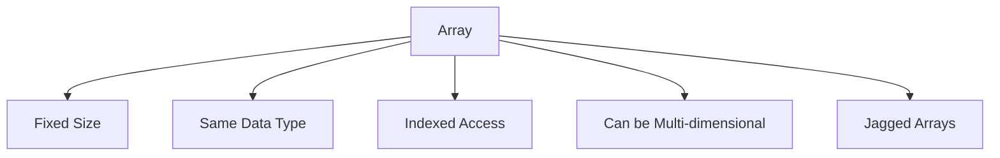

# 📚 C# Arrays — Complete Guide


Arrays in C# are fixed-size collections of elements of the **same type**, used to store multiple values in a single variable.


---


## 🧱 1. Declaring Arrays


You can declare arrays in several ways:


```csharp

int[] numbers;          // Declaration only
string[] names = new string[3]; // Declaration + allocation

```


Or with initialization:


```csharp

int[] scores = { 95, 85, 75 };

```


---


## 📌 2. Accessing Elements


Elements are accessed using **zero-based indexing**:


```csharp

Console.WriteLine(scores[0]); // Output: 95

scores[1] = 99;               // Modify second element

```


> ⚠️ Accessing out-of-range indexes throws `IndexOutOfRangeException`.


---


## 📐 3. Array Length


```csharp

int length = scores.Length; // 3

```


---


## 🔄 4. Looping Through Arrays


### Using `for` loop


```csharp

for (int i = 0; i < scores.Length; i++)
{
    Console.WriteLine(scores[i]);
}

```


### Using `foreach`


```csharp

foreach (int score in scores)
{
    Console.WriteLine(score);
}

```


---


## 🔁 5. Array Initialization Techniques


```csharp

// Empty with size
int[] ages = new int[5];
// With values
string[] colors = new string[] { "Red", "Green", "Blue" };
// Shorthand
bool[] flags = { true, false, true };

```


---


## 🔀 6. Multidimensional Arrays


```csharp

int[,] matrix = {
    { 1, 2 },
    { 3, 4 }
};

Console.WriteLine(matrix[1, 1]); // Output: 4

```


---


## 🧩 7. Jagged Arrays (Array of Arrays)


```csharp

int[][] jagged = new int[2][];
jagged[0] = new int[] { 1, 2 };
jagged[1] = new int[] { 3, 4, 5 };

Console.WriteLine(jagged[1][2]); // Output: 5

```


---


## ⚙️ 8. Common Array Methods


```csharp

Array.Sort(scores);    // Sort in ascending order
Array.Reverse(scores); // Reverse order
int index = Array.IndexOf(scores, 99);

```


---


## 🧠 Summary: When to Use Arrays


- You know the size ahead of time

- You want performance (fixed-size, contiguous memory)

- You don’t need dynamic resizing (consider `List<T>` for that)


---


## 🗺️ Diagram: Array Concepts





---


## 🧪 Example Program


```csharp

public class Program
{
    public static void Main()
    {
        string[] cities = { "Paris", "London", "Tokyo" };
        foreach (var city in cities)
        {
            Console.WriteLine($"Welcome to {city}!");
        }
    }
}

```


---
