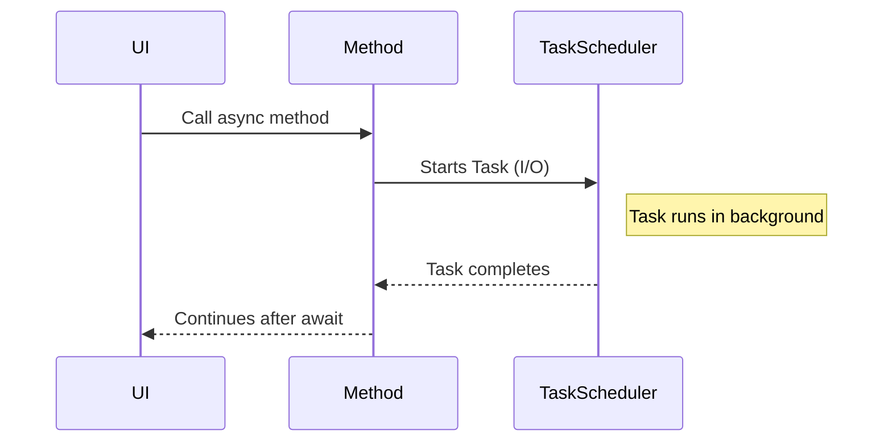
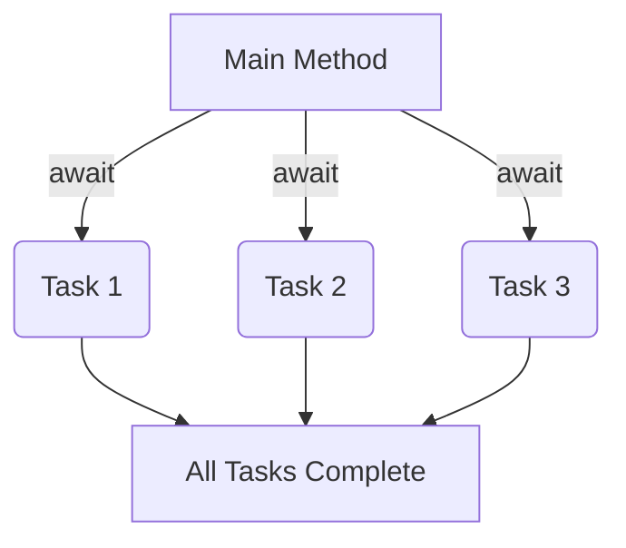

# 🔄 C# Async/Await Guide


> Learn how to write responsive, scalable, and maintainable C# applications using `async` and `await`.


---


## 🧠 What Is Async/Await?


`async` and `await` are C# keywords used to write **asynchronous** code that looks and behaves like synchronous code.


- ✅ Keeps UI responsive

- 🔁 Frees up threads during I/O or delays

- 🧵 Great for high-throughput apps


---


## 🛠️ Basic Syntax


```csharp

public async Task<int> GetNumberAsync()
{
    await Task.Delay(1000); // Simulate delay
    return 42;
}

```


```csharp

int result = await GetNumberAsync();
Console.WriteLine(result); // 42

```


---


## 🔁 Async Method Rules


- Must return `Task`, `Task<T>`, or `ValueTask`

- Must use `await` keyword inside

- Signature must include `async` modifier


---


## 🧵 Synchronous vs Asynchronous


```csharp

// Sync
Thread.Sleep(2000);

// Async
await Task.Delay(2000);

```


---


## 🎯 Real-World Example


```csharp

public async Task<string> DownloadWebsiteAsync(string url)
{
    using HttpClient client = new();
    string content = await client.GetStringAsync(url);
    return content;
}

```


---


## 📈 Diagram: Async Flow





---


## 🛑 What Awaits What?


```csharp

var data = await FetchDataAsync();
// ↓ Waits until FetchDataAsync completes

```


- The method pauses at `await` and **resumes when the awaited task is complete**.


---


## ⚠️ Common Mistakes


| Mistake                           | Fix                                                   |
|----------------------------------|--------------------------------------------------------|
| Using `async void` unnecessarily | Use `async Task` instead (except for event handlers)  |
| Forgetting `await`               | The method runs but you don’t wait for the result     |
| Blocking with `.Result` / `.Wait()` | Can cause deadlocks in UI or ASP.NET apps           |


---


## 🧪 Practice Exercise: Async Counter


```csharp

public async Task CountAsync()
{
    for (int i = 1; i <= 5; i++)
    {
        Console.WriteLine($"Counting {i}...");
        await Task.Delay(500);
    }
    Console.WriteLine("Done!");
}

```


---


## 🔄 Parallel Async Loops (Don't do this)


```csharp

foreach (var url in urls)
{
    await DownloadAsync(url); // ❌ sequential
}

```


✅ **Better** with `Task.WhenAll`:


```csharp

var tasks = urls.Select(url => DownloadAsync(url));
await Task.WhenAll(tasks); // ✅ parallel

```


---


## 🧩 Exception Handling


```csharp

try
{
    string result = await DangerousOperationAsync();
}

catch (Exception ex)
{
    Console.WriteLine($"Error: {ex.Message}");
}

```


---


## 📦 Async in Libraries


```csharp

public interface IDataFetcher
{
    Task<string> FetchAsync(string key);
}

```


---


## 📊 Diagram: Parallel Async Tasks





---


## 🚀 Tips for Production


| Tip                          | Why                            |
|-----------------------------|---------------------------------|
| Use `ConfigureAwait(false)` | Avoid deadlocks in libraries   |
| Avoid `.Result` / `.Wait()` | They block async flow          |
| Use `CancellationToken`     | Support graceful cancellation  |
| Profile with Visual Studio  | Detect sync-over-async issues  |


---


## 📌 Summary


| Concept              | Description                             |
|----------------------|-----------------------------------------|
| `async`              | Marks a method as asynchronous          |
| `await`              | Pauses until the awaited `Task` completes |
| `Task<T>`            | Represents future value                 |
| `Task.WhenAll`       | Runs multiple tasks in parallel         |
| Exception Handling   | Use `try/catch` for awaited operations  |


---


## 🧠 Keep Practicing!


- Convert a sync API to async (`File.ReadAllTextAsync`)

- Create a progress bar using `async` + `Task.Delay`

- Implement a retry policy with `async` + `try/catch`


---


> 👨‍💻 Async/await makes your apps faster, smoother, and more responsive — but only when used correctly. Practice well!
