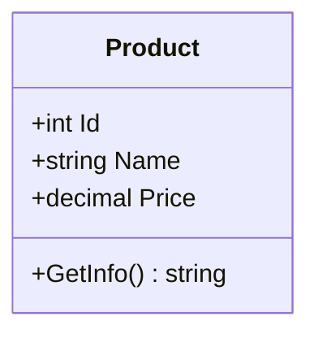
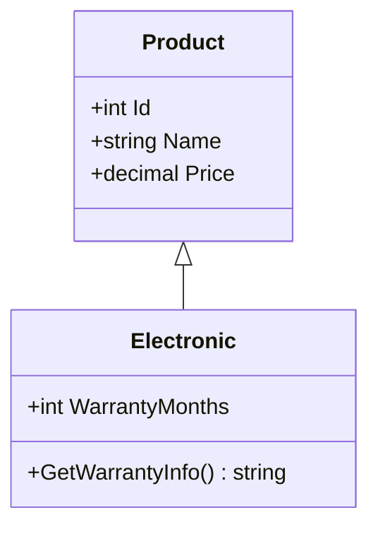
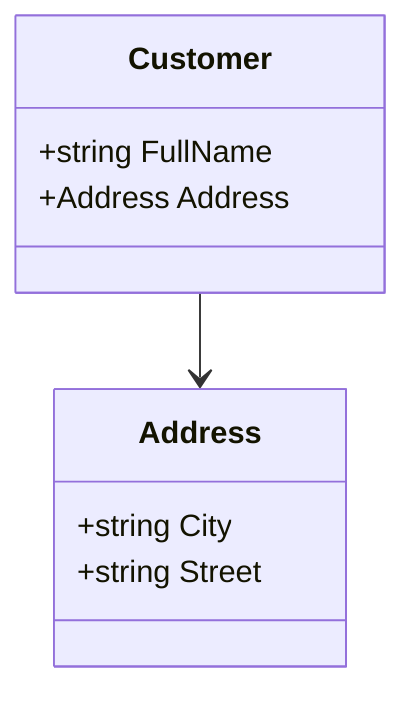
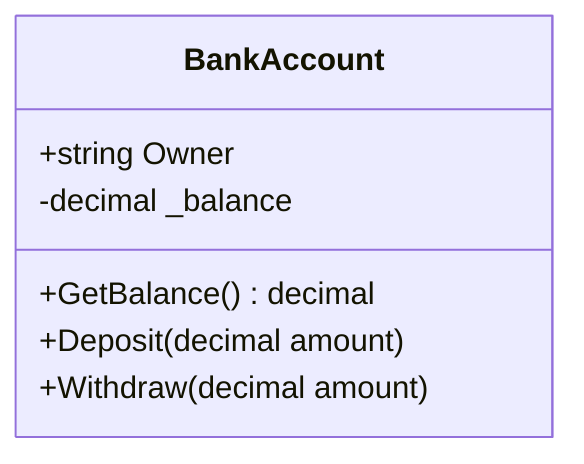
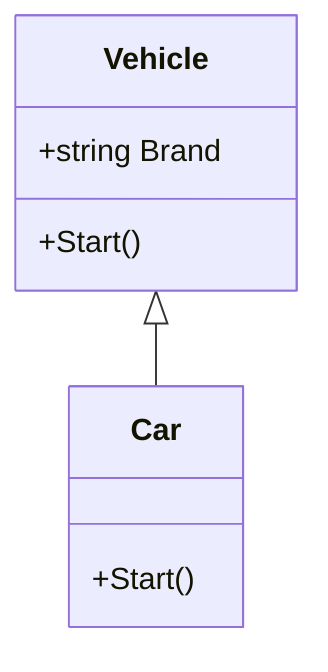

## 🧱 C# Class Operations 


## 📌 1. Class Definition & Properties


```csharp

public class Product
{
    public int Id { get; set; }
    public string Name { get; set; }
    public decimal Price { get; set; }
    public string GetInfo()
    {
        return $"{Name} - {Price:C}";
    }
}
```


📊 Diagram: Product Class




📌 2. Inheritance

```csharp

public class Electronic : Product
{
    public int WarrantyMonths { get; set; }
    public string GetWarrantyInfo()
    {
        return $"{WarrantyMonths} months warranty";
    }
}
```


📊 Diagram: Inheritance




📌 3. Composition (Has-A Relationship)

```csharp

public class Customer
{
    public string FullName { get; set; }
    public Address Address { get; set; }
}
public class Address
{
    public string City { get; set; }
    public string Street { get; set; }
}

```


📊 Diagram: Composition





📌 4. Encapsulation


```csharp
public class BankAccount
{
    public string Owner { get; set; }
    private decimal _balance;
    public decimal GetBalance() => _balance;
    public void Deposit(decimal amount)
    {
        if (amount > 0)
            _balance += amount;
    }
    public void Withdraw(decimal amount)
    {
        if (amount > 0 && amount <= _balance)
            _balance -= amount;
    }
}

```


📊 Diagram: Encapsulation




📌 5. Abstract Class vs Concrete Class


```csharp
public abstract class Vehicle
{
    public string Brand { get; set; }
    public abstract void Start();
}
public class Car : Vehicle
{
    public override void Start()
    {
        Console.WriteLine($"{Brand} car starting...");
    }
}

```


📊 Diagram: Abstract Class





✅ Summary of Key Class Concepts


Concept

Description

Inheritance

One class derives from another (: baseClass)

Composition

A class has another class as a property

Encapsulation

Hide internal state using private fields

Abstract class

Defines a base with some or no implementations

🔧 Tip: Combine interfaces, abstract classes, and composition for best software design practices.


---
