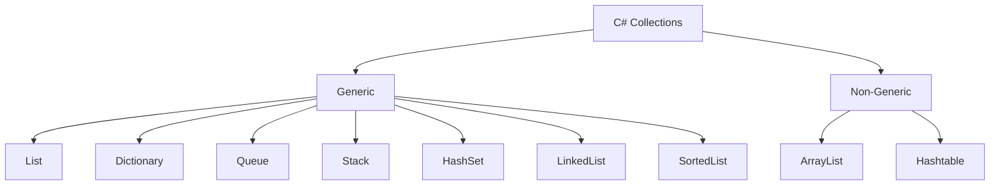

# 📚 C# Collections — A Comprehensive Guide


In C#, **collections** are data structures used to store, manage, and manipulate groups of related objects. The .NET framework offers both **generic** and **non-generic** collections, each designed for different scenarios.


---


## 🧺 1. Types of Collections


### ✅ Generic Collections (in `System.Collections.Generic`)

- Type-safe and performant

- Recommended for most use cases


| Collection Type      | Description                              | Example                         |
|----------------------|------------------------------------------|----------------------------------|
| `List<T>`            | Dynamic array                            | `List<int> numbers`             |
| `Dictionary<TKey,TValue>` | Key-value store                     | `Dictionary<string, int>`       |
| `HashSet<T>`         | Unordered unique items                   | `HashSet<string>`               |
| `Queue<T>`           | FIFO collection                          | `Queue<string>`                 |
| `Stack<T>`           | LIFO collection                          | `Stack<double>`                 |
| `SortedList<TKey,TValue>` | Sorted by key                     | `SortedList<string, int>`       |
| `LinkedList<T>`      | Doubly-linked list                       | `LinkedList<string>`            |


---


### ❗ Non-Generic Collections (in `System.Collections`)

- Not type-safe, uses `object`

- Should be avoided in modern C#


| Collection Type   | Description                |
|-------------------|----------------------------|
| `ArrayList`       | Dynamic array of `object`  |
| `Hashtable`       | Key-value pairs            |
| `Queue`           | FIFO (non-generic)         |
| `Stack`           | LIFO (non-generic)         |


---


## 📦 2. List<T> — Dynamic Array


```csharp

var fruits = new List<string> { "Apple", "Banana" };
fruits.Add("Mango");
Console.WriteLine(fruits[0]); // Apple

```


### Common Methods:

- `.Add(item)`

- `.Remove(item)`

- `.Contains(item)`

- `.Count`

- `.Sort()`


---


## 🧾 3. Dictionary<TKey, TValue>


```csharp

var ages = new Dictionary<string, int>
{
    ["Alice"] = 30,
    ["Bob"] = 25
};

Console.WriteLine(ages["Alice"]); // 30

```


### Common Methods:

- `.Add(key, value)`

- `.Remove(key)`

- `.ContainsKey(key)`

- `.TryGetValue(key, out value)`


---


## 🔁 4. Queue<T> — First-In-First-Out


```csharp

var q = new Queue<string>();
q.Enqueue("First");
q.Enqueue("Second");
Console.WriteLine(q.Dequeue()); // First

```


---


## 🔂 5. Stack<T> — Last-In-First-Out


```csharp

var s = new Stack<string>();
s.Push("Top");
s.Push("Bottom");
Console.WriteLine(s.Pop()); // Bottom

```


---


## ❌ HashSet<T> — Unique Unordered Collection


```csharp

var colors = new HashSet<string> { "Red", "Green" };
colors.Add("Red"); // Ignored, already exists

```


---


## 📚 6. SortedList<TKey, TValue>


Keeps keys sorted automatically.


```csharp

var sl = new SortedList<string, int>
{
    ["b"] = 2,
    ["a"] = 1
};

foreach (var kvp in sl)

    Console.WriteLine($"{kvp.Key} = {kvp.Value}"); // a = 1, b = 2

```


---


## 🧵 7. LinkedList<T>


Efficient insertions/removals in the middle.


```csharp

var linked = new LinkedList<int>();
linked.AddFirst(1);
linked.AddLast(2);

```


---


## 🧠 Choosing the Right Collection


| Scenario                               | Use This               |
|----------------------------------------|------------------------|
| Fast indexed access                    | `List<T>`              |
| Key-value pairs                        | `Dictionary<TKey,TValue>` |
| Unique items only                      | `HashSet<T>`           |
| FIFO queue                             | `Queue<T>`             |
| LIFO stack                             | `Stack<T>`             |
| Sorted keys                            | `SortedList<TKey,TValue>` |
| Frequent middle insertions/removals   | `LinkedList<T>`        |


---


## 🗺️ Summary Diagram





---


## 🧪 Example


```csharp

public class Program
{
    public static void Main()
    {
        var products = new List<string> { "Keyboard", "Mouse" };
        var prices = new Dictionary<string, double>
        {
            ["Keyboard"] = 50.0,
            ["Mouse"] = 25.0
        };

        foreach (var product in products)
        {
            Console.WriteLine($"{product}: ${prices[product]}");
        }
    }
}

```


---


✅ **Next Topics:**

- `IEnumerable<T>` and `ICollection<T>`

- `LINQ on collections`

- `Concurrent collections`

- `Immutable collections`
