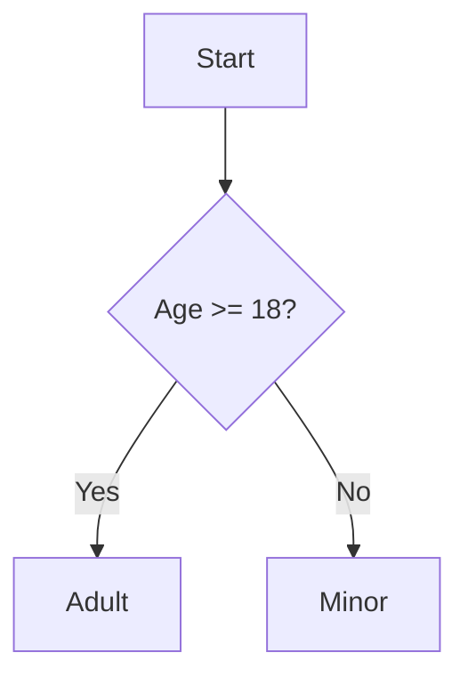

# 📘 C# Conditionals – Complete Guide


> A comprehensive guide to conditionals in C#, including `if`, `else`, `switch`, `ternary`, and best practices, with code examples and flow diagrams.


---


## 🔹 1. if Statement


Basic syntax:


```csharp

int age = 18;
if (age >= 18)
{
    Console.WriteLine("You are an adult.");
}

```


---


## 🔹 2. if-else Statement


```csharp

int age = 16;
if (age >= 18)
{
    Console.WriteLine("You are an adult.");
}
else
{
    Console.WriteLine("You are a minor.");
}

```


---


## 🔹 3. if-else if-else Ladder


```csharp

int score = 75;
if (score >= 90)
{
    Console.WriteLine("Grade: A");
}
else if (score >= 80)
{
    Console.WriteLine("Grade: B");
}
else if (score >= 70)
{
    Console.WriteLine("Grade: C");
}
else
{
    Console.WriteLine("Grade: D or lower");
}

```


---


## 🔹 4. switch Statement


```csharp

string role = "admin";
switch (role)
{
    case "admin":
        Console.WriteLine("Has full access.");
        break;
    case "editor":
        Console.WriteLine("Can edit content.");
        break;
    case "viewer":
        Console.WriteLine("Can view content.");
        break;
    default:
        Console.WriteLine("Unknown role.");
        break;
}

```


---


## 🔹 5. Ternary Operator (`? :`)


A compact way of writing if-else:


```csharp

int number = 10;
string result = (number % 2 == 0) ? "Even" : "Odd";
Console.WriteLine(result);  // Output: Even

```


---


## 🔹 6. Nested Conditionals


```csharp

int number = 15;
if (number > 0)
{
    if (number < 100)
    {
        Console.WriteLine("Between 1 and 99");
    }
}

```


---


## 🔹 7. switch Expressions (C# 8+)


More concise alternative to switch statements:


```csharp

int age = 25;
string category = age switch
{
    < 13 => "Child",
    < 20 => "Teenager",
    < 65 => "Adult",
    _ => "Senior"
};
Console.WriteLine(category);  // Output: Adult

```


---


## 🔹 8. Diagram – if-else Logic





---


## ✅ Best Practices


- ✅ Use `switch` when working with enums or many discrete values.

- ✅ Prefer early returns over deep nested ifs.

- ✅ Use ternary operator for simple value assignments.

- ✅ Consider `switch expression` for modern, clean code.

- ❌ Avoid deeply nested if-else chains.

- ✅ Always cover the `default` or `else` case for safety.


---


## 📌 Summary Table


| Syntax | Use Case | C# Version |
| ----------------| ---------------------------------------- | ------------ |
| `if` | Basic decision | All        |
| `if-else`| Two branches | All        |
| `switch`| Multiple discrete cases | All |
| `ternary`| Inline if-else for values | All |
| `switch expr.`| Functional, pattern-based branching | C# 8.0+ |


---


## 🧪 Challenge Task


Write a method that takes an `int score` and returns `"Pass"` or `"Fail"` using:


- if-else

- ternary

- switch expression


Try to write it in 3 different styles and compare readability.


---


## 📎 Related Topics


- Pattern Matching

- Null-conditional operators

- Nullable reference types and conditionals

- async/await with conditionals


---
