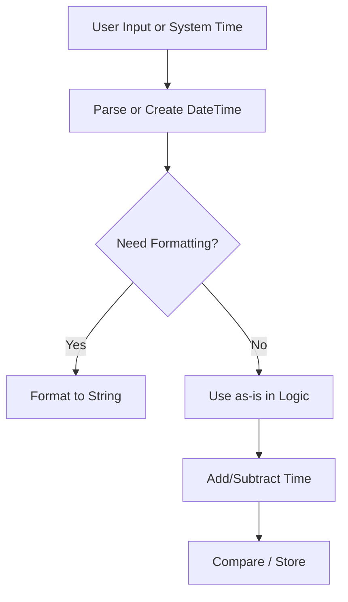

# 🕒 C# `DateTime`


---


## 📌 What is `DateTime`?


`DateTime` is a **value type** in C# used to represent **dates and times**.


```csharp

DateTime now = DateTime.Now;
DateTime utcNow = DateTime.UtcNow;

```


---


## 🛠️ Common Ways to Create DateTime


```csharp

// Current time

var now = DateTime.Now;
// Specific date and time
var dt = new DateTime(2025, 7, 19, 18, 30, 0); // 19 July 2025, 18:30:00
// Parse from string
var parsed = DateTime.Parse("2025-07-19");
// TryParse to avoid exceptions
DateTime.TryParse("2025-07-19", out DateTime safeParsed);

```


---


## 📊 Important Properties


| Property | Description |
| ---------------- | ------------------------------------- |
| `Now` | Local date and time |
| `UtcNow` | Coordinated Universal Time (UTC) |
| `Today` | Date with time set to 00:00:00 |
| `Date` | Strips the time part |
| `DayOfWeek` | Enum: Monday, Tuesday, etc. |
| `Ticks` | Number of 100-nanosecond intervals |


```csharp

Console.WriteLine(DateTime.Today);       // 2025-07-19 00:00:00
Console.WriteLine(DateTime.Now.DayOfWeek); // Saturday

```


---


## 🧮 Formatting DateTime


```csharp

DateTime dt = DateTime.Now;
string formatted = dt.ToString("yyyy-MM-dd HH:mm:ss");
// Output: 2025-07-19 18:30:00

```


| Format String | Example Output       | Description                 |
|---------------|----------------------|-----------------------------|
| `yyyy`        | `2025`               | Year                        |
| `MM`          | `07`                 | Month (01–12)               |
| `dd`          | `19`                 | Day                         |
| `HH`          | `18`                 | Hour (24-hour)              |
| `mm`          | `30`                 | Minutes                     |
| `ss`          | `00`                 | Seconds                     |


---


## 🔁 Adding & Subtracting Time


```csharp

DateTime now = DateTime.Now;
var tomorrow = now.AddDays(1);
var nextMonth = now.AddMonths(1);
var earlier = now.AddHours(-2);

```


---


## 📏 Comparing Dates


```csharp

DateTime a = new DateTime(2025, 1, 1);
DateTime b = new DateTime(2025, 7, 1);
bool isLater = b > a;  // true
int result = DateTime.Compare(a, b);  // -1 = a < b

```


---


## ⏳ TimeSpan (Difference Between Dates)


```csharp

DateTime start = new DateTime(2025, 7, 1);
DateTime end = new DateTime(2025, 7, 19);
TimeSpan difference = end - start;

Console.WriteLine(difference.Days); // 18

```


---


## 🧭 Time Zones and UTC


Always be careful with time zones!


```csharp

DateTime utc = DateTime.UtcNow;
DateTime local = utc.ToLocalTime();

```


---


## 🧵 Thread Safety?


- `DateTime` is a **value type** and **thread-safe**.

- Avoid storing mutable `DateTime` instances in shared static fields.


---


## 📈 Diagram – DateTime Workflow





---


## ✅ Summary


- Use `DateTime.Now` or `DateTime.UtcNow` to get current time.

- Use `Add*` methods for time math.

- Use `ToString("format")` for display.

- Prefer `DateTimeOffset` if time zones matter a lot.


---


## 🧪 Bonus: Parsing Custom Format


```csharp

string dateStr = "19-07-2025 18:30";

DateTime parsed = DateTime.ParseExact(dateStr, "dd-MM-yyyy HH:mm", null);

```
