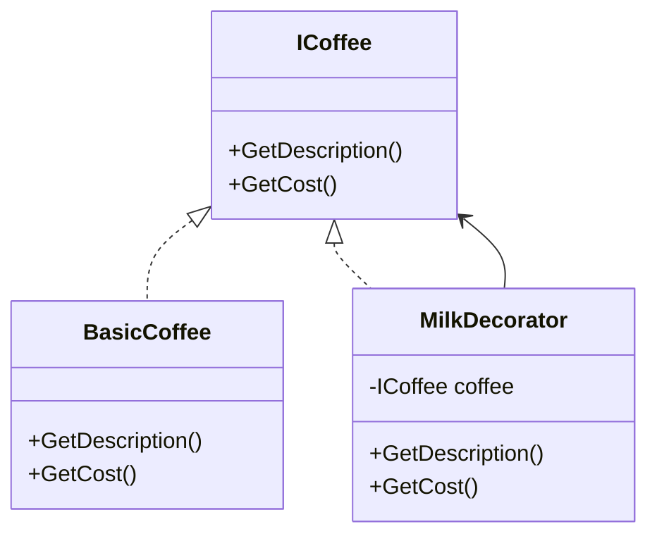

# 🎨 Decorator Pattern

**Definition:** A structural design pattern that lets you attach new behaviors to objects dynamically by placing them inside wrapper objects.

## C# Example

```csharp
public interface ICoffee
{
    string GetDescription();
    double GetCost();
}

public class BasicCoffee : ICoffee
{
    public string GetDescription() => "Basic Coffee";
    public double GetCost() => 2.0;
}

public class MilkDecorator : ICoffee
{
    private readonly ICoffee _coffee;
    public MilkDecorator(ICoffee coffee) => _coffee = coffee;

    public string GetDescription() => _coffee.GetDescription() + ", Milk";
    public double GetCost() => _coffee.GetCost() + 0.5;
}
```

## Usage

```csharp
ICoffee coffee = new BasicCoffee();
coffee = new MilkDecorator(coffee);

Console.WriteLine(coffee.GetDescription());  // Basic Coffee, Milk
Console.WriteLine(coffee.GetCost());         // 2.5
```

## Diagram



---
