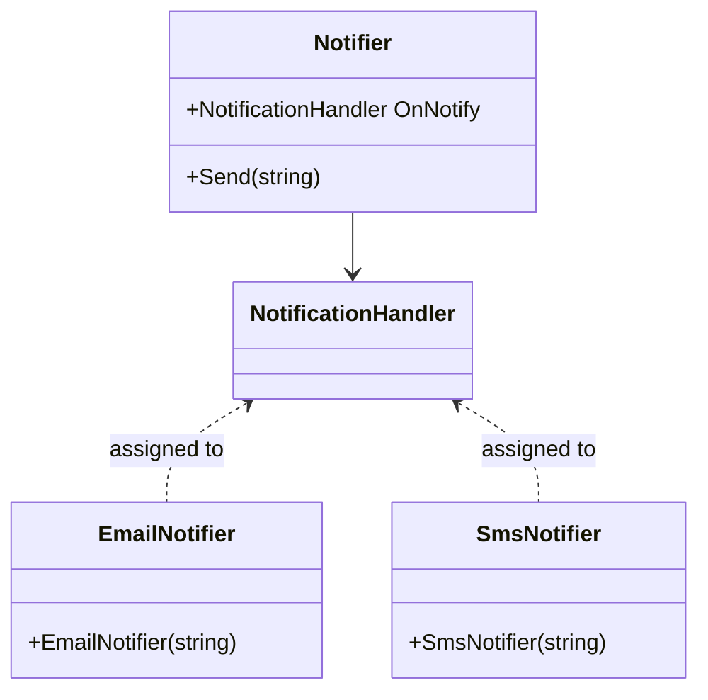

# 🧠 C# `Delegate`s Explained


A **`delegate`** in C# is a **type-safe function pointer**. It allows you to **pass methods as parameters**, **store them**, or **execute them dynamically**.


> Think of a delegate as a reference to a method, similar to a function pointer in C/C++ — but type-safe.


---


## 🎯 Delegate Declaration


```csharp

public delegate void NotificationHandler(string message);
```

This defines a delegate that can point to any method that returns void and accepts a single string parameter.


🔔 Example: Notification System


```csharp
public class Notifier
{
    public NotificationHandler? OnNotify;
    public void Send(string msg)
    {
        OnNotify?.Invoke(msg);
    }
}
```
// Usage
```csharp
void EmailNotifier(string message) => Console.WriteLine($"Email: {message}");
void SmsNotifier(string message) => Console.WriteLine($"SMS: {message}");
var notifier = new Notifier();
notifier.OnNotify = EmailNotifier;
notifier.Send("User registered.");  // Output: Email: User registered.
```


➕ Multicast Delegates


Delegates can point to multiple methods at once.
```csharp
notifier.OnNotify += SmsNotifier;
notifier.Send("Welcome!");
```


Output:

- Email: Welcome!

- SMS: Welcome!


🔁 Anonymous & Lambda Functions


Delegates can be assigned anonymous methods:
```csharp
notifier.OnNotify += delegate (string msg) {
    Console.WriteLine($"[LOG] {msg}");
};
notifier.OnNotify += msg => Console.WriteLine($"[Push] {msg}");
```


📦 Func, Action, Predicate (Built-in Delegates)


| Delegate Type  | Parameters | Return Type | Use Case |
| --- | --- | --- | --- |
| Action\<T\> | 0 or more | void | General actions |
| Func<T, TResult> | 0 or more | TResult | Transformations
| Predicate\<T\> | 1 (T) | bool | Filtering conditions


Example

```csharp
Action<string> log = Console.WriteLine;
Func<int, int, int> sum = (a, b) => a + b;
Predicate<int> isEven = x => x % 2 == 0;
log("Hello");
Console.WriteLine(sum(3, 5));      // 8
Console.WriteLine(isEven(4));     // True

```


🧪 Processing Engine with Delegates


```csharp
public class InvoiceProcessor
{
    public Action<string>? OnProcessed;
    public void Process(string invoiceId)
    {
        // Business logic...
        OnProcessed?.Invoke($"Invoice {invoiceId} processed.");
    }
}
var processor = new InvoiceProcessor();
processor.OnProcessed += Console.WriteLine;
processor.OnProcessed += msg => File.AppendAllText("log.txt", msg + Environment.NewLine);
processor.Process("INV-2025-001");

```


📊 Diagram: Delegate Notification Flow





⚙️ When to Use Delegates?


✅ Event systems (WinForms, ASP.NET, Unity)

✅ Callback-based APIs (async workflows)

✅ Strategy patterns (inject logic at runtime)

✅ LINQ and functional operations


🧩 Summary


| Concept | Explanation |
| --- | --- |
| delegate | Type-safe method reference |
| Action, Func | Built-in generic delegates |
| += / -= | Add/remove methods to/from delegate chain |
| ?.Invoke() | Null-safe invocation |
| Lambda | Anonymous inline functions

Delegates = Code as Data. They are the building blocks of LINQ, events, and reactive programming in C#.


---
