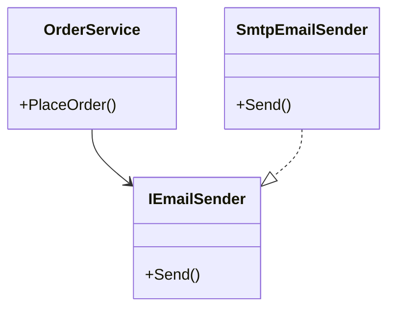
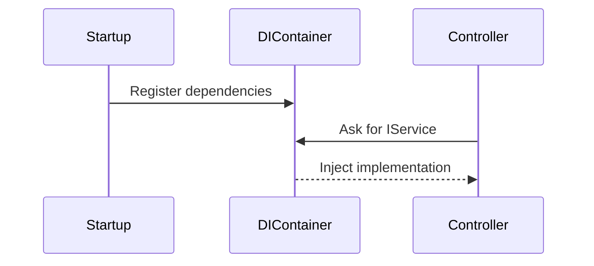

# 🧩 C# Dependency Injection (DI) Training Guide


> Learn how to decouple your code, improve testability, and follow SOLID principles using Dependency Injection in C#.


---


## 📌 What is Dependency Injection?


**Dependency Injection (DI)** is a **design pattern** used to achieve **Inversion of Control (IoC)** between classes and their dependencies.


Instead of creating dependencies inside a class, you pass them in from the outside.


---


## 🎯 Why Use It?


| Benefit             | Description                                      |
|---------------------|--------------------------------------------------|
| 🔁 Decoupling        | Your classes don't directly manage dependencies |
| 🧪 Testability       | Easy to mock in unit tests                      |
| ♻️ Reusability       | Promote interface-based design                  |
| 🔧 Maintainability   | Swap implementations with minimal changes       |


---


## 💡 Without DI (Tightly Coupled)


```csharp

public class OrderService
{
    private EmailSender _email = new EmailSender(); // tightly coupled
    public void PlaceOrder()
    {

        // ...

        _email.Send("Order placed.");
    }
}

```


---


## ✅ With DI (Loosely Coupled)


```csharp

public class OrderService
{
    private readonly IEmailSender _email;
    public OrderService(IEmailSender email)
    {
        _email = email;
    }

    public void PlaceOrder()
    {

        // ...

        _email.Send("Order placed.");
    }
}

```


---


## 🔄Diagram: Dependency Flow





---


## 🧱 Constructor Injection (Most Common)


```csharp

public interface ILogger
{
    void Log(string message);
}

public class ConsoleLogger : ILogger
{
    public void Log(string message) => Console.WriteLine(message);
}

public class UserService
{
    private readonly ILogger _logger;

    public UserService(ILogger logger)
    {
        _logger = logger;
    }

    public void CreateUser(string name)
    {
        _logger.Log($"User '{name}' created.");
    }
}

```


---


## ⚙️ Registering Dependencies (ASP.NET Core)


```csharp

var builder = WebApplication.CreateBuilder(args);
builder.Services.AddScoped<ILogger, ConsoleLogger>();
builder.Services.AddScoped<UserService>();

```


**Lifetime Options:**


| Lifetime     | Description                            |
|--------------|----------------------------------------|
| `Singleton`  | One instance for entire app            |
| `Scoped`     | One per web request                    |
| `Transient`  | New instance every time                |


---


## 🧪 Unit Testing with Mock


```csharp

public class FakeLogger : ILogger
{
    public string LastMessage { get; private set; }
    public void Log(string message)
    {
        LastMessage = message;
    }
}

```


```csharp

var logger = new FakeLogger();
var service = new UserService(logger);

service.CreateUser("Alice");
Console.WriteLine(logger.LastMessage); // ✅ User 'Alice' created.

```


---


## 📦 Real World Services


- `ILogger<T>` from `Microsoft.Extensions.Logging`

- `IOptions<T>` for configuration

- `DbContext` for EF Core

- `IHttpClientFactory`


---


## 📊 Diagram: DI Lifecycle in ASP.NET Core





---


## 📂 Multiple Implementations


```csharp

public class SmsSender : INotification
{
    public void Notify(string msg) => Console.WriteLine($"SMS: {msg}");
}

public class EmailSender : INotification
{
    public void Notify(string msg) => Console.WriteLine($"Email: {msg}");
}

```


```csharp

builder.Services.AddScoped<INotification, SmsSender>();
builder.Services.AddScoped<INotification, EmailSender>(); // 👈 Last wins unless IEnumerable is injected

```


---


## 🧠 Tips & Best Practices


| Tip                               | Why                                 |
|-----------------------------------|--------------------------------------|
| Inject interfaces, not classes    | Enables mocking and switching       |
| Use `IEnumerable<T>` for multiple services | Iterate through implementations |
| Avoid `ServiceLocator` pattern    | Anti-pattern — breaks DI            |
| Prefer constructor injection      | Cleaner, immutable dependencies     |


---


## 🛠️ DIY: Minimal Console DI (Optional)


```csharp

using Microsoft.Extensions.DependencyInjection;

var services = new ServiceCollection();
services.AddSingleton<ILogger, ConsoleLogger>();
services.AddTransient<UserService>();

var provider = services.BuildServiceProvider();
var userService = provider.GetRequiredService<UserService>();

userService.CreateUser("ConsoleUser");

```


---


## ✅ Summary


| Feature             | Purpose                                 |
|---------------------|------------------------------------------|
| DI Pattern          | Pass dependencies from outside           |
| Constructor Injection | Most common and cleanest form         |
| Lifetime Management | Control object reuse                    |
| ASP.NET Core Support | Built-in DI container                   |


---


> 🧑‍💻 Mastering Dependency Injection is essential for clean architecture, maintainability, and testability in modern C# development.

