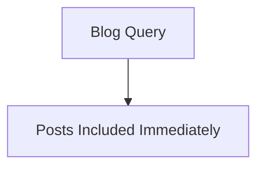
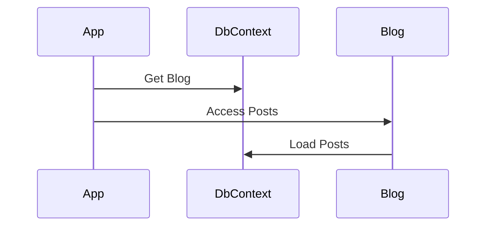
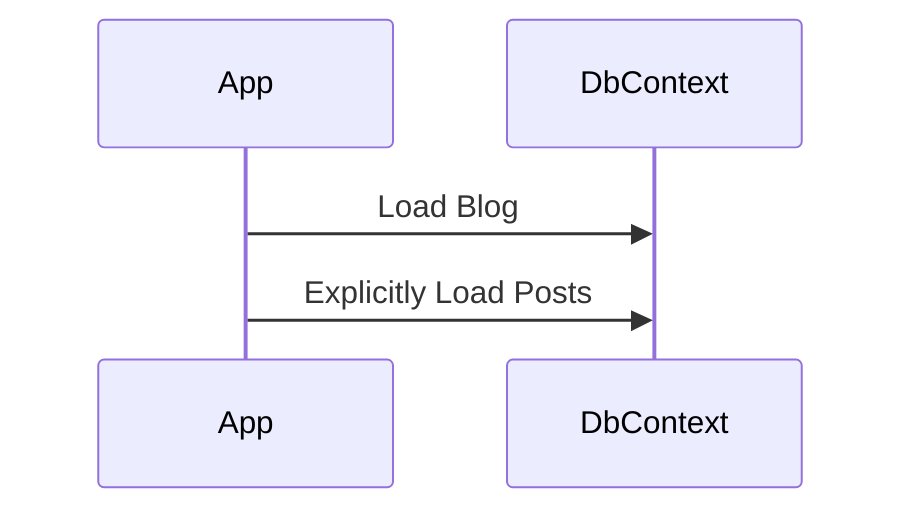

# 🔄 Entity Framework Core: Lazy, Eager, and Explicit Loading

## 🎯 Overview

Entity Framework Core supports **three main ways to load related data**:

| Loading Strategy | When Data is Loaded                             | How It's Loaded                      |
|------------------|--------------------------------------------------|--------------------------------------|
| Eager Loading     | At the time the main entity is queried          | Uses `.Include()` or `.ThenInclude()`|
| Lazy Loading      | Automatically, when the navigation property is accessed | Requires proxy support                |
| Explicit Loading  | Manually, after the entity is loaded            | Uses `.Entry().Reference().Load()`   |

---

## 🏎️ Eager Loading

### ✅ Definition

Eager loading loads **related entities immediately** along with the main entity, in **a single query** using `Include()`.

### 📌 Example

```csharp
var blogs = await context.Blogs
                         .Include(b => b.Posts)
                         .ToListAsync();
```

### 📊 Diagram



### ✅ Use When

- You **always need related data**
- You want **fewer round-trips** to the database

---

## 🐢 Lazy Loading

### ✅ Definition

Lazy loading means related data is **automatically loaded on first access** of a navigation property.

### 📌 Example

```csharp
public class Blog
{
    public int Id { get; set; }
    public string Name { get; set; }
    
    public virtual ICollection<Post> Posts { get; set; } // 'virtual' enables lazy loading
}

// Lazy loading happens here when Posts is accessed
var blog = await context.Blogs.FindAsync(1);
var posts = blog.Posts;
```

### 📦 Requirements

- Install the `Microsoft.EntityFrameworkCore.Proxies` package
- Enable lazy loading in `DbContext`:

```csharp
optionsBuilder
  .UseLazyLoadingProxies()
  .UseSqlServer("connection-string");
```

### 📊 Diagram



### ✅ Use When

- You **don’t always need** related data
- You want to **optimize for initial performance**
- You prefer automatic loading when properties are accessed

---

## 🧭 Explicit Loading

### ✅ Definition

Explicit loading means you manually load the related entities **after** loading the main entity.

### 📌 Example

```csharp
var blog = await context.Blogs.FindAsync(1);

await context.Entry(blog)
             .Collection(b => b.Posts)
             .LoadAsync();
```

### 📊 Diagram



### ✅ Use When

- You want **full control** over loading behavior
- You want to load **condition-based** related data
- You want to load **only some** related items

---

## 🧠 Best Practices Comparison

| Scenario                                       | Preferred Strategy     |
|------------------------------------------------|------------------------|
| Always need related data                       | Eager Loading          |
| Rarely need related data                       | Lazy Loading           |
| Conditionally or filtered related data         | Explicit Loading       |
| Avoiding circular references                   | Explicit or Eager      |
| Complex nested hierarchies                     | Mix of strategies      |

---


## 📘 Bonus: Sample Setup

```bash
dotnet add package Microsoft.EntityFrameworkCore
dotnet add package Microsoft.EntityFrameworkCore.Proxies
```

```csharp
protected override void OnConfiguring(DbContextOptionsBuilder optionsBuilder)
{
    optionsBuilder
        .UseLazyLoadingProxies()
        .UseSqlServer("connection-string");
}
```

---

## 🧪 Hands-On Practice

Create a model with `Blog` and `Posts`, and try:

- `.Include()` (Eager)
- Accessing navigation without `.Include()` (Lazy)
- `.Entry(...).Collection(...).LoadAsync()` (Explicit)

---

## 🧭 Final Tip

Use loading strategies **deliberately**. Don’t just use `Include()` everywhere.  
Balance **performance**, **clarity**, and **data needs** for best results.
