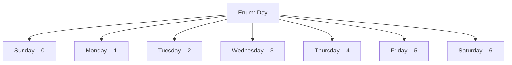

# 🎌 C# `enum` — Enumeration Type


An `enum` in C# (short for *enumeration*) is a **value type** that lets you define a set of **named constants**.


---


## ✅ Basic Syntax


```csharp

public enum Day
{
    Sunday,
    Monday,
    Tuesday,
    Wednesday,
    Thursday,
    Friday,
    Saturday
}

```


### Usage:


```csharp

Day today = Day.Wednesday;
Console.WriteLine(today);        // Output: Wednesday
Console.WriteLine((int)today);   // Output: 3

```


---


## ⚙️ Underlying Type


The default underlying type is `int` (starts from 0). You can change it:


```csharp

public enum Status : byte
{
    Inactive = 0,
    Active = 1,
    Archived = 2
}

```


---


## 🎨 Custom Values


You can assign specific values:


```csharp

public enum HttpStatus
{
    OK = 200,
    NotFound = 404,
    InternalServerError = 500
}

```


---


## 💡 Enum to String and Vice Versa


```csharp

Day d = Day.Friday;
string name = d.ToString();               // "Friday"
Day parsed = Enum.Parse<Day>("Monday");   // Day.Monday

```


---


## 🚀 Flags Enum (Bitwise)


Used when multiple values can be combined using bitwise operators.


```csharp

[Flags]

public enum FileAccess
{
    None    = 0,
    Read    = 1,
    Write   = 2,
    Execute = 4,
    All     = Read | Write | Execute
}

```


```csharp

FileAccess access = FileAccess.Read | FileAccess.Write;
Console.WriteLine(access); // Output: Read, Write

```


---


## 🧠 Useful Enum Methods


```csharp

Enum.GetValues(typeof(Day));     // All enum values
Enum.GetNames(typeof(Day));      // All enum names
Enum.IsDefined(typeof(Day), 2);  // true
Enum.TryParse("Sunday", out Day result);

```


---


## ⚠️ Limitations


- You can't use strings as enum values

- No methods or behavior inside enum itself

- Be cautious with casting unknown integers into enums


---


## 🧬 Diagram — Enum Concept





---


## 🏁 Summary


- ✅ Use enums for clearly defined constant sets

- ✅ Great for readability and intent in code

- ⚠️ Use `[Flags]` when combining multiple values

- 🎯 Cast to/from `int` or `string` when needed


---
