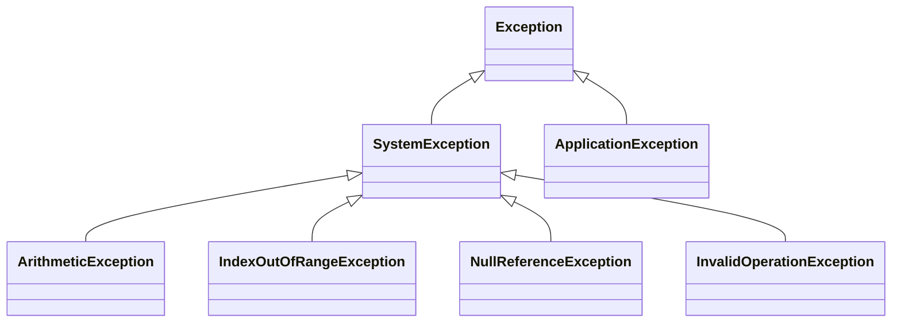

# Error Handling in C#

Error handling in C# is primarily done using **try-catch-finally** blocks and the use of exceptions. It allows developers to handle errors gracefully and maintain application stability.

---

## 🧩 Key Components

| Component   | Purpose |
|-------------|---------|
| `try`       | Defines a block of code to monitor for exceptions. |
| `catch`     | Defines a block of code to handle exceptions. |
| `finally`   | Defines a block of code to execute after try/catch (optional). |
| `throw`     | Throws an exception manually. |

---

## 🧪 Basic Example

```csharp
try
{
    int x = int.Parse("NotANumber");
}
catch (FormatException ex)
{
    Console.WriteLine($"Format error: {ex.Message}");
}
finally
{
    Console.WriteLine("Always runs (cleanup code).");
}
```

---

## 📊 Diagram: Exception Hierarchy



---

## 🛠 Custom Exceptions

```csharp
public class MyCustomException : Exception
{
    public MyCustomException(string message) : base(message) { }
}
```

Usage:

```csharp
throw new MyCustomException("Something went wrong.");
```

---

## 🌍 Best Practices

- Catch specific exceptions, not `Exception` directly.
- Use `finally` for cleanup like closing files, releasing resources.
- Avoid swallowing exceptions (e.g., empty catch blocks).
- Log the error or notify monitoring tools.
- Don’t use exceptions for flow control.

---

## 🔄 Re-throwing Exceptions

```csharp
try
{
    // Code
}
catch (Exception ex)
{
    Console.WriteLine("Logging error...");
    throw; // rethrows the original exception preserving stack trace
}
```

---

## 🧭 When to Use What

| Scenario                            | Approach                  |
|-------------------------------------|---------------------------|
| Invalid input format                | `FormatException`         |
| Accessing null object               | `NullReferenceException`  |
| Array index out of bounds           | `IndexOutOfRangeException`|
| Division by zero                    | `DivideByZeroException`   |
| Custom domain-specific issue        | Custom exception          |

---

## 📚 Further Reading

- Microsoft Docs: [Exception Handling](https://learn.microsoft.com/en-us/dotnet/csharp/fundamentals/exceptions/)
- Logging libraries like Serilog or NLog
