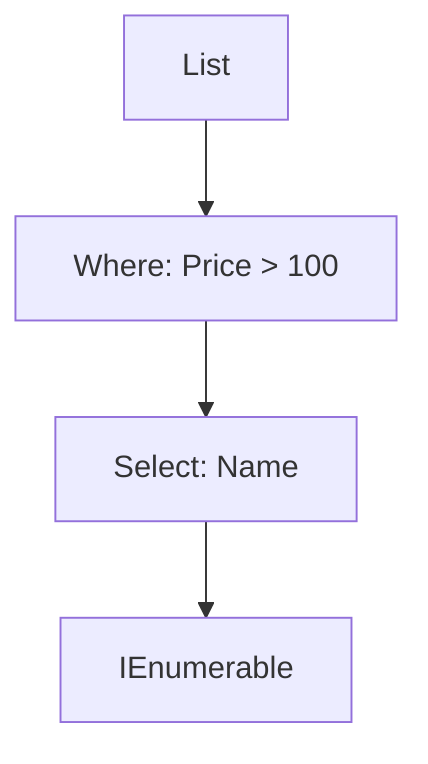

# 🔍 C# LINQ — Real-World Guide

**LINQ (Language Integrated Query)** is a powerful query syntax built into C# for working with **collections**, **databases**, **XML**, and more — using a SQL-like approach.

> Think of it as **SQL for C# objects** — with full IntelliSense, type safety, and compile-time checking.

---

## 📦 Sample Dataset: In-Memory Objects


```csharp

var products = new List<Product>
{
    new Product { Id = 1, Name = "Laptop", Price = 1200 },
    new Product { Id = 2, Name = "Mouse", Price = 20 },
    new Product { Id = 3, Name = "Monitor", Price = 250 },
    new Product { Id = 4, Name = "Keyboard", Price = 45 }
};

```
🔧 LINQ Syntaxes

Method Syntax (Most Common)
```csharp
var expensive = products
    .Where(p => p.Price > 100)
    .Select(p => p.Name);

```

Query Syntax (SQL-like)


```csharp
var expensive =
    from p in products
    where p.Price > 100
    select p.Name;
```
Both produce: "Laptop", "Monitor"


🔁 Common LINQ Operations

### Operation
---
**Where**

Syntax Example
```csharp
.Where(p => p.Price > 100)
```
- Description: Filter records
---
**Select**

Syntax Example
```csharp
.Select(p => p.Name)
```
- Description:  Projection / mapping
---
**OrderBy**

Syntax Example
```csharp
.OrderBy(p => p.Price)
```
- Description: Ascending sort
---
**GroupBy**

Syntax Example
```csharp
.GroupBy(p => p.Category)
```
- Description:  Group into subcollections
---
**Any**

Syntax Example
```csharp
.Any(p => p.Price > 1000)
```
Description: Existence check
---
**FirstOrDefault**

Syntax Example
```csharp
.FirstOrDefault(p => p.Id == 3)
```
- Description:  Safe retrieval
---
🧪 Example: Get Top 2 Cheapest Products

```csharp
var top2 = products
    .OrderBy(p => p.Price)
    .Take(2)
    .Select(p => $"{p.Name}: ${p.Price}");
foreach (var p in top2)
    Console.WriteLine(p);
```
Output:
Mouse: $20
Keyboard: $45

📊 Diagram: LINQ Pipeline




🧩 Grouping Example


```csharp
var groups = products
    .GroupBy(p => p.Price > 100 ? "Expensive" : "Cheap");
foreach (var group in groups)
{
    Console.WriteLine(group.Key);
    foreach (var product in group)
        Console.WriteLine($" - {product.Name}");
}
```
Output:
Expensive
 - Laptop
 - Monitor
   
Cheap
 - Mouse
 - Keyboard


⚡ Advanced: Joining Two Collections


```csharp
var categories = new[]
{
    new { Id = 1, Name = "Electronics" },
    new { Id = 2, Name = "Accessories" }
};
var products = new[]
{
    new { Id = 1, Name = "Mouse", CategoryId = 2 },
    new { Id = 2, Name = "Monitor", CategoryId = 1 }
};
var joined = products.Join(categories,
    p => p.CategoryId,
    c => c.Id,
    (p, c) => $"{p.Name} => {c.Name}");
foreach (var item in joined)
    Console.WriteLine(item);
```
Output:
Mouse => Accessories
Monitor => Electronics

🧠 Summary


- Concept

- Purpose

- Where: Filter elements

- Select: Project/transform data

- GroupBy: Create grouped collections

- Join: Merge two sequences by key

- ToList(): Materialize results into a list

LINQ is declarative, readable, and powerful — especially when working with in-memory or ORM-backed datasets.

✅ When to Use LINQ?

Manipulating List<T>, IEnumerable<T>
Reading structured data (JSON/XML/SQL)
Aggregations (sum, average, count)
Projections and mappings


💡 Bonus Tips


LINQ is lazy — it doesn’t execute until you enumerate it.
Use .ToList() or .ToArray() to force immediate execution.
Chaining multiple LINQ operations is efficient and clean.


---


