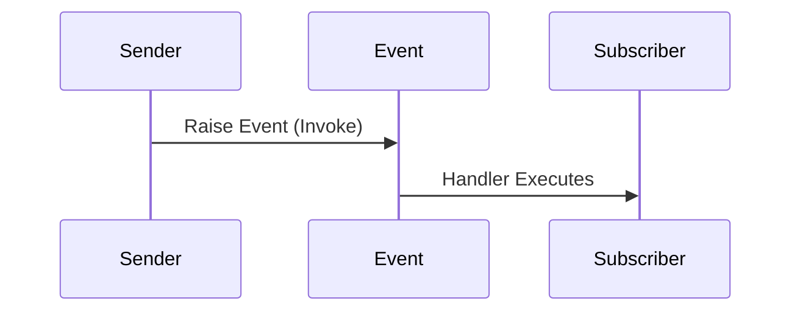
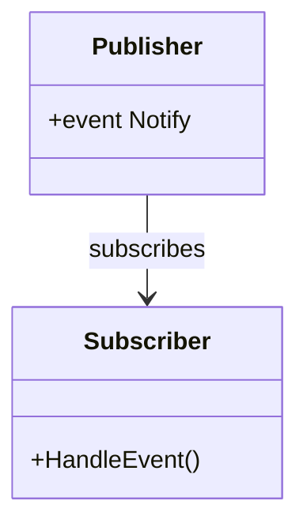

# 📢 C# Events Guide


> Learn how to use **Events** in C# to implement the Observer pattern and enable communication between components.


---


## 📌 What Are Events?


Events are a way for an object to **notify** other objects when something **happens**.


- Based on **delegates**

- Enable **loose coupling**

- Common in UI and event-driven architectures


---


## 🔧 Basic Event Syntax


```csharp

public class Button
{
    public event EventHandler Clicked;
    public void SimulateClick()
    {
        Clicked?.Invoke(this, EventArgs.Empty);
    }
}

```


```csharp

var button = new Button();
button.Clicked += (sender, e) => Console.WriteLine("Button clicked!");
button.SimulateClick();

```


✅ Output: `Button clicked!`


---


## 🧠 Behind the Scenes


- Events are built on **delegates**

- Only the class that declares the event can **raise** it

- Other classes can only **subscribe/unsubscribe**


---


## 🧩 Custom EventArgs Example


```csharp

public class MessageEventArgs : EventArgs
{
    public string Message { get; set; }
}
public class Messenger
{
    public event EventHandler<MessageEventArgs> MessageSent;
    public void Send(string msg)
    {
        MessageSent?.Invoke(this, new MessageEventArgs { Message = msg });
    }
}

```


```csharp

var messenger = new Messenger();
messenger.MessageSent += (s, e) => Console.WriteLine($"Received: {e.Message}");
messenger.Send("Hello!");

```


---


## 📈 Diagram: Event Flow Diagram





---


## 🔐 Event Access Control


```csharp

public event EventHandler SomethingHappened; // public to subscribe
protected void OnSomethingHappened()         // only class can raise
{
    SomethingHappened?.Invoke(this, EventArgs.Empty);
}

```


---


## 🔄 Add / Remove Handlers


```csharp

void Handler(object sender, EventArgs e) => Console.WriteLine("Handled");

obj.MyEvent += Handler; // Subscribe
obj.MyEvent -= Handler; // Unsubscribe

```


---


## 🧪 Exercise: Temperature Sensor


```csharp

public class TemperatureChangedEventArgs : EventArgs
{
    public double Temperature { get; set; }
}
public class Sensor
{
    public event EventHandler<TemperatureChangedEventArgs> TemperatureChanged;
    public void Update(double temp)
    {
        TemperatureChanged?.Invoke(this, new TemperatureChangedEventArgs { Temperature = temp });
    }
}

```


**Usage**


```csharp

var sensor = new Sensor();
sensor.TemperatureChanged += (s, e) => Console.WriteLine($"Temp = {e.Temperature}");
sensor.Update(23.5);

```


---


## 💡 When to Use Events


| Scenario                         | Example                        |
|----------------------------------|--------------------------------|
| UI Interaction                   | Button clicked, key pressed   |
| Real-time Monitoring             | Sensor updated, value changed |
| Background Process Notification  | Task completed, error raised  |


---


## ⚠️ Best Practices


| Practice                           | Why                              |
|------------------------------------|-----------------------------------|
| Use `?.Invoke(...)`                | Prevents null reference exceptions |
| Use `EventHandler<T>` with `EventArgs` | Standard and reusable            |
| Unsubscribe in `Dispose()`         | Prevent memory leaks              |
| Don't expose delegate directly     | Use `event` keyword instead       |


---


## 📊 Diagram: Observer Pattern





---


## 🧠 Advanced Topics


- Multicast delegates (invoking multiple handlers)

- `+=` vs `delegate` assignment

- Event bubbling (e.g., in UI frameworks)

- Weak events (to avoid memory leaks)


---


## ✅ Summary


| Concept         | Description                                  |
|------------------|----------------------------------------------|
| Event            | Notification system based on delegates       |
| Publisher        | Raises (fires) the event                     |
| Subscriber       | Reacts to the event                          |
| EventArgs        | Data passed during the event                 |
| Best Practice    | Use `EventHandler<T>` with custom args       |


---


> 🔔 Events enable loose, decoupled communication between objects. A core pattern in UI, game, and reactive systems.
