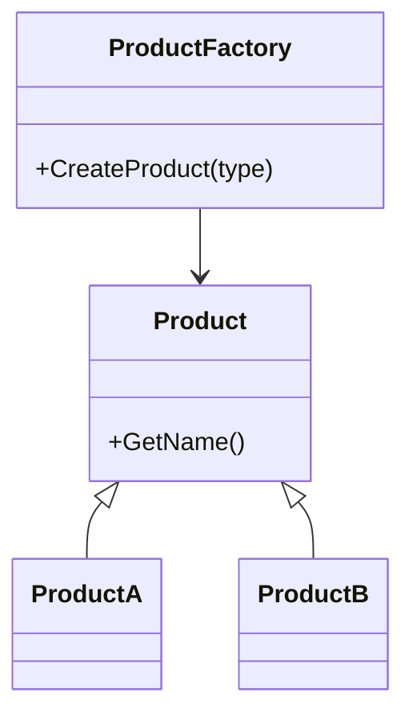

# 🏭 Factory Pattern

**Definition:** A creational design pattern that lets you create objects without specifying the exact class of object that will be created.

## C# Example

```csharp
public abstract class Product
{
    public abstract string GetName();
}

public class ProductA : Product
{
    public override string GetName() => "Product A";
}

public class ProductB : Product
{
    public override string GetName() => "Product B";
}

public class ProductFactory
{
    public Product CreateProduct(string type)
    {
        return type switch
        {
            "A" => new ProductA(),
            "B" => new ProductB(),
            _ => throw new ArgumentException("Unknown product type")
        };
    }
}
```

## Usage

```csharp
var factory = new ProductFactory();
Product product = factory.CreateProduct("A");
Console.WriteLine(product.GetName());  // Output: Product A
```

## Diagram



---
