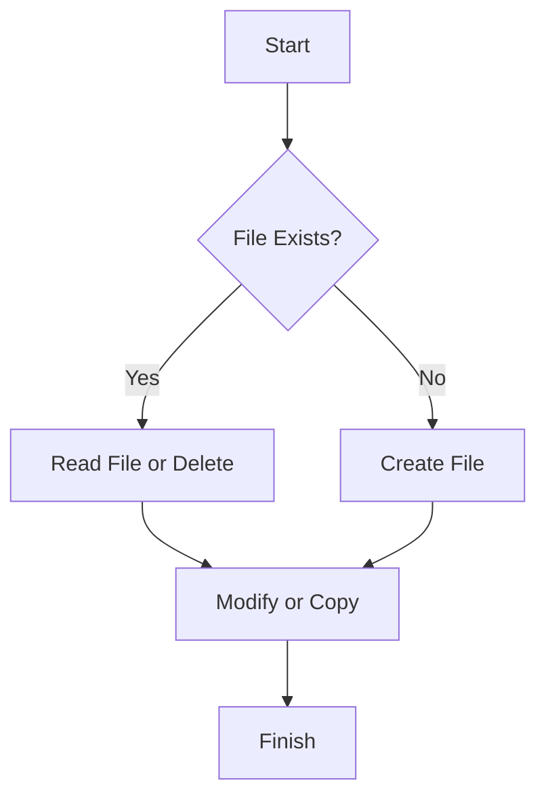

# 📂 File Operations in C#

---

## 📌 Overview

C# provides powerful APIs to perform file operations such as creating, reading, writing, copying, moving, and deleting files using the `System.IO` namespace.

---

## 🔧 Common Namespaces

```csharp
using System.IO;
```

---

## 1️⃣ Creating and Writing to a File

```csharp
string path = "example.txt";

// Write text to a new file (overwrites if exists)
File.WriteAllText(path, "Hello, File!");

// Append text to the file
File.AppendAllText(path, "\nAppended line.");
```

---

## 2️⃣ Reading from a File

```csharp
string content = File.ReadAllText(path);
Console.WriteLine(content);

// Read lines one by one
string[] lines = File.ReadAllLines(path);
foreach (var line in lines)
{
    Console.WriteLine(line);
}
```

---

## 3️⃣ Using `StreamReader` and `StreamWriter` (for large files or streaming)

```csharp
// Writing with StreamWriter
using (StreamWriter writer = new StreamWriter("stream.txt"))
{
    writer.WriteLine("Line 1");
    writer.WriteLine("Line 2");
}

// Reading with StreamReader
using (StreamReader reader = new StreamReader("stream.txt"))
{
    string line;
    while ((line = reader.ReadLine()) != null)
    {
        Console.WriteLine(line);
    }
}
```

---

## 4️⃣ Checking File Existence and Deleting

```csharp
if (File.Exists(path))
{
    File.Delete(path);
    Console.WriteLine($"{path} deleted.");
}
else
{
    Console.WriteLine($"{path} not found.");
}
```

---

## 5️⃣ Copying and Moving Files

```csharp
// Copy file (overwrite: true)
File.Copy("example.txt", "example_copy.txt", overwrite: true);

// Move (or rename) file
File.Move("example_copy.txt", "new_location/example_renamed.txt");
```

---

## 6️⃣ Working with FileInfo for More Control

```csharp
FileInfo fi = new FileInfo("example.txt");

Console.WriteLine($"File size: {fi.Length} bytes");
Console.WriteLine($"Created: {fi.CreationTime}");
Console.WriteLine($"Last Accessed: {fi.LastAccessTime}");

// Delete file using FileInfo
fi.Delete();
```

---

## 7️⃣ Asynchronous File Operations (`async` / `await`)

```csharp
// Async write
await File.WriteAllTextAsync("async.txt", "Hello Async");

// Async read
string content = await File.ReadAllTextAsync("async.txt");
Console.WriteLine(content);
```

---

## 📊 Summary Table

| Operation         | Method                         | Notes                       |
|-------------------|--------------------------------|-----------------------------|
| Write all text    | `File.WriteAllText`             | Overwrites or creates file   |
| Append text      | `File.AppendAllText`            | Adds to existing file        |
| Read all text    | `File.ReadAllText`              | Reads whole file as string   |
| Read all lines   | `File.ReadAllLines`             | Reads file lines into array  |
| Check existence  | `File.Exists`                   | Boolean check                |
| Delete file      | `File.Delete`                   | Deletes file                 |
| Copy file        | `File.Copy`                     | Can overwrite                |
| Move file        | `File.Move`                     | Rename or move               |
| File info        | `FileInfo` class                | Detailed file info and ops   |
| Async operations | `File.WriteAllTextAsync` etc.  | Non-blocking I/O             |

---

## 🧭 Mermaid Diagram — Basic File Operation Flow



---

## ✅ Best Practices

- Always check if the file exists before reading or deleting.
- Use `using` blocks or async methods to avoid file locks.
- Handle exceptions like `IOException` and `UnauthorizedAccessException`.
- Prefer async methods in UI or server apps to avoid blocking threads.

---

## 📚 References

- [Microsoft Docs - System.IO.File](https://learn.microsoft.com/en-us/dotnet/api/system.io.file)
- [Microsoft Docs - FileInfo Class](https://learn.microsoft.com/en-us/dotnet/api/system.io.fileinfo)
