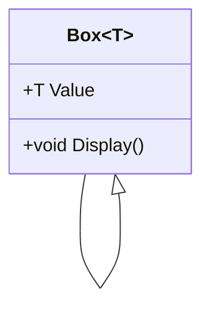
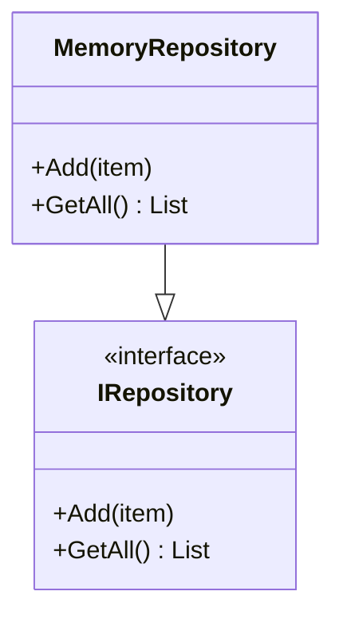

# 📘 C# Generics Guide


> Learn how to master Generics in C# through theory, code, diagrams, and exercises.


---


## 📌 What Are Generics?


Generics let you define classes, interfaces, methods, and delegates with a **placeholder for a data type**.


```csharp

List<int> numbers = new List<int>();

```


The `List<T>` class is a generic. You can create strongly-typed lists without boxing or casting.


---


## 🔧 Why Use Generics?


- Type Safety ✅

- Code Reuse 🔁

- Performance ⚡ (no boxing/unboxing)

- Clarity & Maintainability 📚


---


## 🏗️ Basic Generic Class


```csharp

public class Box<T>
{
    public T Value { get; set; }
    public void Display() => Console.WriteLine($"Value: {Value}");
}

```


### ✅ Usage


```csharp

var intBox = new Box<int> { Value = 42 };
intBox.Display(); // Output: Value: 42

var strBox = new Box<string> { Value = "hello" };
strBox.Display(); // Output: Value: hello

```


---


## 🎯 Generic Method


```csharp

public class Utilities
{
    public void Print<T>(T input)
    {
        Console.WriteLine(input);
    }
}

```


---


## 🌐 Class Diagram





---


## 🧩 Generic Constraints


```csharp

public class Repository<T> where T : class, new()
{
    public T CreateInstance()
    {
        return new T(); // T must have a parameterless constructor
    }
}

```


### Types of Constraints


| Constraint         | Meaning                                |
|--------------------|----------------------------------------|
| `where T : class`  | T must be a reference type             |
| `where T : struct` | T must be a value type                 |
| `where T : new()`  | T must have a public parameterless ctor |
| `where T : BaseClass` | T must inherit from `BaseClass`     |
| `where T : IMyInterface` | T must implement the interface  |


---


## 🔁 Generic Interface


```csharp

public interface IRepository<T>
{
    void Add(T item);
    IEnumerable<T> GetAll();
}

```


```csharp

public class MemoryRepository<T> : IRepository<T>
{
    private List<T> items = new List<T>();
    public void Add(T item) => items.Add(item);
    public IEnumerable<T> GetAll() => items;
}

```


---


## 🔄 Diagram: Interface Implementation





---


## 🧪 Exercises


### 1. Generic Swap Method


```csharp

public static void Swap<T>(ref T a, ref T b)
{
    T temp = a;
    a = b;
    b = temp;

}

```


**Try it:**

```csharp

int x = 1, y = 2;
Swap(ref x, ref y); // x = 2, y = 1

```


---


### 2. Generic Stack Class


```csharp

public class MyStack<T>
{
    private List<T> list = new List<T>();
    public void Push(T item) => list.Add(item);
    public T Pop()
    {
        T item = list[^1];
        list.RemoveAt(list.Count - 1);
        return item;
    }
}

```


---


## 📈 Advanced Topics (Optional)


- Covariance & Contravariance (`out T`, `in T`)

- Generic Delegates (`Func<T>`, `Action<T>`)

- Nullable Generics (`T?` in .NET 6+)

- Generic Math Interfaces (with `INumber<T>`)


---


## ✅ Summary


| Feature             | Benefit                    |
|---------------------|----------------------------|
| Generic Class       | Reusable type-safe classes |
| Generic Method      | Code reuse in functions    |
| Constraints         | Compile-time type safety   |
| Interfaces + Generics | Decoupled architecture   |


---


> 🧠 Generics are a foundation of clean, reusable, and efficient C# code. Keep practicing by building reusable libraries!

