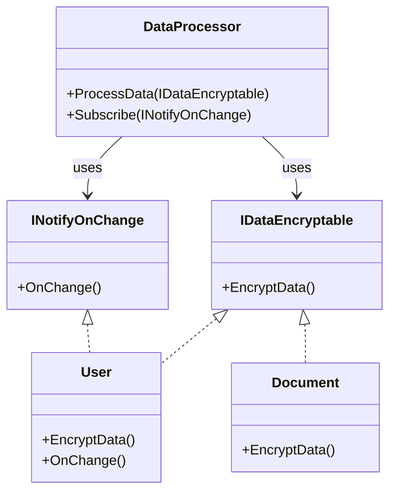
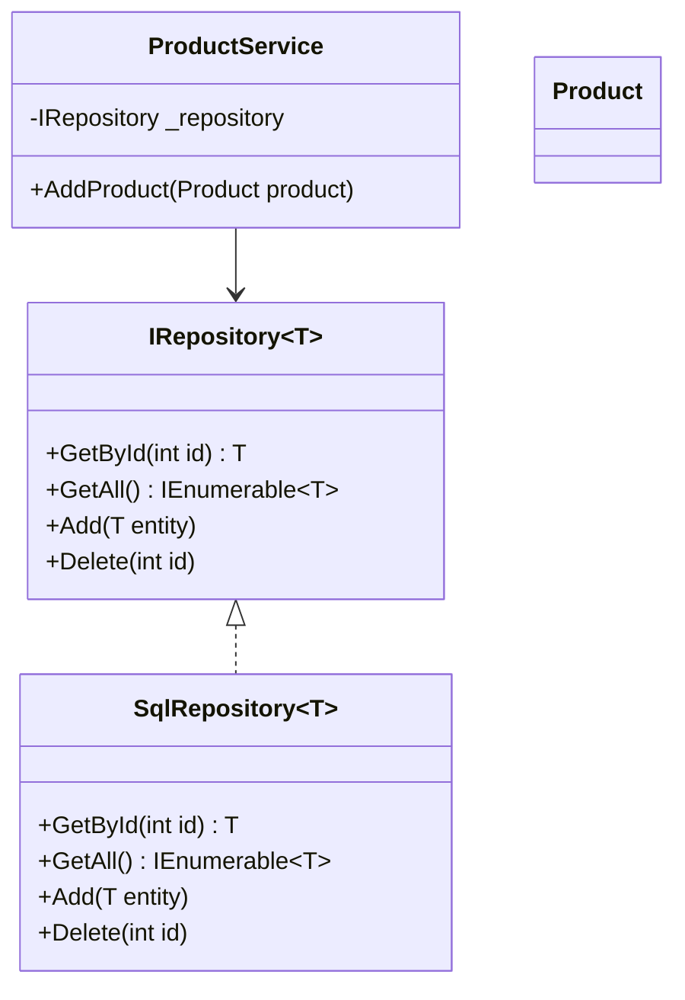
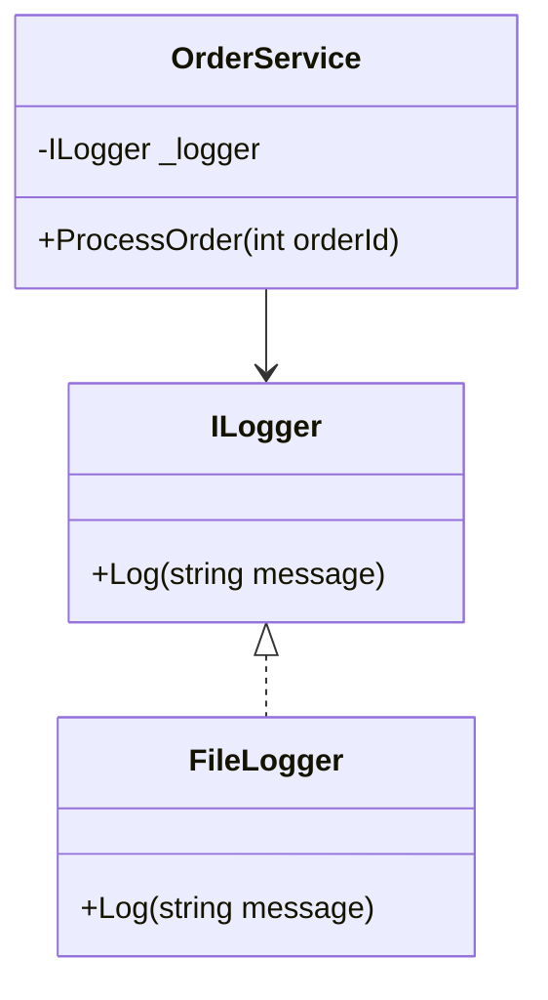

## 📘 What is an `Interface`?

Interfaces define contracts that classes must follow — especially common in service-oriented and layered architectures.

## Interfaces in C#: A Conceptual Overview

In the C# programming language, **interfaces** define a contract that implementing classes must adhere to. They specify a set of members—such as methods, properties, and events—that a class must implement, without providing any implementation logic themselves. Interfaces play a key role in building **loosely coupled systems**, enabling **dependency injection**, and enhancing **testability** within your codebase.

In C#, classes are used to define and instantiate objects. Different kinds of objects are created by defining different classes, each with its own set of properties, methods, and related information. Interfaces, however, differ from classes in several important ways. Rather than describing discrete objects, **interfaces define behavior**. When a class implements an interface, it is essentially stating that *"this class is capable of performing a specific behavior."*

For example, suppose you want different types of objects in your application to have a particular capability—such as the ability to encrypt their data or to broadcast an event when their internal state changes. You could define an interface to represent that capability. Then, any class that needs to offer that behavior would implement the interface accordingly. Other classes in the application can then interact with such objects through the interface, without needing to know the specific type of the underlying class. They only need to know that the object supports the defined interface, and therefore, the specified behavior.




In this sense, an interface acts as a **contract**. When you have a reference to an object that implements a given interface, you are assured that the object provides the functionalities declared by that interface.

---

## Key Points to Remember About Interfaces in C#

- **Interfaces define behavior, not concrete classes.**
- **A single interface can be implemented by many different classes.**
- **A C# class can inherit from only one base class but may implement multiple interfaces.**
- **Interfaces do not contain implementation logic; they only declare the structure of expected functionality.**
- **The implementing class is responsible for providing the actual behavior.**

---

## 🛠️ Example: IRepository Pattern (Generic Repository)

### Interface

```csharp

public interface IRepository<T>
{
    T GetById(int id);
    IEnumerable<T> GetAll();
    void Add(T entity);
    void Delete(int id);
}
```


### Implementation

```csharp

public class SqlRepository<T> : IRepository<T>
{
    public T GetById(int id)
    {
        // Simulated database fetch
        Console.WriteLine($"Fetching {typeof(T).Name} with ID {id}");
        return default!;
    }
    public IEnumerable<T> GetAll()
    {
        return new List<T>(); // Simulated list
    }
    public void Add(T entity)
    {
        Console.WriteLine($"{typeof(T).Name} added to SQL database");
    }
    public void Delete(int id)
    {
        Console.WriteLine($"{typeof(T).Name} with ID {id} deleted from SQL");
    }
}
```
✨ Usage with Service
```csharp
public class ProductService
{
    private readonly IRepository<Product> _repository;
    public ProductService(IRepository<Product> repository)
    {
        _repository = repository;
    }
    public void AddProduct(Product product)
    {
        _repository.Add(product);
    }
}

```

📊 Class Diagram



🔔 Logging Interface Example

```csharp

public interface ILogger
{
    void Log(string message);
}
public class FileLogger : ILogger
{
    public void Log(string message)
    {
        File.AppendAllText("log.txt", $"{DateTime.Now}: {message}\n");
    }
}

```

### Usage with Dependency Injection

```csharp

public class OrderService
{
    private readonly ILogger _logger;
    public OrderService(ILogger logger)
    {
        _logger = logger;
    }
    public void ProcessOrder(int orderId)
    {
        // Order processing logic...
        _logger.Log($"Order {orderId} processed.");
    }
}

```


📊 Diagram for Logger




📚 Summary


Concept

Real-World Use Case

IRepository<T>

Abstract data access layer

ILogger

Pluggable logging mechanisms

Dependency Injection

Swap implementations easily

✅ Interfaces allow clean separation of concerns and make your code loosely coupled, testable, and scalable.

---
