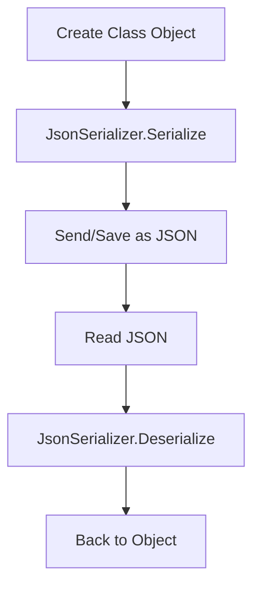

# 🧾 JSON Operations in C#


---


## 📌 What is JSON?


**JSON** (JavaScript Object Notation) is a lightweight data-interchange format that is easy for humans to read and write and easy for machines to parse and generate.


In C#, we use libraries such as:


- `System.Text.Json` (modern and built-in)

- `Newtonsoft.Json` (popular, external package)


---


## 🔧 Recommended Library: `System.Text.Json`


Built into .NET Core 3.0+ and .NET 5/6/7/8.


```csharp

using System.Text.Json;

```


---


## 📤 Serialize an Object to JSON


```csharp

public class Person
{
    public string Name { get; set; }
    public int Age { get; set; }
}
var person = new Person { Name = "Alice", Age = 30 };
string json = JsonSerializer.Serialize(person);
Console.WriteLine(json); // {"Name":"Alice","Age":30}

```


---


## 📥 Deserialize JSON to Object


```csharp

string json = "{\"Name\":\"Alice\",\"Age\":30}";
var person = JsonSerializer.Deserialize<Person>(json);
Console.WriteLine(person.Name); // Alice
Console.WriteLine(person.Age);  // 30

```


---


## 📑 Working with JSON Files


```csharp

// Write to file
File.WriteAllText("person.json", json);
// Read from file
string content = File.ReadAllText("person.json");
var loadedPerson = JsonSerializer.Deserialize<Person>(content);

```


---


## 🧪 Handling Complex/Nested Objects


```csharp

public class Company
{
    public string Name { get; set; }
    public List<Person> Employees { get; set; }
}
var company = new Company
{
    Name = "TechCorp",
    Employees = new List<Person>
    {
        new Person { Name = "Alice", Age = 30 },
        new Person { Name = "Bob", Age = 25 }
    }
};
string json = JsonSerializer.Serialize(company, new JsonSerializerOptions { WriteIndented = true });
Console.WriteLine(json);

```


---


## 🔄 Serialize with Options (Pretty Print, CamelCase)


```csharp

var options = new JsonSerializerOptions
{
    WriteIndented = true,
    PropertyNamingPolicy = JsonNamingPolicy.CamelCase
};
string json = JsonSerializer.Serialize(person, options);

```


---


## 🕵️ Read JSON Without a Class (JsonDocument)


```csharp

string json = "{\"Name\":\"Alice\",\"Age\":30}";
using var doc = JsonDocument.Parse(json);
string name = doc.RootElement.GetProperty("Name").GetString();
int age = doc.RootElement.GetProperty("Age").GetInt32();

```


---


## 🚫 Error Handling in JSON


```csharp

try
{
    var person = JsonSerializer.Deserialize<Person>("invalid json");
}
catch (JsonException ex)
{
    Console.WriteLine("Invalid JSON: " + ex.Message);
}

```


---


## 🧭 Diagram – JSON Operations Flow





---


## 📚 Newtonsoft.Json (Alternative)


```bash

dotnet add package Newtonsoft.Json

```


```csharp

using Newtonsoft.Json;
string json = JsonConvert.SerializeObject(person, Formatting.Indented);
Person p = JsonConvert.DeserializeObject<Person>(json);

```


---


## ✅ Summary


| Operation | Method | Example |
| ----- | ------ | ----- |
| Serialize | `JsonSerializer.Serialize` | Convert object → JSON string |
| Deserialize | `JsonSerializer.Deserialize` | JSON string → Object |
| File I/O | `File.WriteAllText` | `ReadAllText` | Read/write JSON to files |
| Dynamic Access | `JsonDocument` | Read JSON without model |
| Legacy Support | `Newtonsoft.Json` | Older projects or advanced use cases |


---


## 🧪 Bonus: Serialize Anonymous Type


```csharp

var anon = new { Name = "Charlie", Score = 85 };
string json = JsonSerializer.Serialize(anon);

```


---


## 🧰 Recommended Tools


- [jsonlint.com](https://jsonlint.com/) – Validate JSON

- Visual Studio / VS Code with `System.Text.Json` Intellisense
