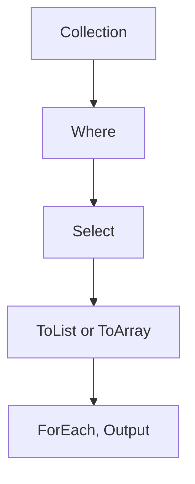

# 🔍 C# LINQ — Language Integrated Query


**LINQ (Language Integrated Query)** is a powerful feature in C# that lets you query data directly in C# using a clean, readable syntax — whether the data comes from arrays, collections, XML, SQL databases, or other sources.


---


## 📦 1. What Can You Query with LINQ?


- Arrays

- Lists

- Dictionaries

- DataTables

- XML

- Entity Framework (EF)

- Custom collections


---


## 🧪 2. LINQ Syntax Styles


### ➕ Query Syntax (SQL-like)


```csharp

var result = from n in numbers

             where n > 5

             orderby n

             select n;

```


### ➕ Method Syntax (Fluent)


```csharp

var result = numbers.Where(n => n > 5)

                    .OrderBy(n => n);

```


> 🔹 Both styles compile to the same code under the hood.


---


## 🧰 3. Common LINQ Methods


| Method        | Description                         |
|---------------|-------------------------------------|
| `Where`       | Filters based on a condition        |
| `Select`      | Projects each element               |
| `OrderBy`     | Sorts in ascending order            |
| `OrderByDescending` | Sorts in descending order    |
| `GroupBy`     | Groups elements                     |
| `Join`        | Joins two sequences                 |
| `Distinct`    | Removes duplicates                  |
| `Take`, `Skip`| Pagination                          |
| `Any`, `All`  | Boolean checks                      |
| `First`, `FirstOrDefault` | Retrieve single element |


---


## 📌 4. Example: Basic Usage


```csharp

int[] numbers = { 1, 3, 5, 7, 9 };
var evenNumbers = numbers
    .Where(n => n % 2 == 0)
    .ToList();

Console.WriteLine(string.Join(",", evenNumbers));

```


---


## 🧠 5. Using LINQ with Objects


```csharp

public class Product
{
    public string Name { get; set; }
    public double Price { get; set; }
}

var products = new List<Product>
{
    new() { Name = "Book", Price = 12.99 },
    new() { Name = "Laptop", Price = 999.99 },
    new() { Name = "Pen", Price = 1.99 }
};

var expensive = products
    .Where(p => p.Price > 100)
    .Select(p => p.Name);

```


---


## 🔄 6. Grouping and Aggregates


```csharp

var grouped = products
    .GroupBy(p => p.Price > 100 ? "Expensive" : "Cheap");

foreach (var group in grouped)
{
    Console.WriteLine(group.Key);
    foreach (var product in group)
        Console.WriteLine($"- {product.Name}");
}

```


---


## 🔗 7. Join Example


```csharp

var customers = new[] {
    new { Id = 1, Name = "Alice" },
    new { Id = 2, Name = "Bob" }
};

var orders = new[] {
    new { Id = 1, CustomerId = 1, Total = 250 },
    new { Id = 2, CustomerId = 2, Total = 100 }
};

var result = from c in customers
             join o in orders on c.Id equals o.CustomerId
             select new { c.Name, o.Total };

```


---


## ⚠️ 8. Deferred Execution


LINQ queries are **not executed immediately**. They are deferred until enumerated with `.ToList()`, `.ToArray()`, `.Count()`, etc.


```csharp

var filtered = products.Where(p => p.Price > 10);
// Not executed yet
var list = filtered.ToList(); // Executed now

```


---


## 🧪 9. LINQ with Anonymous Types


```csharp

var summary = products
    .Select(p => new { p.Name, TaxedPrice = p.Price * 1.18 });

```


---


## 🧱 10. Chaining Multiple LINQ Methods


```csharp

var names = products
    .Where(p => p.Price > 10)
    .OrderBy(p => p.Name)
    .Select(p => p.Name);

```


---


## 🗺️ Summary Diagram





---


## 🔥 Best Practices


- Use `FirstOrDefault()` instead of `First()` if the collection might be empty

- Avoid unnecessary `ToList()` — it breaks deferred execution

- Combine filtering and projection for efficiency

- Use method syntax for dynamic query composition


---


## ✅ Example Program


```csharp

public class Program
{
    public static void Main()
    {
        var names = new[] { "Alice", "Bob", "Charlie", "Dave" };
        var result = names
            .Where(n => n.Length <= 4)
            .OrderBy(n => n)
            .ToList();

        result.ForEach(Console.WriteLine);
    }
}

```


---


## 📚 LINQ Resources


- [`System.Linq` namespace](https://learn.microsoft.com/en-us/dotnet/api/system.linq)

- LINQPad: Tool for testing LINQ queries

- Entity Framework LINQ Support
