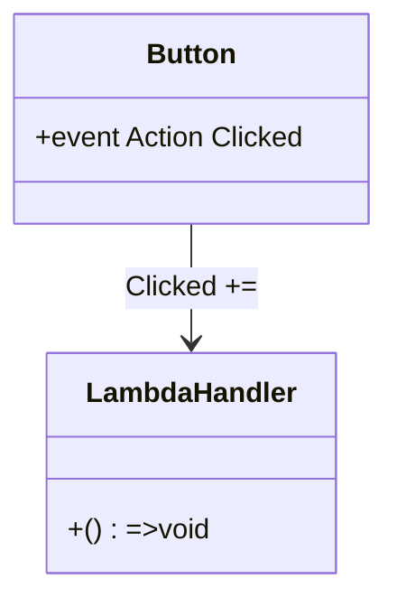

# 🧠 C# Lambda Functions


A **lambda function** is a concise way to represent an **anonymous method** using the `=>` operator.


> Think of lambdas as **inline functions** — fast to write, powerful to use, especially with LINQ, events, and delegates.


---


## 🔧 Basic Syntax


(parameter) => expression

If the lambda contains more than one statement, use {}:
```csharp
(x, y) => {
    var sum = x + y;
    return sum;
}

```


✅ Example: Replacing Anonymous Method


Action\<string\> log = msg => 

Console.WriteLine($"[LOG] {msg}");

log("App started.");


Equivalent Traditional Code:


```csharp
void Log(string msg)
{
    Console.WriteLine($"[LOG] {msg}");
}
```


📦 With Func, Action, Predicate


| Delegate Type   |   Signature     |         Example        |        Usage|
| --- | --- | --- | --- |
| Action\<T\> | (T) => void | Action\<string\> | log = s => Console.WriteLine(s); |
| Func<T, R>      |   (T) => R        |       Func<int, int>       |  square = x => x * x;|
| Predicate\<T\>    |   (T) => bool       |     Predicate\<int\>     |    isEven = x => x % 2 == 0;|


🔄 LINQ + Lambda = 🔥


```csharp
var products = new[] { "Book", "Laptop", "Pen", "Notebook" };
var filtered = products.Where(p => p.Length > 4)
                       .Select(p => p.ToUpper());
foreach (var p in filtered)
    Console.WriteLine(p);
```
Output:

Book

Laptop

Notebook


🧪 Real-World Example: Event with Lambda


```csharp
var button = new Button();
button.Clicked += () => Console.WriteLine("Button clicked!");
```


🧬 Lambda with Custom Delegates


```csharp
public delegate int Operation(int a, int b);
Operation sum = (a, b) => a + b;
Operation mul = (a, b) => a * b;
Console.WriteLine(sum(2, 3));  // 5
Console.WriteLine(mul(2, 3));  // 6
```


📊 Diagram: Delegate and Lambda





🧩 Summary


| Concept | Description |
| --- | --- |
| => | Lambda operator (goes to) |
| Func, Action | Built-in delegate types for lambdas |
| Inline Event Hook | No need to define separate methods |
| Common in LINQ | Filtering, projection, grouping etc. |

Lambdas make your code shorter, cleaner, and often more readable — when used responsibly.


❗ Best Practices


✅ Use lambdas for short, stateless logic
⚠️ Avoid complex multi-line lambdas — prefer named methods
✅ Combine with LINQ and events for clean declarative code


---

