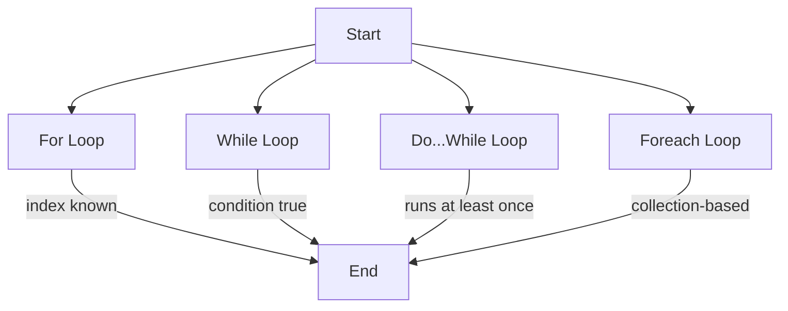

# 🔁 C# Loops — Complete Guide with Examples


Loops in C# allow us to **execute a block of code multiple times** based on conditions. C# provides several types of loops for different use cases.


---


## 🔹 1. `for` Loop


Use when the number of iterations is known.


```csharp

for (int i = 0; i < 5; i++)
{
    Console.WriteLine($"Iteration {i}");
}

```


➡ Outputs:

```

Iteration 0

Iteration 1

Iteration 2

Iteration 3

Iteration 4

```


---


## 🔹 2. `while` Loop


Repeats **as long as a condition is true**.


```csharp

int count = 0;
while (count < 3)
{
    Console.WriteLine($"Count: {count}");
    count++;
}

```


➡ Outputs:

```

Count: 0

Count: 1

Count: 2

```


---


## 🔹 3. `do...while` Loop


Like `while`, but **guarantees at least one execution**.


```csharp

int num = 0;
do
{
    Console.WriteLine($"Number: {num}");
    num++;
}
while (num < 2);

```


➡ Outputs:

```

Number: 0

Number: 1

```


---


## 🔹 4. `foreach` Loop


Iterates over a **collection** or array.


```csharp

string[] fruits = { "Apple", "Banana", "Cherry" };
foreach (var fruit in fruits)
{
    Console.WriteLine(fruit);
}

```


➡ Outputs:

```

Apple

Banana

Cherry

```


---


## 💡 Loop Control Keywords


| Keyword     | Description |
| ----------- | ----------- |
| `break`     | Exits the current loop entirely |
| `continue`  | Skips the current iteration and continues with the next |
| `return`    | Exits the current method (also ends loop) |


### Example: `break` and `continue`


```csharp

for (int i = 0; i < 5; i++)
{
    if (i == 2) continue;
    if (i == 4) break;
    Console.WriteLine(i);
}

```


➡ Outputs:

```

0

1

3

```


---


## 📌 Common Use Cases


| Loop Type     | Use Case |
| --------------- | ---------- |
| `for`| Known number of repetitions (e.g. index-based)  |
| `while` | Repeat until a condition becomes false |
| `do...while`| Always run at least once |
| `foreach`| Iterate over collections or arrays |


---


## ✅ Summary


- Use `for` when you know how many times to loop.

- Use `while` for open-ended looping with a condition.

- Use `do...while` when the loop should run at least once.

- Use `foreach` for easy iteration through collections.


---


## 📈 Diagram – Loop Overview





---
