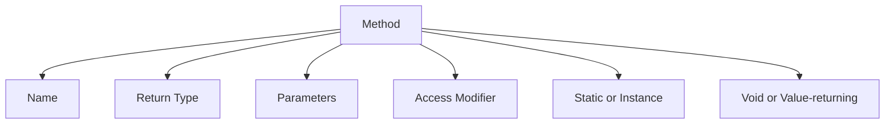

# 🧮 C# Methods — Complete Guide with Examples


In C#, **methods** are blocks of code that perform specific tasks. They help structure your program, enable **code reuse**, and support **modularity**.


---


## 🧱 1. Method Basics


A method in C# is defined with:


```csharp

<access_modifier> <return_type> <method_name>(<parameters>)
{
    // method body
}

```


### Example:


```csharp

public int Add(int a, int b)
{
    return a + b;
}

```


---


## 🏷️ 2. Access Modifiers


| Modifier   | Description                               |
|------------|-------------------------------------------|
| `public`   | Accessible from anywhere                  |
| `private`  | Accessible only within the class          |
| `protected`| Accessible in derived classes             |
| `internal` | Accessible within the same assembly       |


---


## 🧪 3. Calling Methods


```csharp

public class Calculator
{
    public int Multiply(int a, int b)
    {
        return a * b;
    }
}

var calc = new Calculator();
int result = calc.Multiply(4, 5); // 20

```


---


## 🎁 4. Return Types


| Return Type | Meaning                      |
|-------------|------------------------------|
| `void`      | No value returned            |
| `int`, `string`, `bool`, etc. | Returns value of specified type |


```csharp

void PrintMessage() => Console.WriteLine("Hello");
bool IsEven(int number) => number % 2 == 0;

```


---


## 📦 5. Parameters


### Regular Parameters


```csharp

void Greet(string name)
{
    Console.WriteLine($"Hello {name}");
}

```


### Optional Parameters


```csharp

void Greet(string name = "Guest")
{
    Console.WriteLine($"Hello {name}");
}

```


### Named Arguments


```csharp

Greet(name: "Alice");

```


---


## 🔁 6. Method Overloading


Same method name, different parameters:


```csharp

int Sum(int a, int b) => a + b;
double Sum(double a, double b) => a + b;

```


---


## ⬅️ 7. `ref` and `out` Parameters

In C#, `ref` and `out` are keywords used to pass parameters by reference to methods, allowing the method to modify the value of the argument.

### `ref`: Pass by reference (value must be initialized)

The `ref` keyword indicates that a parameter is being passed by reference. When you pass a variable as `ref`, the method can modify the original value of the variable. 

### Key Points:
- The variable must be initialized **before** being passed to the method.
- The method can read and modify the value of the argument.


```csharp

void AddOne(ref int number)
{
    number += 1;
}

```

### Example:

```csharp
using System;
public class Program
{
    public static void Increment(ref int number)
    {
        number++;
    }

    public static void Main()
    {
        int a = 5;
        Increment(ref a);
        Console.WriteLine(a);  // Output: 6
    }
}

```

_In this example_:

The variable `a` is passed to the `Increment` method by reference.

The method modifies `a`, and the change is reflected outside the method.


### `out`: Output parameter (must be assigned inside method)

The `out` keyword also passes a parameter by reference but with a crucial difference: 
the variable does not need to be initialized before being passed to the method. The method is expected to assign a value to the `out` parameter.

### Key Points:

- The variable does not **need to be initialized** before being passed to the method.
- The method must assign a value to the `out` parameter before returning.

```csharp

void CreateUser(out string username)
{
    username = "user123";
}

```
### Example:

```csharp

using System;

public class Program
{
    public static void Divide(int dividend, int divisor, out int result)
    {
        if (divisor == 0)
        {
            result = 0;  // Default value in case of error
        }
        else
        {
            result = dividend / divisor;
        }
    }

    public static void Main()
    {
        int res;
        Divide(10, 2, out res);
        Console.WriteLine(res);  // Output: 5

        Divide(10, 0, out res);
        Console.WriteLine(res);  // Output: 0 (error case)
    }
}


```

_In this example_:

- The variable `res` is passed to the `Divide` method using `out`.

- The method assigns a value to `res`, even if it's an error value.

### Key Differences Between `ref` and `out`
| Feature |	ref |	out |
| ---- |	---- |	--- |
| Initialization | Must be initialized before use	| Does not need to be initialized before use |
| Modification	| Can read and modify the value	| Must assign a value before exiting the method |
| Use Case	| Use when the parameter might be updated and used within the method	| Use when the method must assign a new value to the parameter |

### When to Use Each
- Use ref when the method needs to **modify** an already initialized value.

- Use out when the method is responsible for **providing** a value that has not been initialized previously.

### Conclusion
Both `ref` and `out` are powerful tools in C# for passing parameters by reference, but they are used in different scenarios 
depending on whether the variable is initialized before the method call (`ref`) or needs to be assigned within the method (`out`).


---


## 🧰 8. Static Methods


Called on the class itself, not instances.


```csharp

public static class MathHelper
{
    public static double Square(double x) => x * x;
}

var squared = MathHelper.Square(3); // 9

```


---


## 🔄 9. Recursive Methods


A method that calls itself:


```csharp
int Factorial(int n)
{
    if (n == 1) return 1;
    return n * Factorial(n - 1);
}

```


---


## ⛓️ 10. Expression-bodied Methods (C# 6+)


```csharp

int Square(int n) => n * n;

```


---


## 🧠 11. Best Practices


- Keep methods short and focused

- Use meaningful names (`GetCustomer` vs `DoThing`)

- Avoid too many parameters (prefer parameter objects)

- Return early if possible (`guard clauses`)

- Document public methods with XML comments


---


## 🗺️ Summary Diagram





---


## 🚀 Example


```csharp

public class Program
{
    static double CalculateTax(double amount, double rate = 0.18)
    {
        return amount * rate;
    }

    public static void Main()
    {
        double total = 150.0;
        double tax = CalculateTax(total);
        Console.WriteLine($"Tax: {tax}");
    }
}

```


---
