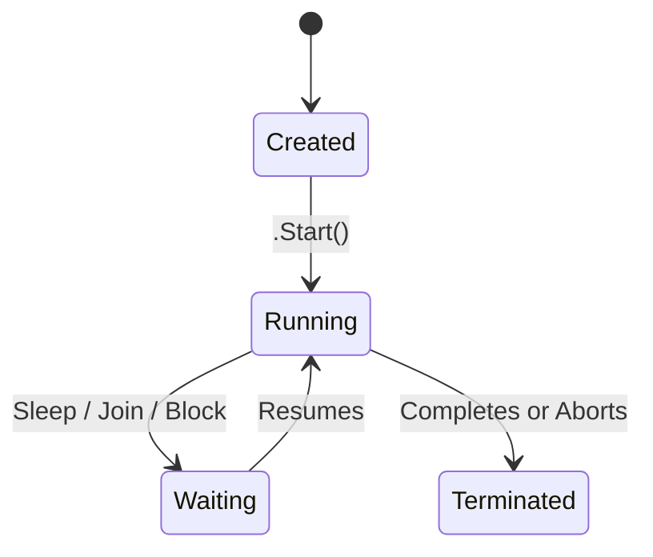
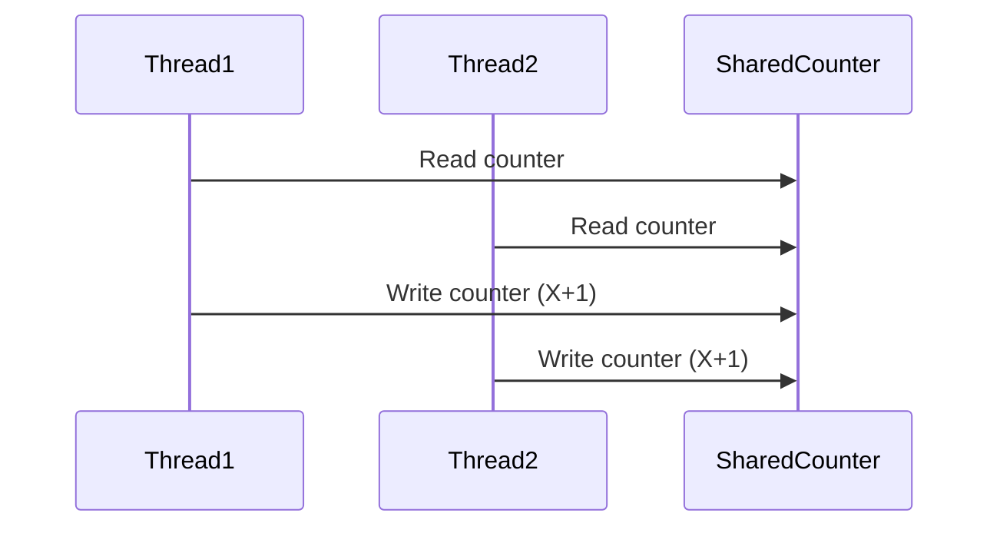

# 🧵 C# Multithreading Training Guide


> Learn how to write responsive and performant C# applications using multithreading and parallel execution.


---


## 🚦 What is Multithreading?


Multithreading allows your program to **execute multiple operations at once**, by using multiple **threads of execution**.


- Improves responsiveness (e.g. UI apps)

- Enables concurrency for heavy tasks

- Utilizes modern multi-core CPUs


---


## 🧠 Key Concepts


| Term        | Meaning                                 |
|-------------|------------------------------------------|
| Thread      | A separate execution path in a program  |
| ThreadPool  | A pool of worker threads managed by .NET |
| Task        | A wrapper over thread work, easier to manage |
| Lock        | Mechanism to avoid race conditions       |


---


## 🔧 Creating Threads


```csharp

using System.Threading;

Thread thread = new Thread(() =>
{
    Console.WriteLine("Running in another thread!");
});
thread.Start();
Console.WriteLine("Main thread continues...");

```


---


## 📊 Diagram: Thread Lifecycle





---


## 🧪 Example: Parallel Execution


```csharp

void Task1() => Console.WriteLine("Task 1");
void Task2() => Console.WriteLine("Task 2");

var t1 = new Thread(Task1);
var t2 = new Thread(Task2);

t1.Start();
t2.Start();

```


> Both threads run in parallel. Output order is **not guaranteed**.


---


## ✅ Using `Thread.Sleep`


```csharp

Thread.Sleep(2000); // Pause current thread for 2 seconds

```


---


## 🧵 ThreadPool Example


```csharp

ThreadPool.QueueUserWorkItem(_ =>
{
    Console.WriteLine($"ThreadPool Thread ID: {Thread.CurrentThread.ManagedThreadId}");
});

```


> ⚡ Efficient for short, frequent background tasks.


---


## 🚀 Using `Task` (Preferred in Modern C#)


```csharp

Task.Run(() =>
{
    Console.WriteLine($"Running in Task thread ID: {Thread.CurrentThread.ManagedThreadId}");
});

```

> `Task` API abstracts the complexity of managing threads.


---


## 🔐 Locking & Thread Safety


```csharp

object locker = new();

void SafeIncrement()
{
    lock (locker)
    {
        counter++;
    }
}

```


| Keyword | Purpose                 |
|---------|--------------------------|
| `lock`  | Exclusive access to block |
| `volatile` | Prevent CPU-level caching  |
| `Monitor` | Advanced lock control     |


---


## 📈 Diagram: Race Condition (Bad)





➡️ **Final value = X+1**, expected X+2. This is a race condition!


---


## 🧪 Exercise: Multi-threaded Counter


```csharp

int counter = 0;
object lockObj = new();

void Increment()
{
    for (int i = 0; i < 10000; i++)
    {
        lock (lockObj)
        {
            counter++;
        }
    }
}

var t1 = new Thread(Increment);
var t2 = new Thread(Increment);
t1.Start();
t2.Start();
t1.Join();
t2.Join();
Console.WriteLine(counter); // Expected: 20000

```


---


## 🧰 `Parallel.For` Example


```csharp

Parallel.For(0, 5, i =>
{
    Console.WriteLine($"Parallel iteration {i} on thread {Thread.CurrentThread.ManagedThreadId}");
});

```


---


## 🔄 Task vs Thread


| Feature          | `Thread`         | `Task`               |
|------------------|------------------|-----------------------|
| Creation         | Manual            | Lightweight wrapper   |
| Cancellation     | Complex           | Supports `CancellationToken` |
| Pooling          | No                | Uses thread pool      |
| Use Case         | Low-level control | Preferred in modern code |


---


## 🔌 Thread Synchronization Primitives


| Tool          | Purpose                          |
|---------------|----------------------------------|
| `lock`        | Mutual exclusion                 |
| `Monitor`     | Wait/Pulse mechanisms            |
| `Mutex`       | Cross-process lock               |
| `Semaphore`   | Limit access to a resource       |
| `Barrier`     | Wait for all threads to reach a point |


---


## 🧠 Best Practices


| Practice                         | Why                                |
|----------------------------------|-------------------------------------|
| Prefer `Task`/`async` over `Thread` | Easier management, scalability    |
| Always `Join()` or `await`       | Avoid premature app exit           |
| Use `lock` on private object     | Prevent deadlocks                  |
| Avoid shared state               | Reduces need for synchronization   |


---


## ✅ Summary


| Concept     | Description                          |
|-------------|--------------------------------------|
| Thread      | A separate execution path            |
| Task        | Easier abstraction for async work    |
| Locking     | Prevents simultaneous access         |
| ThreadPool  | Managed thread reuse                 |
| Parallel    | Simplifies multithreaded loops       |


---


> 🧑‍💻 Multithreading is powerful, but complex. Use it wisely to avoid bugs, deadlocks, and race conditions.
