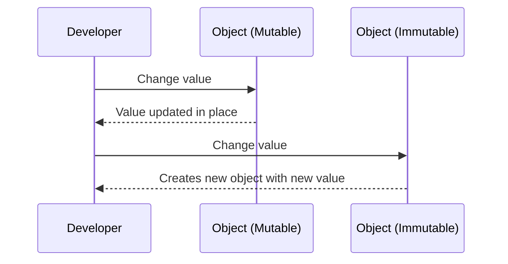

# 🧠 Mutable vs Immutable Types in C#


---


## 📌 What Does It Mean?


**Mutability** refers to whether or not the state or content of an object or data structure can be changed after it is created. Understanding whether a piece of data is mutable (can be modified) or immutable (cannot be modified) is crucial in programming, as it influences how data is handled and manipulated.

- **Mutable** objects **can be changed** after creation.

- **Immutable** objects **cannot be changed** — any modification creates a **new instance**.
---

## 🔄 **Mutable vs 🔒 Immutable in C#**

1. 🔄 **Mutable Types**:  
   - These are types where the data or state can be changed after the object is created.
   - Examples: **Classes**, **Arrays**, **Lists**, **Dictionaries**.

2. 🔒 **Immutable Types**:  
   - These are types whose data cannot be changed after they are created. If you want to change their content, a new instance must be created.
   - Examples: **Structs (by default)**, **Strings**, **Tuples**, **Readonly fields**.

---


## 🧪 Immutable Types in C#


In .NET, most built-in types such as:


- `string`

- `System.DateTime`

- `System.Guid`


...are **immutable**.


### Example: `string` is Immutable


```csharp

string a = "Hello";
string b = a;
a = a + " World";
Console.WriteLine(b); // Output: "Hello"

```

🔍 `a` was modified, but `b` still holds the original value.


🔸🔸🔸


📌 **Tuples** in C# are also immutable. Once a tuple is created, its values cannot be changed.

```csharp

class Program
{
    static void Main()
    {
        var person = (Name: "Alice", Age: 30);
        // person.Name = "Bob";  // This would cause a compile-time error!

        Console.WriteLine(person.Name);  // Output: Alice
        Console.WriteLine(person.Age);   // Output: 30
    }
}
```
🔍 The values in the person tuple cannot be modified after the tuple is created.

🔸🔸🔸

📌 You can use readonly fields in C# to create immutable data in classes. These fields can be assigned a value only in the constructor or during initialization.

```csharp
public class Product
{
    public readonly string Name;
    public readonly decimal Price;

    public Product(string name, decimal price)
    {
        Name = name;
        Price = price;
    }
}

class Program
{
    static void Main()
    {
        var product = new Product("Laptop", 1000m);
        // product.Name = "Phone";  // Error: cannot modify readonly field
        // product.Price = 500m;     // Error: cannot modify readonly field

        Console.WriteLine(product.Name);  // Output: Laptop
        Console.WriteLine(product.Price); // Output: 1000
    }
}
```

🔍 The readonly fields in the Product class cannot be modified after they are assigned during object construction.

---


## 🔧 Mutable Types in C#


Most **classes** and **structs** that you define yourself are **mutable** by default unless you restrict them.


### Example: Mutable Class


```csharp

class Person
{
    public string Name { get; set; }
}

var p = new Person { Name = "Alice" };
p.Name = "Bob"; // Object modified!

```

🔸🔸🔸

---


## 🧱 Structs Are Value Types


- Structs are **copied by value**, but **still mutable** unless made `readonly`.


```csharp

struct Point
{
    public int X;
    public int Y;
}

var pt = new Point { X = 1, Y = 2 };
pt.X = 5; // Mutable

```

🔸🔸🔸


📌 Arrays in C# are mutable. You can change the values of the elements within an array.

```csharp

class Program
{
    static void Main()
    {
        int[] numbers = { 1, 2, 3, 4 };
        numbers[0] = 10;  // Modifying an element in the array

        Console.WriteLine(numbers[0]);  // Output: 10
    }
}
```

🔍 The array elements can be modified even after the array is created.

---


## 🔐 Creating Immutable Types (Custom)


Use `readonly` and private setters:


```csharp

class ImmutablePerson
{
    public string Name { get; }
    public int Age { get; }
    public ImmutablePerson(string name, int age)
    {
        Name = name;
        Age = age;
    }
}

```


Or use a `record` (C# 9.0+):


```csharp

public record Product(string Name, decimal Price);

```


---


## 📊 Comparison Table


| Feature             | Mutable                           | Immutable                           |
|---------------------|-----------------------------------|--------------------------------------|
| Can change data?    | ✅ Yes                            | ❌ No                                 |
| Thread-safe         | ❌ Usually No                     | ✅ Often Yes                          |
| Memory efficient    | ❌ Modifying may cause issues     | ✅ Reuse and caching possible         |
| Example type        | `List<T>`, `Person` class         | `string`, `DateTime`, `record` types |


---


## 📈 Diagram — Mutation Behavior





---


## ⚠️ When to Use What?


| Situation                                 | Recommended Type |
|-------------------------------------------|------------------|
| Data that changes often                   | Mutable          |
| Shared state in multithreading            | Immutable         |
| Logging, versioned objects, snapshots     | Immutable         |
| Performance-critical with large updates   | Mutable (carefully)


---


## ✅ Summary


- Immutable types are safer and easier to reason about.

- Mutable types offer flexibility but can introduce bugs if not handled with care.

- Prefer immutable types unless mutation is explicitly required.
