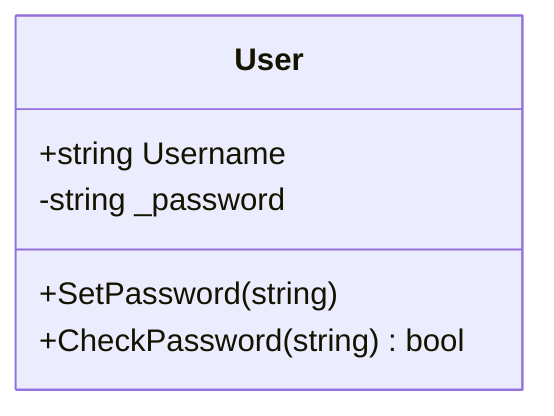
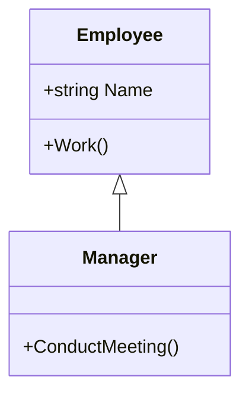
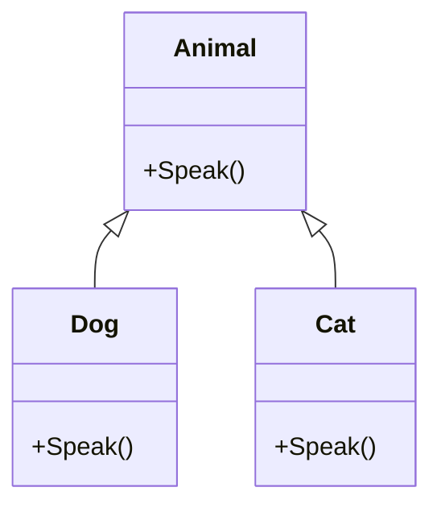
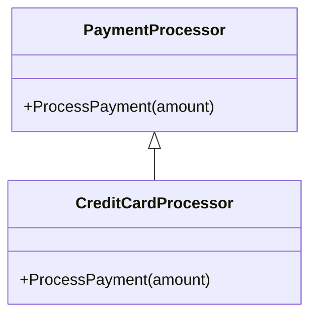

# 🧠 C# Object-Oriented Programming (OOP) Basics


Object-Oriented Programming (OOP) in C# revolves around **four core principles**:


1. Encapsulation

2. Inheritance

3. Polymorphism

4. Abstraction


---


## 🔒 1. Encapsulation


Encapsulation means hiding internal data and exposing only what's necessary.


```csharp

public class User
{
    public string Username { get; set; }
    private string _password;
    public void SetPassword(string password)
    {
        if (password.Length >= 6)
            _password = password;
    }
    public bool CheckPassword(string input)
    {
        return _password == input;
    }
}
```


📊 Encapsulation



# Encapsulation in Object-Oriented Programming

Encapsulation is one of the core principles of object-oriented programming. It refers to the practice of **bundling data (attributes) and the methods that operate on that data into a single unit**, typically a class. More importantly, it involves **restricting direct access to some of an object's components**, thereby safeguarding the internal state and logic of the object.

## Purpose of Encapsulation

Encapsulation serves several purposes:

1. **Data protection:** Prevents unauthorized or unintended access and modification of internal data.
2. **Abstraction:** Hides internal implementation details and exposes only what is necessary.
3. **Maintainability:** Reduces dependencies between components, making the code easier to modify and refactor.
4. **Robustness:** Helps prevent inconsistent or invalid object states.

## Real-World Analogy

Consider a class named `CookieJar`. This class holds a private attribute representing the number of cookies in the jar. Rather than allowing direct modification of this attribute, the class provides a public method called `RequestCookie()` to control access.

This is similar to a real cookie jar with a lid—you can't reach in directly; you must ask the jar (or its owner) for a cookie.

## Code Example: CookieJar Class

```csharp
public class CookieJar
{
    // Private field: not accessible directly from outside
    private int _numberOfCookies;

    // Constructor
    public CookieJar(int initialCookies)
    {
        _numberOfCookies = initialCookies >= 0 ? initialCookies : 0;
    }

    // Public method to request a cookie
    public bool RequestCookie()
    {
        if (_numberOfCookies > 0)
        {
            _numberOfCookies--;
            Console.WriteLine("Here's a cookie!");
            return true;
        }
        else
        {
            Console.WriteLine("Sorry, no cookies left.");
            return false;
        }
    }

    // Optional: public read-only access (encapsulated)
    public int CookiesRemaining => _numberOfCookies;
}
```

### Example Usage:

```csharp
var jar = new CookieJar(3);
jar.RequestCookie();  // Output: Here's a cookie!
jar.RequestCookie();  // Output: Here's a cookie!
Console.WriteLine(jar.CookiesRemaining); // Output: 1
```

Direct access to `_numberOfCookies` from outside the class is **not allowed**, preserving the integrity of the data.

## Black Boxing: Hiding the Inner Workings

Encapsulation enforces a "black box" model. The **user of a class does not need to understand its internal implementation**—they only interact with a well-defined public interface.

For example, a phone user doesn't need to understand how radio signals work to make a call. They just press buttons. Similarly, calling `RequestCookie()` is enough; the user doesn't need to know how cookies are tracked internally.

This abstraction **allows the internal implementation to evolve** without affecting the code that uses the object.

## Encapsulation Enables Safe Refactoring

Suppose the original `CookieJar` class tracks cookies with a single integer. Later, you decide to track individual cookie types (e.g., chocolate, vanilla, oatmeal). You can change the internal implementation without affecting external code, as long as the `RequestCookie()` method still works the same way.

```csharp
// Internal change - no external code needs to change
private Dictionary<string, int> _cookies = new()
{
    { "chocolate", 2 },
    { "vanilla", 1 }
};
```

By hiding the internal structure, **you prevent a change in one part of the code from requiring changes everywhere else**.

## Best Practices

- **Mark fields as `private`** and expose them through methods or properties when necessary.
- **Expose only what is needed** to other parts of the application.
- **Encapsulate as much as possible** to increase flexibility and reduce coupling.
- Use access modifiers (`private`, `protected`, `public`, `internal`) to control visibility.

### Example: Field vs Property Access

```csharp
// Less safe: public field (bad practice)
public int NumberOfCookies;

// Safer: public property with encapsulation
private int _numberOfCookies;
public int NumberOfCookies
{
    get => _numberOfCookies;
    private set => _numberOfCookies = Math.Max(0, value);
}
```

## Conclusion

Encapsulation is not about "hiding secrets" but about **defining clear boundaries** between parts of your program. It protects internal state, enforces valid usage, and makes your code more maintainable and flexible in the long term.

By encapsulating data and exposing only necessary methods, you ensure a robust and scalable object-oriented design.


👪 2. Inheritance


Inheritance allows a class to inherit members from a base class.
```csharp
public class Employee
{
    public string Name { get; set; }
    public void Work()
    {
        Console.WriteLine($"{Name} is working.");
    }
}
public class Manager : Employee
{
    public void ConductMeeting()
    {
        Console.WriteLine($"{Name} is conducting a meeting.");
    }
}

```

📊 Inheritance





## Utilizing Inheritance in Object-Oriented Programming: A Practical Example

One of the fundamental principles of object-oriented programming is **inheritance**, which allows for the creation of classes that derive functionality from existing classes. This promotes code reuse, minimizes duplication, and encourages the development of flexible and maintainable code structures.

### Project Structure and Base Classes

In this example, we define several classes representing two-dimensional geometric shapes. At the top of the hierarchy is the `Shape2D` class, which serves as the **base class** for all other shape types. Two classes, `Circle` and `Rectangle`, inherit from `Shape2D`, each extending its functionality with shape-specific properties:

- `Circle`: has a `radius` field
- `Rectangle`: has `width` and `height` fields

### Overriding Methods from the `Object` Class

In .NET, all classes implicitly derive from the `Object` class, which provides several useful methods, including `ToString()` and `GetType()`. In our example, we override the `ToString()` method in the `Shape2D` class to return a custom string representation of the object, using `GetType()` to dynamically retrieve the class name:

```csharp
public override string ToString() => $"This object is a '{GetType()}'";
```

This override ensures that any object deriving from `Shape2D` will display its runtime type when printed.

### Type Checking with `is`

We also demonstrate the use of the `is` operator to check whether an object is an instance of a specific class:

```csharp
Console.WriteLine(c is Shape2D);     // True
Console.WriteLine(c is Rectangle);   // False
```

This allows for runtime type validation and supports polymorphic behavior.

### Defining and Overriding Methods

To calculate the area of each shape, we add a virtual method named `GetArea()` in the `Shape2D` class:

```csharp
public virtual float GetArea() => 0;
```

Derived classes override this method to provide shape-specific implementations:

- **Circle**: returns π × radius²
- **Rectangle**: returns width × height

```csharp
public override float GetArea() => 3.14f * radius * radius; // Circle
public override float GetArea() => width * height;          // Rectangle
```

### Extending the Hierarchy: The `Square` Class

We further extend the class hierarchy by creating a `Square` class, which is a specialized version of `Rectangle`. Since a square is a rectangle with equal sides, we pass the same value for both width and height via the base class constructor:

```csharp
public class Square : Rectangle
{
    public Square(int side) : base(side, side) { }
}
```

There is no need to override `GetArea()` in `Square`, as the implementation in `Rectangle` is already sufficient.

### Polymorphism in Action

Because all shapes derive from `Shape2D`, we can use polymorphism to handle different shape types uniformly. For instance, the following method can accept any `Shape2D` instance:

```csharp
public static void PrintArea(Shape2D shape)
{
    Console.WriteLine($"Area: {shape.GetArea()}");
}
```

We can then call this method with a `Circle`, `Rectangle`, or `Square`, and the correct `GetArea()` implementation will be invoked due to polymorphic behavior:

```csharp
PrintArea(c); // Circle
PrintArea(r); // Rectangle
PrintArea(s); // Square
```

## Conclusion

This structured approach demonstrates how inheritance and polymorphism can be effectively applied in object-oriented programming to create reusable, maintainable, and extensible code.


🧬 3. Polymorphism


Polymorphism allows you to treat different objects through a common interface or base class.
```csharp
public class Animal
{
    public virtual void Speak()
    {
        Console.WriteLine("Animal speaks.");
    }
}
public class Dog : Animal
{
    public override void Speak()
    {
        Console.WriteLine("Woof!");
    }
}
public class Cat : Animal
{
    public override void Speak()
    {
        Console.WriteLine("Meow!");
    }
}

// Usage

List<Animal> animals = new List<Animal> { new Dog(), new Cat() };
foreach (var a in animals)
{
    a.Speak(); // Calls overridden methods
}

```

📊 Polymorphism





# Polymorphism in Object-Oriented Programming

**Polymorphism**, derived from Greek meaning "many forms", is a key principle of object-oriented programming (OOP). It allows objects of different types to be treated through the same interface, enabling flexibility and extensibility in code design.

There are two primary forms of polymorphism:

- **Dynamic (Runtime) Polymorphism**
- **Static (Compile-Time) Polymorphism**

---

## 1. Dynamic (Runtime) Polymorphism

Dynamic polymorphism allows you to use the same method name and interface to call different behaviors depending on the object type at runtime. This is typically achieved through **method overriding** in **inheritance hierarchies** or via **abstract classes** or **interfaces**.

### Real-World Analogy: Coffee Makers

Imagine two different types of coffee makers:

- A **BasicCoffeeMaker**
- A **FrenchPress**

Both have the same method signature for brewing coffee:

```csharp
CupOfCoffee Brew(GroundCoffee coffee, Water water);
```

However, their brewing processes differ internally. The `BasicCoffeeMaker` uses a paper filter, while the `FrenchPress` uses a metal plunger screen.

### Code Example

```csharp
public abstract class CoffeeMaker
{
    public abstract CupOfCoffee Brew(GroundCoffee coffee, Water water);
}

public class BasicCoffeeMaker : CoffeeMaker
{
    public override CupOfCoffee Brew(GroundCoffee coffee, Water water)
    {
        Console.WriteLine("Brewing with paper filter...");
        return new CupOfCoffee("Standard Coffee");
    }
}

public class FrenchPress : CoffeeMaker
{
    public override CupOfCoffee Brew(GroundCoffee coffee, Water water)
    {
        Console.WriteLine("Brewing with French press...");
        return new CupOfCoffee("Rich French Press Coffee");
    }
}
```

### Usage

```csharp
CoffeeMaker maker;

maker = new BasicCoffeeMaker();
maker.Brew(new GroundCoffee(), new Water());

maker = new FrenchPress();
maker.Brew(new GroundCoffee(), new Water());
```

Even though we use the same `maker.Brew()` method, the actual method executed depends on the **concrete type** of the object (`BasicCoffeeMaker` or `FrenchPress`). This is **dynamic dispatch**.

### Benefits

- Enables **code flexibility** and **interchangeability**.
- Allows **behavior customization** in derived classes.
- Supports **abstraction** and **interface-based design**.

---

## 2. Static (Compile-Time) Polymorphism

Static polymorphism is achieved through **method overloading**. This allows multiple methods in the same class to have the same name but **different parameter lists** (either in number, order, or type of parameters).

### Example: Overloading Brew Method

```csharp
public class FrenchPress
{
    public CupOfCoffee Brew(GroundCoffee coffee, Water water)
    {
        return new CupOfCoffee("Coffee");
    }

    public CupOfTea Brew(TeaLeaves tea, Water water)
    {
        return new CupOfTea("Tea");
    }

    public Drink Brew(GroundCoffee coffee, TeaLeaves tea, Water water)
    {
        return new Drink("Mixed Beverage (Not Recommended)");
    }
}
```

### Usage

```csharp
FrenchPress press = new FrenchPress();

var coffee = press.Brew(new GroundCoffee(), new Water());
var tea = press.Brew(new TeaLeaves(), new Water());
var strange = press.Brew(new GroundCoffee(), new TeaLeaves(), new Water());
```

Each `Brew` method has the same name but is distinguished by **parameter signature**, and the compiler chooses the appropriate one based on the arguments provided at **compile time**.

### Method Overloading vs Overriding

| Concept         | Overloading                         | Overriding                           |
|-----------------|-------------------------------------|---------------------------------------|
| When            | Compile-time                        | Runtime                               |
| Scope           | Within same class                   | Across base and derived classes       |
| Parameters      | Must differ                         | Must match exactly                    |
| Purpose         | Multiple behaviors for different inputs | Redefine behavior in derived class |

---

## Summary

Polymorphism allows for:

- Writing **generalized code** that works with different types.
- **Extending systems** without modifying existing code.
- Achieving **loose coupling** between components.

### Two Key Forms:

1. **Dynamic Polymorphism**  
   - Achieved via **inheritance**, **abstract classes**, or **interfaces**  
   - Uses **method overriding** to provide specific implementations

2. **Static Polymorphism**  
   - Achieved via **method overloading**  
   - Allows multiple methods with the same name but different parameters

Together, these techniques make object-oriented systems **more modular**, **easier to maintain**, and **more extensible**.


🧼 4. Abstraction

Abstraction hides complex logic and exposes only necessary behavior via abstract classes or interfaces.
```csharp
public abstract class PaymentProcessor
{
    public abstract void ProcessPayment(decimal amount);
}
public class CreditCardProcessor : PaymentProcessor
{
    public override void ProcessPayment(decimal amount)
    {
        Console.WriteLine($"Processing credit card payment of {amount:C}");
    }
}
```


📊 Abstraction




🧩 OOP Summary Table


| Principle | Purpose | Keyword |
| --- | --- | --- |
| Encapsulation | Protect internal state | private | 
| Inheritance | Reuse code via base classes | :
| Polymorphism | Use shared interface/base with overrides | virtual/override |
| Abstraction | Expose essentials, hide complexity | abstract/interface |

---
✅ Real-World Analogy


🔒 Encapsulation: Medicine in a capsule – you only take the pill, not the formula.
 
👪 Inheritance: A child inherits behavior from a parent.

🧬 Polymorphism: A universal remote works for different devices.

🧼 Abstraction: You drive a car without knowing how the engine works.


---
