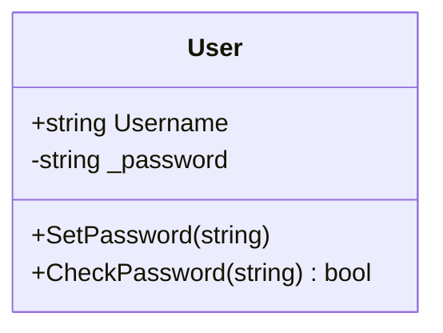
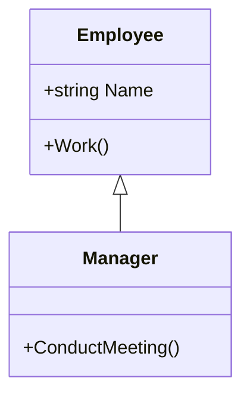
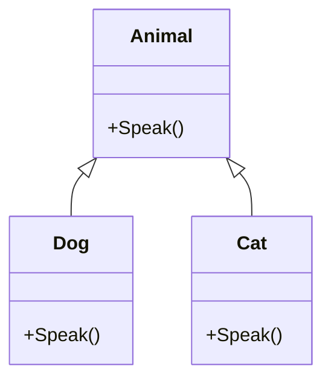
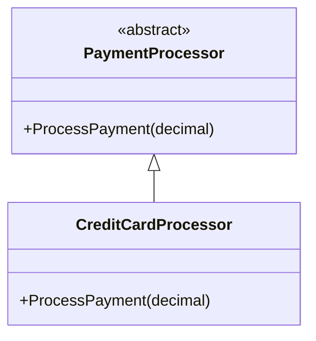

# 🧠 C# Object-Oriented Programming (OOP) Basics


Object-Oriented Programming (OOP) in C# revolves around **four core principles**:


1. Encapsulation

2. Inheritance

3. Polymorphism

4. Abstraction


---


## 🔒 1. Encapsulation


Encapsulation means hiding internal data and exposing only what's necessary.


```csharp

public class User
{
    public string Username { get; set; }
    private string _password;
    public void SetPassword(string password)
    {
        if (password.Length >= 6)
            _password = password;
    }
    public bool CheckPassword(string input)
    {
        return _password == input;
    }
}
```


📊 Encapsulation




👪 2. Inheritance


Inheritance allows a class to inherit members from a base class.
```csharp
public class Employee
{
    public string Name { get; set; }
    public void Work()
    {
        Console.WriteLine($"{Name} is working.");
    }
}
public class Manager : Employee
{
    public void ConductMeeting()
    {
        Console.WriteLine($"{Name} is conducting a meeting.");
    }
}

```

📊 Inheritance





## Utilizing Inheritance in Object-Oriented Programming: A Practical Example

One of the fundamental principles of object-oriented programming is **inheritance**, which allows for the creation of classes that derive functionality from existing classes. This promotes code reuse, minimizes duplication, and encourages the development of flexible and maintainable code structures.

### Project Structure and Base Classes

In this example, we define several classes representing two-dimensional geometric shapes. At the top of the hierarchy is the `Shape2D` class, which serves as the **base class** for all other shape types. Two classes, `Circle` and `Rectangle`, inherit from `Shape2D`, each extending its functionality with shape-specific properties:

- `Circle`: has a `radius` field
- `Rectangle`: has `width` and `height` fields

### Overriding Methods from the `Object` Class

In .NET, all classes implicitly derive from the `Object` class, which provides several useful methods, including `ToString()` and `GetType()`. In our example, we override the `ToString()` method in the `Shape2D` class to return a custom string representation of the object, using `GetType()` to dynamically retrieve the class name:

```csharp
public override string ToString() => $"This object is a '{GetType()}'";
```

This override ensures that any object deriving from `Shape2D` will display its runtime type when printed.

### Type Checking with `is`

We also demonstrate the use of the `is` operator to check whether an object is an instance of a specific class:

```csharp
Console.WriteLine(c is Shape2D);     // True
Console.WriteLine(c is Rectangle);   // False
```

This allows for runtime type validation and supports polymorphic behavior.

### Defining and Overriding Methods

To calculate the area of each shape, we add a virtual method named `GetArea()` in the `Shape2D` class:

```csharp
public virtual float GetArea() => 0;
```

Derived classes override this method to provide shape-specific implementations:

- **Circle**: returns π × radius²
- **Rectangle**: returns width × height

```csharp
public override float GetArea() => 3.14f * radius * radius; // Circle
public override float GetArea() => width * height;          // Rectangle
```

### Extending the Hierarchy: The `Square` Class

We further extend the class hierarchy by creating a `Square` class, which is a specialized version of `Rectangle`. Since a square is a rectangle with equal sides, we pass the same value for both width and height via the base class constructor:

```csharp
public class Square : Rectangle
{
    public Square(int side) : base(side, side) { }
}
```

There is no need to override `GetArea()` in `Square`, as the implementation in `Rectangle` is already sufficient.

### Polymorphism in Action

Because all shapes derive from `Shape2D`, we can use polymorphism to handle different shape types uniformly. For instance, the following method can accept any `Shape2D` instance:

```csharp
public static void PrintArea(Shape2D shape)
{
    Console.WriteLine($"Area: {shape.GetArea()}");
}
```

We can then call this method with a `Circle`, `Rectangle`, or `Square`, and the correct `GetArea()` implementation will be invoked due to polymorphic behavior:

```csharp
PrintArea(c); // Circle
PrintArea(r); // Rectangle
PrintArea(s); // Square
```

## Conclusion

This structured approach demonstrates how inheritance and polymorphism can be effectively applied in object-oriented programming to create reusable, maintainable, and extensible code.


🧬 3. Polymorphism


Polymorphism allows you to treat different objects through a common interface or base class.
```csharp
public class Animal
{
    public virtual void Speak()
    {
        Console.WriteLine("Animal speaks.");
    }
}
public class Dog : Animal
{
    public override void Speak()
    {
        Console.WriteLine("Woof!");
    }
}
public class Cat : Animal
{
    public override void Speak()
    {
        Console.WriteLine("Meow!");
    }
}

// Usage

List<Animal> animals = new List<Animal> { new Dog(), new Cat() };
foreach (var a in animals)
{
    a.Speak(); // Calls overridden methods
}

```

📊 Polymorphism





🧼 4. Abstraction


Abstraction hides complex logic and exposes only necessary behavior via abstract classes or interfaces.
```csharp
public abstract class PaymentProcessor
{
    public abstract void ProcessPayment(decimal amount);
}
public class CreditCardProcessor : PaymentProcessor
{
    public override void ProcessPayment(decimal amount)
    {
        Console.WriteLine($"Processing credit card payment of {amount:C}");
    }
}
```


📊 Abstraction





🧩 OOP Summary Table


| Principle | Purpose | Keyword |
| --- | --- | --- |
| Encapsulation | Protect internal state | private | 
| Inheritance | Reuse code via base classes | :
| Polymorphism | Use shared interface/base with overrides | virtual/override |
| Abstraction | Expose essentials, hide complexity | abstract/interface |

---
✅ Real-World Analogy


🔒 Encapsulation: Medicine in a capsule – you only take the pill, not the formula.
 
👪 Inheritance: A child inherits behavior from a parent.

🧬 Polymorphism: A universal remote works for different devices.

🧼 Abstraction: You drive a car without knowing how the engine works.


---
