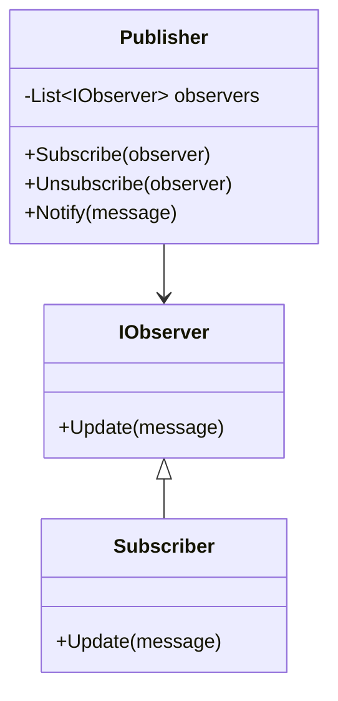

# 👀 Observer Pattern

**Definition:** A behavioral design pattern where an object (subject) notifies other objects (observers) about changes in its state.

## C# Example

```csharp
public interface IObserver
{
    void Update(string message);
}

public class Subscriber : IObserver
{
    private string _name;
    public Subscriber(string name) => _name = name;

    public void Update(string message)
    {
        Console.WriteLine($"{_name} received: {message}");
    }
}

public class Publisher
{
    private List<IObserver> _observers = new List<IObserver>();

    public void Subscribe(IObserver observer) => _observers.Add(observer);
    public void Unsubscribe(IObserver observer) => _observers.Remove(observer);

    public void Notify(string message)
    {
        foreach(var observer in _observers)
            observer.Update(message);
    }
}
```

## Usage

```csharp
var publisher = new Publisher();
var alice = new Subscriber("Alice");
var bob = new Subscriber("Bob");

publisher.Subscribe(alice);
publisher.Subscribe(bob);

publisher.Notify("New article is published!");
```

## Diagram



---
