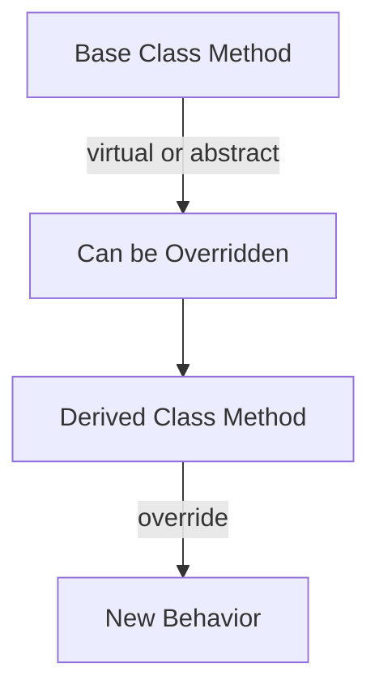
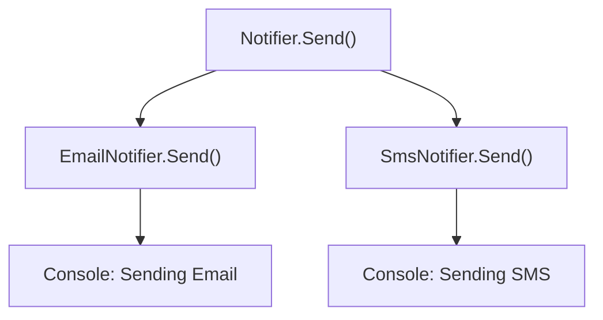
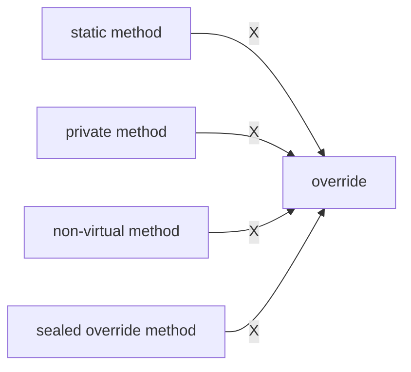
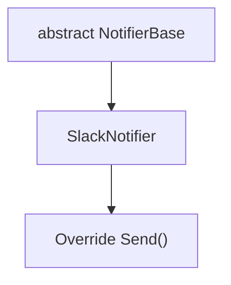

# 📘 C# Method Overriding (Custom Methods) + Mermaid

In C#, you can override your own methods in a derived class — if the method in the base class is marked `virtual` or `abstract`.

---

## 🧩 Table of Contents

- [What is Method Overriding?](#what-is-method-overriding)
- [Keywords: virtual, override, abstract](#keywords-virtual-override-abstract)
- [Real-World Example: Notifier System](#real-world-example-notifier-system)
- [What Can't Be Overridden](#what-cant-be-overridden)
- [Abstract Class Example](#abstract-class-example)
- [Summary Table](#summary-table)

---

## ❓ What is Method Overriding?

Method overriding allows a **derived class** to **replace** the behavior of a `virtual` or `abstract` method defined in the base class.

---

## 🔑 Keywords: `virtual`, `override`, `abstract`



| Modifier     | Has Body? | Must Override? | Purpose                               |
|--------------|-----------|----------------|----------------------------------------|
| `virtual`    | ✅ Yes    | ❌ Optional     | Allow optional override                |
| `abstract`   | ❌ No     | ✅ Required     | Must override in derived class         |
| `override`   | ✅ Yes    | 🔄 Required     | Overrides a base method                |

---

## 🛠 Real-World Example: Notifier System

Imagine a system that sends notifications via Email, SMS, or Slack.  
You want to define a generic `Send()` method and override it per channel.

---

### 🧱 Base Class: `Notifier`

```csharp
public class Notifier
{
    public virtual void Send(string message)
    {
        Console.WriteLine($"Generic notification: {message}");
    }
}
```

---

### 📧 Email Notifier

```csharp
public class EmailNotifier : Notifier
{
    public override void Send(string message)
    {
        Console.WriteLine($"Sending Email: {message}");
    }
}
```

---

### 📱 SMS Notifier

```csharp
public class SmsNotifier : Notifier
{
    public override void Send(string message)
    {
        Console.WriteLine($"Sending SMS: {message}");
    }
}
```

---

### ✅ Usage

```csharp
Notifier notifier = new EmailNotifier();
notifier.Send("System maintenance at 2 AM.");

notifier = new SmsNotifier();
notifier.Send("Your verification code is 123456.");
```

---

### 🧭 Mermaid Diagram



---

## 🚫 What Can't Be Overridden?



| Method Type          | Why Not?                              |
|----------------------|----------------------------------------|
| `private`            | Not accessible from derived class      |
| `static`             | Belongs to the type, not instance      |
| Non-virtual methods  | Not marked for override                |
| `sealed override`    | Explicitly prevents further override   |

---

## 📐 Abstract Class Example

```csharp
public abstract class NotifierBase
{
    public abstract void Send(string message);
}
```

```csharp
public class SlackNotifier : NotifierBase
{
    public override void Send(string message)
    {
        Console.WriteLine($"[Slack] {message}");
    }
}
```



---

## 🧠 Summary Table

| Feature         | Description                                       |
|------------------|---------------------------------------------------|
| `virtual`        | Base method can be optionally overridden          |
| `override`       | Used in child to replace base method              |
| `abstract`       | Declared in abstract class; must override         |
| `sealed`         | Prevents further overriding                       |
| `new`            | Hides method (not true overriding)                |

---

## 📚 Related Concepts

- Method hiding with `new`
- Polymorphism & dynamic dispatch
- Abstract vs interface methods
- Notification pipelines, plug-in architectures

---


> ✍️ “Favor composition over inheritance, but when you inherit — override responsibly.”
