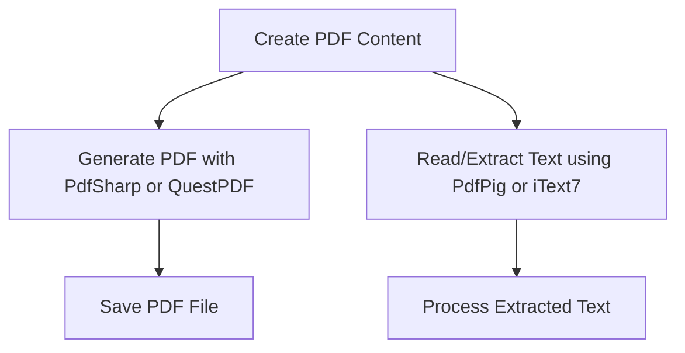

# 📄 PDF Operations in C#


---


## 📌 Overview


C# does **not** have built-in support for PDF creation or manipulation. You need to use **third-party libraries** to work with PDFs.


---


## 🔧 Popular Libraries for PDF in C#


| Library            | Description                       | NuGet Package               | License             |
|--------------------|---------------------------------|-----------------------------|---------------------|
| **PdfSharp**       | Create PDF documents             | `PdfSharp`                  | MIT                 |
| **iText7**         | Create and manipulate PDFs       | `itext7` (commercial + AGPL)| AGPL / Commercial   |
| **PdfiumViewer**   | PDF rendering/viewing            | `PdfiumViewer`              | BSD                 |
| **QuestPDF**       | Modern, fluent API PDF generation| `QuestPDF`                  | MIT                 |
| **Syncfusion PDF** | Commercial full-featured library | `Syncfusion.Pdf.Net.Core`   | Commercial (free community license available) |


---


## 🛠 Example: Creating a PDF with **PdfSharp**


### 1. Install NuGet package:


```bash

dotnet add package PdfSharp

```


### 2. Simple PDF creation code:


```csharp

using PdfSharp.Pdf;
using PdfSharp.Drawing;

var document = new PdfDocument();
document.Info.Title = "Created with PdfSharp";
PdfPage page = document.AddPage();
XGraphics gfx = XGraphics.FromPdfPage(page);
XFont font = new XFont("Verdana", 20, XFontStyle.Bold);
gfx.DrawString("Hello, PDF World!", font, XBrushes.Black,
    new XRect(0, 0, page.Width, page.Height),
    XStringFormats.Center);
string filename = "hello.pdf";
document.Save(filename);
Console.WriteLine($"PDF saved to {filename}");

```


---


## 🔍 Reading / Extracting PDF Content


- PdfSharp **does not support** reading/extracting text.

- For extraction, use **iText7**, **PdfPig**, or **PdfBox.NET**.


---


## 🧩 Example: Extract Text Using `PdfPig`


### 1. Install NuGet package:


```bash

dotnet add package UglyToad.PdfPig

```


### 2. Extract text:


```csharp

using UglyToad.PdfPig;
using (var document = PdfDocument.Open("hello.pdf"))
{
    foreach (var page in document.GetPages())
    {
        string text = page.Text;
        Console.WriteLine(text);
    }
}

```


---


## 📊 Diagram — PDF Workflow





---


## ✅ Summary


| Operation            | Recommended Library      | Notes                              |
|----------------------|-------------------------|-----------------------------------|
| PDF Creation         | PdfSharp, QuestPDF      | PdfSharp is simpler, QuestPDF modern |
| PDF Text Extraction  | PdfPig, iText7          | iText7 commercial for advanced    |
| PDF Viewing          | PdfiumViewer            | Renders PDF in WinForms or WPF    |
| Commercial Options   | Syncfusion, iText7      | Feature-rich, paid licenses       |


---


## ⚠️ Important


- Always check library licenses for commercial use.

- PDF manipulation can get complex; choose library based on need.


---


## 📚 References


- [PdfSharp Documentation](http://www.pdfsharp.net/)

- [PdfPig GitHub](https://github.com/UglyToad/PdfPig)

- [QuestPDF](https://www.questpdf.com/)

- [iText7](https://itextpdf.com/en/products/itext-7)
