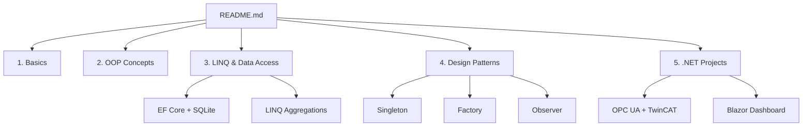
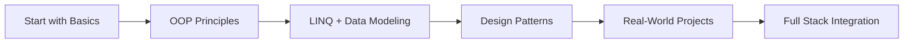
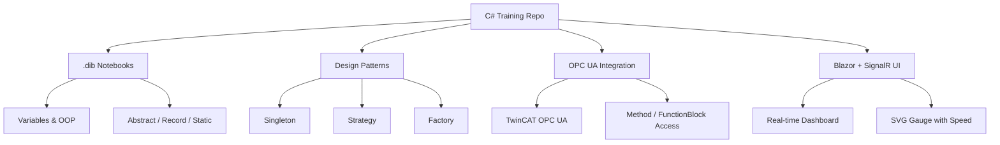

> 📘 **Learn C# step by step** with runnable `.dib` notebooks, design patterns, and real-world examples (OPC UA, Blazor, SignalR, etc.)

# 🧠 C# Training Repository

Welcome to the **Ultimate C# Training Repository** — an interactive, visual, and hands-on learning environment for mastering C# from fundamentals to advanced topics.

> 🎯 **Goal:** Help developers build a deep, practical understanding of modern C# with real-world examples, Mermaid diagrams, and runnable `.dib` notebooks.

---

## 📂 Repository Structure

📘 Topics Covered

✅ 1. C# Basics

Variables, Types, and Control Flow
Methods, Parameters, and Loops
Structural Pattern Matching

🧱 2. Object-Oriented Programming

Classes vs Abstract Classes vs Interfaces
Inheritance, Polymorphism
Delegates, Events, and Lambdas

🔍 3. LINQ & Data Access

LINQ to Objects / SQL
Entity Framework Core
SQLite with EF and Polyglot Notebooks (.dib)

🧩 4. Design Patterns in C#

Each comes with:

✅ Explanation
✅ Real Use Case
✅ Mermaid Diagram
✅ Runnable .dib Code

🌐 5. .NET Real-World Projects

TwinCAT OPC UA Client (C#/WPF/WinForms)
SignalR & Blazor WebAssembly Dashboard
WPF SVG Gauges + Real-Time Bindings

⚙️ How to Use

# Clone the repository

git clone https://github.com/buribalkan/C-SHARP-Training.git

# Open the .dib files with Visual Studio or VS Code + Polyglot Notebooks

💡 For real hardware examples (TwinCAT, OPC UA), see /projects/opcua-client/README.md.

📈 Learning Flow

🧠 Knowledge Map

mindmap

✨ Contributing

Pull requests are welcome! Submit issues, suggest diagrams, or contribute new .dib notebooks. Let’s build this C# hub together. 💪

---
MIT License

Copyright (c) 2025 buribalkan

Permission is hereby granted, free of charge, to any person obtaining a copy 
of this software and associated documentation files (the "Software"), to deal 
in the Software without restriction, including without limitation the rights 
to use, copy, modify, merge, publish, distribute, sublicense, and/or sell 
copies of the Software, and to permit persons to whom the Software is 
furnished to do so, subject to the following conditions:

The above copyright notice and this permission notice shall be included in all 
copies or substantial portions of the Software.

THE SOFTWARE IS PROVIDED "AS IS", WITHOUT WARRANTY OF ANY KIND...

---
🧠 Author

Made with ❤️ buribalkan

---
