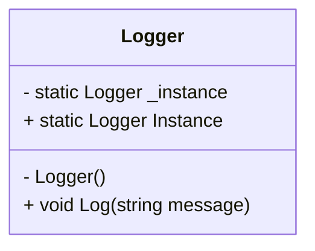

# 🔑 Singleton Pattern in C#

The Singleton pattern ensures a class has only one instance and provides a global point of access to it.

---

## 📘 What is Singleton?

The Singleton design pattern restricts the instantiation of a class to one object. This is useful when exactly one object is needed to coordinate actions across the system.

---

## 📌 Real-life Analogy

Think of a **government** — there is only one official government for a country. It acts as a central authority and coordinates decisions across departments.

---

## 🧠 Key Characteristics

- **Single Instance**  
- **Global Access Point**  
- **Thread Safety (optional)**

---

## 🧪 When to Use?

- Logging  
- Configuration Managers  
- Caching  
- Database Connections  
- Shared Resources

---

## 🛠️ Basic Singleton Example

```csharp
public sealed class Logger
{
    private static readonly Logger _instance = new Logger();

    // Private constructor
    private Logger() { }

    public static Logger Instance => _instance;

    public void Log(string message)
    {
        Console.WriteLine($"[LOG]: {message}");
    }
}
```

### ✅ Usage

```csharp
Logger.Instance.Log("Application started.");
Logger.Instance.Log("User logged in.");
```

---

## 🧵 Thread-Safe Lazy Singleton

```csharp
public sealed class LazyLogger
{
    private static Lazy<LazyLogger> _instance = new Lazy<LazyLogger>(() => new LazyLogger());

    private LazyLogger() { }

    public static LazyLogger Instance => _instance.Value;

    public void Log(string message)
    {
        Console.WriteLine($"[Thread-Safe]: {message}");
    }
}
```

---

## 📊 Diagram



---

## ✅ Pros

- Controlled access to the sole instance  
- Saves memory if the object is heavy  
- Centralized resource management

---

## ⚠️ Cons

- Global state can lead to hidden dependencies  
- Difficult to test (hard to mock)  
- Can violate Single Responsibility Principle if not careful

---

## 🧩 Related Patterns

- Factory Method  
- Monostate  
- Dependency Injection (as alternative)

---

## 🧠 Tips

- Use `Lazy<T>` in multithreaded apps  
- Avoid using Singleton as a global variable or God Object  
- Ensure immutability if possible

---

Happy coding! 🚀
