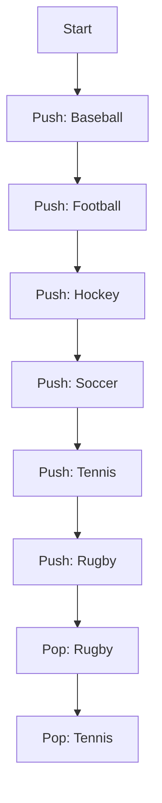
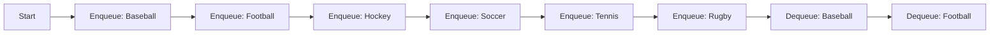

# 📦 Understanding Stack and Queue in .NET with Examples

This guide explains two commonly used data structures in programming: **Stack** and **Queue**, using C# and .NET's generic collections. These structures help manage collections of items in a specific order and are foundational concepts in algorithms and data processing.

---

## 📚 Stack: Last-In, First-Out (LIFO)

A **stack** follows the **Last-In, First-Out (LIFO)** principle. The last item added (pushed) to the stack is the first one to be removed (popped).

> **Real-life analogy**: Think of a stack of plates — you add to the top and remove from the top.

### 🧰 Stack Methods in .NET

| Method/Property   | Description                                        |
|-------------------|----------------------------------------------------|
| `Push(item)`      | Adds an item to the top of the stack               |
| `Pop()`           | Removes and returns the top item                   |
| `Peek()`          | Returns the top item without removing it           |
| `Contains(item)`  | Checks if an item exists in the stack              |
| `Clear()`         | Removes all items from the stack                   |
| `Count`           | Returns the number of items in the stack           |

---

### 🔎 Stack Example-1

```csharp
using System;
using System.Collections.Generic;

class Program
{
    static void Main()
    {
        Stack<string> sportsStack = new Stack<string>();
        sportsStack.Push("Baseball");
        sportsStack.Push("Football");
        sportsStack.Push("Hockey");
        sportsStack.Push("Soccer");
        sportsStack.Push("Tennis");
        sportsStack.Push("Rugby");

        Console.WriteLine($"Stack Count: {sportsStack.Count}");           // 6
        Console.WriteLine($"Top Item: {sportsStack.Peek()}");            // Rugby

        sportsStack.Pop(); // Removes Rugby
        sportsStack.Pop(); // Removes Tennis

        Console.WriteLine($"Contains 'Hockey': {sportsStack.Contains("Hockey")}"); // True
        Console.WriteLine($"Contains 'Rugby': {sportsStack.Contains("Rugby")}");   // False
    }
}
```

### 🔎 Stack Example-2
```csharp
using System;
using System.Collections.Generic;

class Example
{
    public static void Main()
    {
        Stack<string> numbers = new Stack<string>();
        numbers.Push("one");
        numbers.Push("two");
        numbers.Push("three");
        numbers.Push("four");
        numbers.Push("five");

        // A stack can be enumerated without disturbing its contents.
        foreach( string number in numbers )
        {
            Console.WriteLine(number);
        }

        Console.WriteLine("\nPopping '{0}'", numbers.Pop());
        Console.WriteLine("Peek at next item to destack: {0}",
            numbers.Peek());
        Console.WriteLine("Popping '{0}'", numbers.Pop());

        // Create a copy of the stack, using the ToArray method and the
        // constructor that accepts an IEnumerable<T>.
        Stack<string> stack2 = new Stack<string>(numbers.ToArray());

        Console.WriteLine("\nContents of the first copy:");
        foreach( string number in stack2 )
        {
            Console.WriteLine(number);
        }

        // Create an array twice the size of the stack and copy the
        // elements of the stack, starting at the middle of the
        // array.
        string[] array2 = new string[numbers.Count * 2];
        numbers.CopyTo(array2, numbers.Count);

        // Create a second stack, using the constructor that accepts an
        // IEnumerable(Of T).
        Stack<string> stack3 = new Stack<string>(array2);

        Console.WriteLine("\nContents of the second copy, with duplicates and nulls:");
        foreach( string number in stack3 )
        {
            Console.WriteLine(number);
        }

        Console.WriteLine("\nstack2.Contains(\"four\") = {0}",
            stack2.Contains("four"));

        Console.WriteLine("\nstack2.Clear()");
        stack2.Clear();
        Console.WriteLine("\nstack2.Count = {0}", stack2.Count);
    }
}
```
/* This code example produces the following output:

five
four
three
two
one

Popping 'five'
Peek at next item to destack: four
Popping 'four'

Contents of the first copy:
one
two
three

Contents of the second copy, with duplicates and nulls:
one
two
three


stack2.Contains("four") = False

stack2.Clear()

stack2.Count = 0
 */


---

### 🔁 Stack Operations (Visualized)



After popping two elements (`Rugby`, `Tennis`), the top of the stack becomes **Soccer**.

---

## 🚌 Queue: First-In, First-Out (FIFO)

A **queue** follows the **First-In, First-Out (FIFO)** principle. The first item added (enqueued) is the first one removed (dequeued).

> **Real-life analogy**: Think of a line at the grocery store. First person in line gets served first.

### 🧰 Queue Methods in .NET

| Method/Property     | Description                                          |
|---------------------|------------------------------------------------------|
| `Enqueue(item)`     | Adds an item to the end of the queue                |
| `Dequeue()`         | Removes and returns the item at the front           |
| `Peek()`            | Returns the item at the front without removing it   |
| `Contains(item)`    | Checks if an item exists in the queue               |
| `Clear()`           | Removes all items from the queue                    |
| `Count`             | Returns the number of items in the queue            |

---

### 🔎 Queue Example (C#)

```csharp
using System;
using System.Collections.Generic;

class Program
{
    static void Main()
    {
        Queue<string> sportsQueue = new Queue<string>();
        sportsQueue.Enqueue("Baseball");
        sportsQueue.Enqueue("Football");
        sportsQueue.Enqueue("Hockey");
        sportsQueue.Enqueue("Soccer");
        sportsQueue.Enqueue("Tennis");
        sportsQueue.Enqueue("Rugby");

        Console.WriteLine($"Queue Count: {sportsQueue.Count}");         // 6
        Console.WriteLine($"Front Item: {sportsQueue.Peek()}");         // Baseball

        sportsQueue.Dequeue(); // Removes Baseball
        sportsQueue.Dequeue(); // Removes Football

        Console.WriteLine($"Contains 'Hockey': {sportsQueue.Contains("Hockey")}"); // True
        Console.WriteLine($"Contains 'Baseball': {sportsQueue.Contains("Baseball")}"); // False
    }
}
```

---

### 🔁 Queue Operations (Visualized)



After two `Dequeue()` operations, **Hockey** becomes the new front of the queue.

---

## 🧪 Stack vs Queue Comparison Table

| Feature            | Stack                      | Queue                      |
|--------------------|----------------------------|----------------------------|
| Principle          | Last In, First Out (LIFO)  | First In, First Out (FIFO) |
| Add Item           | `Push()`                   | `Enqueue()`                |
| Remove Item        | `Pop()`                    | `Dequeue()`                |
| Inspect Top/Front  | `Peek()`                   | `Peek()`                   |
| Real-world Analogy | Stack of plates            | People in a line           |

---

## 🧠 When to Use

| Scenario                                             | Use...    |
|------------------------------------------------------|-----------|
| Undo/Redo operations in an editor                    | `Stack`   |
| Call stack in function execution                     | `Stack`   |
| Task scheduling or customer service ticket handling  | `Queue`   |
| Print queue or job scheduling system                 | `Queue`   |

---

## 🔗 Further Resources

- [Microsoft Docs - Stack\<T>](https://learn.microsoft.com/en-us/dotnet/api/system.collections.generic.stack-1)
- [Microsoft Docs - Queue\<T>](https://learn.microsoft.com/en-us/dotnet/api/system.collections.generic.queue-1)


---

Happy coding! 🚀
