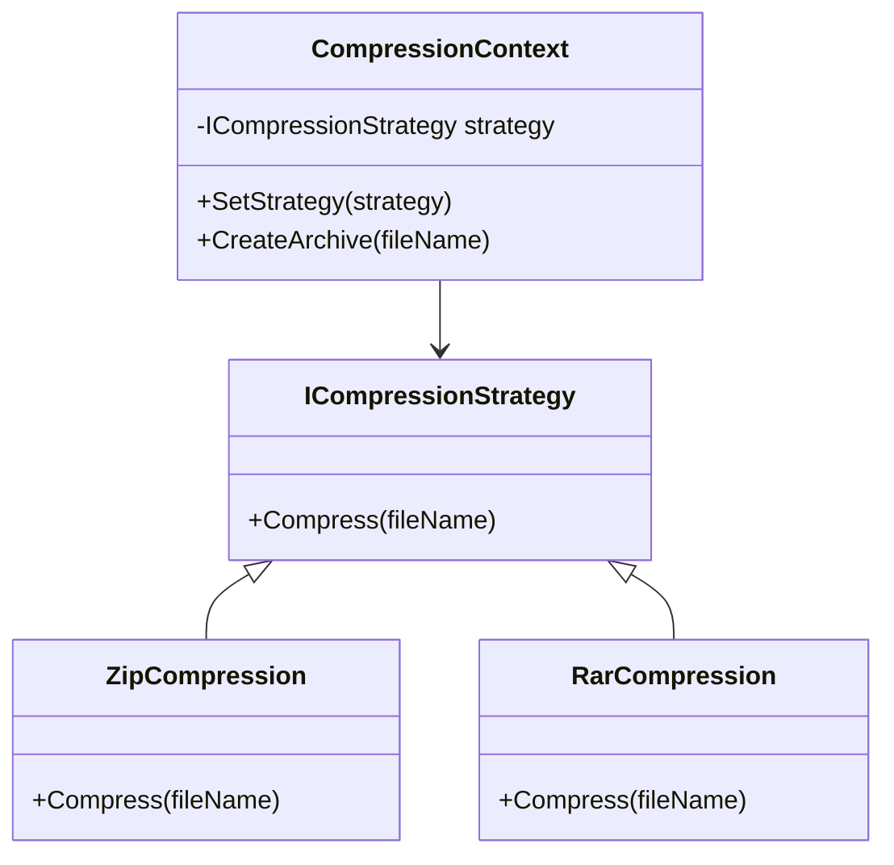

# ⚙️ Strategy Pattern

**Definition:** A behavioral design pattern that enables selecting an algorithm’s behavior at runtime.

## C# Example

```csharp
public interface ICompressionStrategy
{
    void Compress(string fileName);
}

public class ZipCompression : ICompressionStrategy
{
    public void Compress(string fileName)
    {
        Console.WriteLine($"Compressing {fileName} using ZIP");
    }
}

public class RarCompression : ICompressionStrategy
{
    public void Compress(string fileName)
    {
        Console.WriteLine($"Compressing {fileName} using RAR");
    }
}

public class CompressionContext
{
    private ICompressionStrategy _strategy;

    public void SetStrategy(ICompressionStrategy strategy)
    {
        _strategy = strategy;
    }

    public void CreateArchive(string fileName)
    {
        _strategy.Compress(fileName);
    }
}
```

## Usage

```csharp
var context = new CompressionContext();

context.SetStrategy(new ZipCompression());
context.CreateArchive("file1.txt");  // Compressing file1.txt using ZIP

context.SetStrategy(new RarCompression());
context.CreateArchive("file2.txt");  // Compressing file2.txt using RAR
```

## Diagram


