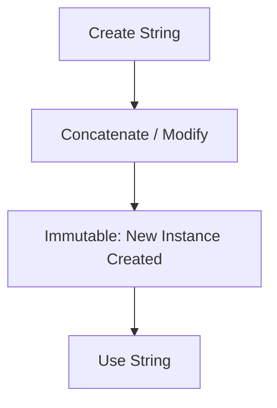

# 📌 C# `String` Operations — Detailed Guide


---


## 📘 What is a `String` in C#?


- A `string` is an object of type `System.String`.

- It is **immutable**, meaning once created, it cannot be changed.

- Strings are **reference types**, not value types.


---


## 🔤 Creating `Strings`


```csharp

string s1 = "Hello";

string s2 = new string('x', 5); // "xxxxx"

string s3 = string.Empty;

```


---


## 🔁 Common `String` Operations


### ✅ Concatenation


```csharp

string first = "Hello";

string second = "World";

string result = first + " " + second; // "Hello World"

```


### ✅ Interpolation


```csharp

int age = 30;

string message = $"I am {age} years old."; // "I am 30 years old."

```


### ✅ Length


```csharp

string name = "Alice";

int len = name.Length; // 5

```


### ✅ Accessing Characters


```csharp

char firstChar = name[0]; // 'A'

```


### ✅ Substring


```csharp

string text = "HelloWorld";

string sub = text.Substring(5);     // "World"

string mid = text.Substring(2, 3);  // "llo"

```


### ✅ Replace


```csharp

string sentence = "cat dog cat";

string replaced = sentence.Replace("cat", "hamster"); // "hamster dog hamster"

```


### ✅ ToUpper / ToLower


```csharp

string upper = "hello".ToUpper(); // "HELLO"

string lower = "HELLO".ToLower(); // "hello"

```


### ✅ Trim / TrimStart / TrimEnd


```csharp

string raw = "  padded  ";

string clean = raw.Trim(); // "padded"

```


### ✅ Contains / StartsWith / EndsWith


```csharp

string data = "apple pie";

bool hasPie = data.Contains("pie"); // true

bool starts = data.StartsWith("app"); // true

```


---


## 🔍 Searching in Strings


### IndexOf / LastIndexOf


```csharp

string input = "banana";

int index = input.IndexOf("na"); // 2

int lastIndex = input.LastIndexOf("na"); // 4

```


---


## 🧵 Splitting and Joining


### Split


```csharp

string csv = "red,green,blue";

string[] colors = csv.Split(','); // ["red", "green", "blue"]

```


### Join


```csharp

string result = string.Join(" - ", colors); // "red - green - blue"

```


---


## 🔄 Comparing Strings


```csharp

string a = "Hello";

string b = "hello";

bool equals = a == b; // false (case-sensitive)

bool ignoreCase = a.Equals(b, StringComparison.OrdinalIgnoreCase); // true

```


---


## 🧪 Null or Empty or WhiteSpace


```csharp

string s = " ";

bool isEmpty = string.IsNullOrEmpty(s);      // false

bool isWhite = string.IsNullOrWhiteSpace(s); // true

```


---


## 🧵 StringBuilder (For Performance)


Use `System.Text.StringBuilder` for frequent modifications:


```csharp

var sb = new StringBuilder();

sb.Append("Hello");

sb.Append(" ");

sb.Append("World");

string final = sb.ToString(); // "Hello World"

```


---


## 🧠 Advanced: Regex with Strings


```csharp

using System.Text.RegularExpressions;


string email = "test@example.com";

bool isValid = Regex.IsMatch(email, @"^[^@\s]+@[^@\s]+\.[^@\s]+$");

```


---


## 📊 Summary Table


| Operation       | Method Used              | Example                            |
|----------------|--------------------------|------------------------------------|
| Length          | `.Length`               | `"test".Length` → 4                |
| Substring       | `.Substring()`           | `"hello".Substring(1)` → "ello"    |
| Replace         | `.Replace()`             | `"a-b".Replace("-", ":")`          |
| ToUpper/Lower   | `.ToUpper() / ToLower()` | `"abc".ToUpper()` → "ABC"          |
| Trim            | `.Trim()`                | `"  abc  ".Trim()` → "abc"         |
| Contains        | `.Contains()`            | `"apple".Contains("pp")` → true    |
| Split           | `.Split()`               | `"a,b,c".Split(',')`               |
| Join            | `string.Join()`          | `string.Join("-", arr)`            |
| Equals          | `.Equals()`              | `a.Equals(b)`                      |


---


## 🔁 Diagram — String Lifecycle





---


## ✅ Best Practices


- Use `string.IsNullOrWhiteSpace()` for input validation.

- Avoid `+` in loops, prefer `StringBuilder`.

- Use interpolation (`$"Hello {name}"`) for readability.
