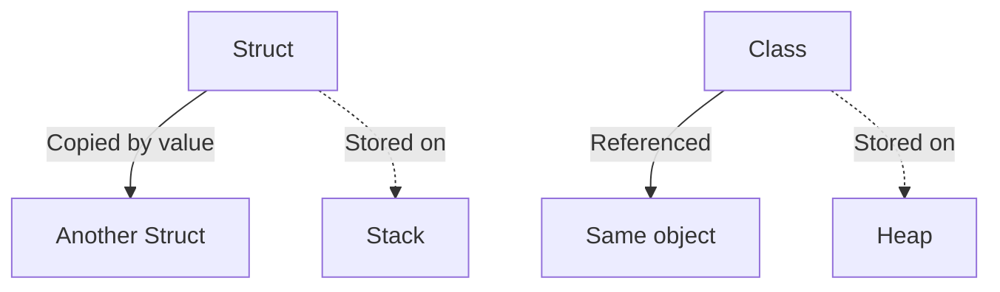

# 🧱 C# `struct` — Value Type Essentials


A `struct` in C# is a **value type** used to encapsulate small groups of related variables. Structs are **lightweight** alternatives to classes, especially when **performance** and **memory layout** matter.


---


## ✅ Basic Syntax


```csharp

public struct Point
{
    public int X;
    public int Y;
    public Point(int x, int y)
    {
        X = x;
        Y = y;
    }
    public void Display()
    {
        Console.WriteLine($"({X}, {Y})");
    }
}

```


### Usage:


```csharp

Point p1 = new Point(5, 10);
p1.Display(); // Outputs: (5, 10)

```


---


## 🆚 Structs vs Classes


| Feature | Struct | Class |
| -------------------- | -------------------------------------- | ---------------------------------- |
| Type | Value Type | Reference Type |
| Stored In | Stack (usually) | Heap |
| Inheritance | Cannot inherit from another struct | Supports inheritance |
| Default Constructor | Not allowed (must define manually) | Always has default constructor |
| Null | Cannot be null (unless nullable)     | Can be null |
| Performance | Faster (smaller data) | Slight overhead (reference copy) |


---


## 🧬 When to Use Structs


Use a struct when:

- It logically represents a **single value** (e.g., coordinates, color, rectangle)

- It is **small and immutable**

- It will **not be inherited**

- You want to **avoid heap allocations**


---


## 🚫 Limitations


- Cannot inherit from another struct or class

- Cannot have a parameterless constructor (until C# 10 with `init`)

- Cannot define a finalizer (`~Destructor`)

- Boxed when cast to `object` (performance hit)


---


## 🧩 Example: `Rectangle` Struct


```csharp

public struct Rectangle
{
    public int Width;
    public int Height;
    public int Area => Width * Height;
}

```


```csharp

Rectangle r = new Rectangle { Width = 10, Height = 5 };
Console.WriteLine($"Area: {r.Area}"); // Output: Area: 50

```


---


## 📦 Boxing and Unboxing


Boxing occurs when a value type is converted to `object`.


```csharp

int number = 42;
object boxed = number;       // Boxing
int unboxed = (int)boxed;    // Unboxing

```


➡ Avoid frequent boxing in performance-critical code.


---


## 🧠 Structs Are Copied By Value


```csharp

Point a = new Point(1, 2);
Point b = a;   // Copy made
b.X = 99;
Console.WriteLine(a.X); // Still 1
Console.WriteLine(b.X); // 99

```


🟨 Changes to `b` do **not** affect `a`.


---


## 💡 Nullable Structs


You can use structs with `?` to allow null values.


```csharp

int? maybeAge = null;
if (maybeAge.HasValue)
    Console.WriteLine(maybeAge.Value);
else
    Console.WriteLine("No age provided");

```


---


## 🧬 Diagram — Struct vs Class





---


## 🏁 Summary


- ✅ Structs are value types, stored on the stack.

- ✅ Use them for small, immutable, self-contained types.

- ❌ Avoid them when inheritance or large object graphs are needed.


---
