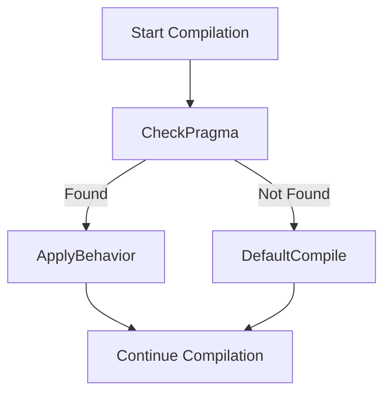

# TwinCAT 3 – All Common `#PRAGMA` Directives (Beckhoff Structured Text)

In TwinCAT (IEC 61131-3 Structured Text), `#PRAGMA` directives are used to **instruct the compiler or code generator** about special handling of variables, methods, structures, or compiler behavior.

---

## 🔧 Syntax
```iecst
{#PRAGMA <directive> [<parameters>]}
```

---

## 📋 Common `#PRAGMA` Directives in TwinCAT

| Directive                    | Description                                                                 |
|------------------------------|-----------------------------------------------------------------------------|
| `#pragma pack`               | Controls memory alignment (packing) of structures                           |
| `#pragma alias`              | Assigns a symbolic alias to a variable or function                          |
| `#pragma warning`            | Suppresses or enables compiler warnings                                     |
| `#pragma component`          | Assigns variables to components (e.g., I/O mapping)                         |
| `#pragma retain`             | Ensures variable retains its value after reboot                            |
| `#pragma restore`            | Restores previous pragma settings                                           |
| `#pragma no_copy`            | Excludes the variable from online change copy buffer                        |
| `#pragma export`             | Exports a variable for access from HMI/ADS                                 |
| `#pragma link`               | Links variable to a symbol (e.g., PLC task variable)                        |
| `#pragma pointer_behavior`   | Configures pointer access type (e.g., checked/unchecked)                    |
| `#pragma fb_reference`       | Used in function block instances for diagnostics or referencing             |
| `#pragma strict`             | Enforces stricter type rules during compilation                             |
| `#pragma property`           | Allows struct members to be visible as properties in the TwinCAT UI         |
| `#pragma access`             | Sets access rights: `read_only`, `write_only`, `hidden`, etc.              |
| `#pragma register`           | Registers a symbol for use by external tools                               |
| `#pragma attribute`          | Adds metadata to symbols (e.g., descriptions, HMI hints)                    |
| `#pragma ignore`             | Ignores a section of code for warnings or documentation                    |
| `#pragma version`            | Attaches a version label to a library/type                                 |

---

## 🧪 Examples

### 🧱 1. `#pragma pack`
```iecst
{#pragma pack(push,1)}
TYPE MyPackedStruct :
STRUCT
  a : BYTE;
  b : INT;
END_STRUCT
END_TYPE
{#pragma pack(pop)}
```

### 🔗 2. `#pragma alias`
```iecst
{#pragma alias 'Motor1Speed'}
MotorSpeed : REAL;
```

### 🔐 3. `#pragma retain`
```iecst
{#pragma retain}
CycleCounter : INT;
```

### 📉 4. `#pragma warning(disable)`
```iecst
{#pragma warning(disable,5001)} // Suppress warning #5001
```

### 📤 5. `#pragma export`
```iecst
{#pragma export}
VisibleToADS : BOOL;
```

### ⚠️ 6. `#pragma access`
```iecst
{#pragma access read_only}
InternalState : INT;
```

---

## 📊 Mermaid: Pragma Processing Flow



---

## 🧠 Notes

- Pragmas **do not affect logic flow**, only metadata or compiler behavior.
- Some pragmas are **specific to TwinCAT 3** (not general IEC 61131-3).
- Overusing `#pragma warning(disable)` may hide bugs.

---

## 📚 References

- [Beckhoff InfoSystem – Pragmas](https://infosys.beckhoff.com/english.php?content=../content/1033/tcplccontrol/html/tcplccontrol_pragmas.htm&id=)
- [TwinCAT 3 Programming Manual](https://www.beckhoff.com/en-en/support/download-documentation/)
