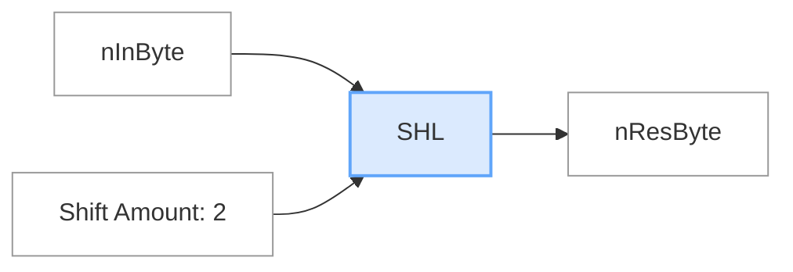
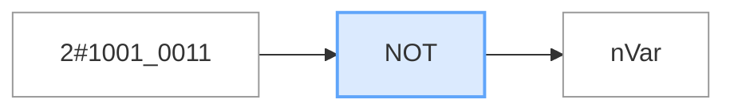
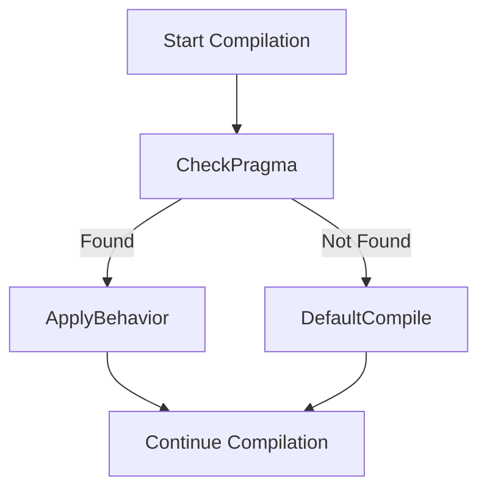

# TwinCAT 3 – All Common `#PRAGMA` Directives (Beckhoff Structured Text)

In TwinCAT (IEC 61131-3 Structured Text), `#PRAGMA` directives are used to **instruct the compiler or code generator** about special handling of variables, methods, structures, or compiler behavior.



---


```pascal
nVar := NOT 2#1001_0011 
```


```pascal
{attribute 'qualified_only'}
{attribute 'strict'}
TYPE E_ColorBasic :
(
    eRed, 
    eYellow,
    eGreen := 10,
    eBlue,
    eBlack
) // Basic data type is INT, default initialization for all E_ColorBasic  variables is eYellow
;
END_TYPE
```

```pascal
TYPE E_Color :
(
    eWhite  := 16#FFFFFF,
    eYellow := 16#FFFF00,
    eGreen  := 16#FF00FF,
    eBlue   := 16#0000FF,
    eBlack  := 16#000000
)DWORD := eBlack
; // Basic data type is DWORD, default initialization for all E_Color variables is eBlack
END_TYPE

```
## 🔧 Syntax
```iecst
{#PRAGMA <directive> [<parameters>]}
```

---

## 📋 Common `#PRAGMA` Directives in TwinCAT

| Directive                    | Description                                                                 |
|------------------------------|-----------------------------------------------------------------------------|
| `#pragma pack`               | Controls memory alignment (packing) of structures                           |
| `#pragma alias`              | Assigns a symbolic alias to a variable or function                          |
| `#pragma warning`            | Suppresses or enables compiler warnings                                     |
| `#pragma component`          | Assigns variables to components (e.g., I/O mapping)                         |
| `#pragma retain`             | Ensures variable retains its value after reboot                            |
| `#pragma restore`            | Restores previous pragma settings                                           |
| `#pragma no_copy`            | Excludes the variable from online change copy buffer                        |
| `#pragma export`             | Exports a variable for access from HMI/ADS                                 |
| `#pragma link`               | Links variable to a symbol (e.g., PLC task variable)                        |
| `#pragma pointer_behavior`   | Configures pointer access type (e.g., checked/unchecked)                    |
| `#pragma fb_reference`       | Used in function block instances for diagnostics or referencing             |
| `#pragma strict`             | Enforces stricter type rules during compilation                             |
| `#pragma property`           | Allows struct members to be visible as properties in the TwinCAT UI         |
| `#pragma access`             | Sets access rights: `read_only`, `write_only`, `hidden`, etc.              |
| `#pragma register`           | Registers a symbol for use by external tools                               |
| `#pragma attribute`          | Adds metadata to symbols (e.g., descriptions, HMI hints)                    |
| `#pragma ignore`             | Ignores a section of code for warnings or documentation                    |
| `#pragma version`            | Attaches a version label to a library/type                                 |

---

## 🧪 Examples

### 🧱 1. `#pragma pack`
```iecst
{#pragma pack(push,1)}
TYPE MyPackedStruct :
STRUCT
  a : BYTE;
  b : INT;
END_STRUCT
END_TYPE
{#pragma pack(pop)}
```

### 🔗 2. `#pragma alias`
```iecst
{#pragma alias 'Motor1Speed'}
MotorSpeed : REAL;
```

### 🔐 3. `#pragma retain`
```iecst
{#pragma retain}
CycleCounter : INT;
```

### 📉 4. `#pragma warning(disable)`
```iecst
{#pragma warning(disable,5001)} // Suppress warning #5001
```

### 📤 5. `#pragma export`
```iecst
{#pragma export}
VisibleToADS : BOOL;
```

### ⚠️ 6. `#pragma access`
```iecst
{#pragma access read_only}
InternalState : INT;
```

---

## 📊 Pragma Processing Flow



---
## Message pragmas
Message pragmas force the output of messages in the message window during the compilation process.

Insertion location: Separate or already existing line in the text editor of a POU.
```pascal
VAR 
    nVar : INT; {info 'TODO: should get another name'} 
    bVar : BOOL; 
    aTest : ARRAY [0..10] OF INT; 
    nIdx : INT; 
END_VAR 
...
aTest[nIdx] := aTest[nIdx]+1; 
nVar := nVar+1; 

{warning 'This is a warning'} 
{text 'Part xy has been compiled completely'}
...
```
## Conditional pragmas
Conditional pragmas are used to influence the code generation in the precompile process or the compile process. The programming language ST supports these pragmas.

## Region pragma
The pragma is used to consolidate multiple lines in a text editor to a block. The block can be assigned a name. Region pragmas can be nested.

Syntax: {region "description"} … {endregion}

Be sure to follow this syntax so that the pragma is taken into account.

Code with region pragma: Extended and reduced view

The pragma can be used in the ST editor and all declaration editors. Syntax highlighting can be adapted in the options.


## 🧠 Notes

- Pragmas **do not affect logic flow**, only metadata or compiler behavior.
- Some pragmas are **specific to TwinCAT 3** (not general IEC 61131-3).
- Overusing `#pragma warning(disable)` may hide bugs.

---

## 📚 References

- [TwinCAT 3 Programming Manual](https://infosys.beckhoff.com/english.php?content=../content/1033/tcplccontrol/html/tcplccontrol_pragmas.htm&id=)

