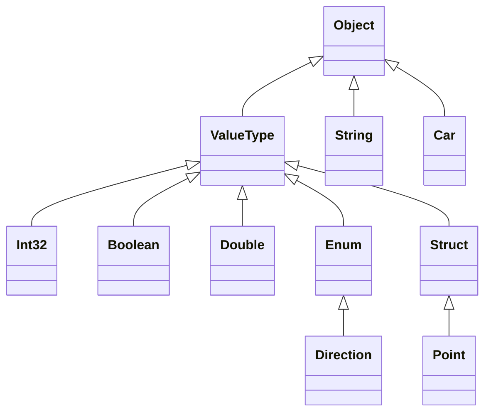

# 🧬 C# Types


C# is a statically typed language, meaning **every variable and object has a type** at compile time.


---


## 🧱 1. Major Type Categories


### 🔹 Value Types

Stored in the **stack**. They contain actual data.


```csharp

int age = 30;
bool isActive = true;
char grade = 'A';

```


Includes:

- `int`, `double`, `bool`, `char`

- `struct`

- `enum`


### 🔸 Reference Types

Stored in the **heap**. They contain a **reference** to the actual data.


```csharp

string name = "Alice";
Person p = new Person();

```


Includes:

- `class`

- `interface`

- `delegate`

- `string`, `object`

- Arrays


---


## 🧮 2. Built-in Types


| Alias    | .NET Type     | Category     |
|----------|---------------|--------------|
| `int`    | `System.Int32` | Value type   |
| `double` | `System.Double` | Value type  |
| `bool`   | `System.Boolean` | Value type |
| `char`   | `System.Char`  | Value type   |
| `string` | `System.String` | Reference type |
| `object` | `System.Object` | Reference type |


---


## 🧱 3. User-defined Types


### ✅ Class

Reference type


```csharp

class Car
{
    public string Model { get; set; }
}

```


### ✅ Struct

Value type


```csharp

struct Point
{
    public int X, Y;
}

```


### ✅ Enum

Value type


```csharp

enum Direction { North, East, South, West }

```


### ✅ Interface

Reference type, defines a contract


```csharp

interface IDrawable
{
    void Draw();
}

```


### ✅ Delegate

Reference type for function pointers


```csharp

delegate int Operation(int a, int b);

```


---


## 🗃️ 4. Diagram: Type Hierarchy





---


## 🔄 5. Boxing and Unboxing


### Boxing: Value → Reference


```csharp

int x = 42;
object obj = x;  // Boxed

```


### Unboxing: Reference → Value


```csharp

int y = (int)obj;  // Unboxed

```


---


## 🧠 6. `typeof`, `is`, and `as`


```csharp

if (obj is string)
{
    string s = obj as string;
    Console.WriteLine($"It's a string: {s}");
}

```


```csharp

Type t = typeof(int);  // System.Int32

```


---


## 🧪 7. Nullable Types


```csharp

int? score = null;
if (score.HasValue)
    Console.WriteLine(score.Value);

```


---


## 🧭 8. Dynamic Type


```csharp

dynamic d = "Hello";
d = 42;  // Valid

```


---


## 🧾 Summary Table


| Type            | Category        | Stack/Heap | Mutable | Inheritance |
|-----------------|------------------|------------|---------|-------------|
| `int`, `double` | Value Type       | Stack      | Yes     | No          |
| `string`        | Reference Type   | Heap       | No*     | Yes         |
| `class`         | Reference Type   | Heap       | Yes     | Yes         |
| `struct`        | Value Type       | Stack      | Yes     | No          |
| `enum`          | Value Type       | Stack      | No      | No          |
| `interface`     | Reference Type   | Heap       | -       | Yes         |
| `delegate`      | Reference Type   | Heap       | Yes     | Yes         |


---


## 🏁 Summary


- ✅ Use value types for lightweight data

- ✅ Use reference types for objects and behaviors

- 🧠 Use nullable types for optional values

- ⚠️ Be cautious with boxing/unboxing (performance hit)
