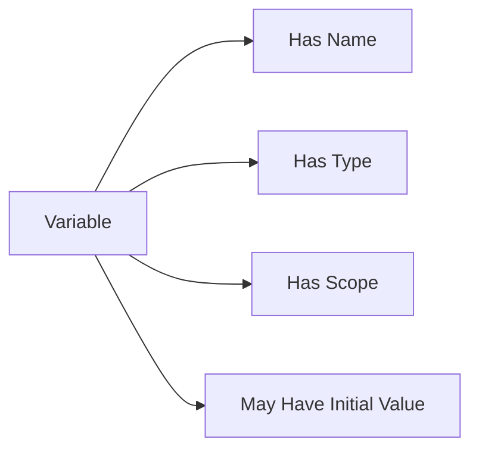

# 🧠 C# Variables — A Comprehensive Guide


In C#, **variables** are named storage locations that hold data which can be manipulated during program execution. Every variable has:

- A **name**

- A **type**

- An optional **initial value**

- A **scope**


---


## 🔤 1. Declaring Variables


```csharp

int age;
string name;
bool isRegistered;

```


---


## 🧮 2. Assigning Values


```csharp

age = 30;
name = "Alice";
isRegistered = true;

```


You can also declare and assign in one step:


```csharp

int score = 100;
string country = "Germany";

```


---


## 📦 3. Variable Types


### 🔹 Value Types


| Type  | Example       | Description             |
|-------|---------------|-------------------------|
| int   | `int a = 10;` | Whole numbers           |
| float | `float b = 3.14f;` | Floating-point numbers |
| bool  | `bool c = true;` | Boolean true/false    |
| char  | `char d = 'X';` | Single character       |


### 🔸 Reference Types


| Type   | Example                 | Description               |
|--------|-------------------------|---------------------------|
| string | `string name = "Bob";`  | Sequence of characters    |
| object | `object obj = new();`   | Base type of all types    |
| array  | `int[] arr = {1,2,3};`  | Collection of items       |
| class  | `MyClass m = new();`    | User-defined type         |


---


## 🧪 4. Type Inference with `var`


```csharp

var count = 42;       // inferred as int
var price = 19.99;    // inferred as double
var name = "Charlie"; // inferred as string

```


> ⚠️ `var` requires immediate initialization and can’t be used without assignment.


---


## 📏 5. Constants and Readonly


- **Constant**: value must be known at compile time


```csharp

const double Pi = 3.14159;

```


- **Readonly**: value set once at runtime (e.g. in constructor)


```csharp

readonly DateTime createdAt;

```


---


## 🌀 6. Scope


```csharp

void MyMethod()
{
    int localVar = 10; // Only accessible inside this method
}

```


Variables defined inside:

- Methods → **local scope**

- Classes → **field scope**

- Blocks (`if`, `for`, etc.) → **block scope**


---


## 📌 7. Naming Conventions


✅ Camel case for locals and parameters:

```csharp

int totalScore;
string userName;

```


✅ Pascal case for properties and fields:

```csharp

public int UserAge { get; set; }

```


❌ Avoid:

- Starting with numbers: `int 1score;`

- Reserved keywords: `int class;`


---


## 🔁 8. Multiple Declarations


```csharp

int x = 0, y = 5, z = 10;

```


---


## 🎯 9. Best Practices


- Prefer meaningful names (`int count` over `int c`)

- Use explicit types unless inference improves readability

- Limit variable scope as much as possible


---


## 🧠 Summary Diagram 





---


## 🧪 Quick Example


```csharp

public class Program
{
    public static void Main()
    {
        const double taxRate = 0.18;
        string customer = "John Doe";
        double amount = 200.0;
        double tax = amount * taxRate;

        Console.WriteLine($"{customer} pays ${tax} in tax.");

    }

}

```


---
