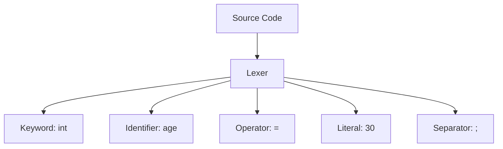

# 🔍 What is a Token in Programming?

In programming languages like **C#**, a **token** is the **smallest meaningful unit** in the source code that the compiler can understand and work with.

---

## 📘 Definition

> A **token** is a categorized block of text, such as a keyword, identifier, symbol, literal, or operator, that serves as the basic building block of a program's source code.

When you write code, the compiler breaks it into tokens during **lexical analysis (tokenization)** before parsing and generating machine code.

---

## 🧱 Types of Tokens

| Token Type        | Examples                        | Description                                |
|-------------------|----------------------------------|--------------------------------------------|
| **Keywords**       | `int`, `if`, `class`, `return`   | Reserved words with special meaning.       |
| **Identifiers**    | `total`, `Calculate`, `person`   | Names for variables, methods, classes.     |
| **Literals**       | `42`, `"hello"`, `true`          | Fixed values written directly in code.     |
| **Operators**      | `+`, `-`, `=`, `==`, `!`         | Perform operations on variables or values. |
| **Separators**     | `(`, `)`, `{`, `}`, `;`, `,`     | Structure and delimit program syntax.      |
| **Comments**       | `//`, `/* */`                    | Ignored by the compiler.                   |

---

## 🧪 Example Breakdown

```csharp
int age = 30;
```

This code is tokenized into:

1. `int` → Keyword  
2. `age` → Identifier  
3. `=` → Operator  
4. `30` → Literal  
5. `;` → Separator  

Each token has its role in conveying what the line of code does.

---

## 🎯 Why Tokens Matter

- Tokens form the foundation of parsing logic.
- The compiler or interpreter builds the program’s meaning by analyzing the token stream.
- Incorrect or unknown tokens result in **compiler errors** like:
  - `CS1056: Unexpected character`
  - `CS4079: Invalid token`

---

## 📊 Diagram – Token Categories



---

## ⚠️ Invalid Tokens

An **invalid token** is a symbol or character that the compiler cannot recognize in its current context.

### Example:

```csharp
int #value = 5;
```

Output:
```
CS1056: Unexpected character '#'
```

The `#` character is **not valid** in identifiers. The compiler throws a syntax error.

---

## 🛠 Bonus: Tokenization Tools

- C# Lexer: [Roslyn API](https://github.com/dotnet/roslyn)
- Online tools: [https://sharplab.io/](https://sharplab.io/)
- Polyglot Notebook: Use `.dib` notebooks to inspect and experiment with tokens interactively.

---

## ✅ Summary

- A **token** is the basic unit of a programming language’s syntax.
- C# code is parsed as a sequence of tokens before compilation.
- Knowing token types helps you understand syntax errors and write cleaner code.

---

🧠 *"Think like the compiler: every statement you write becomes a sequence of tokens it tries to understand."*
