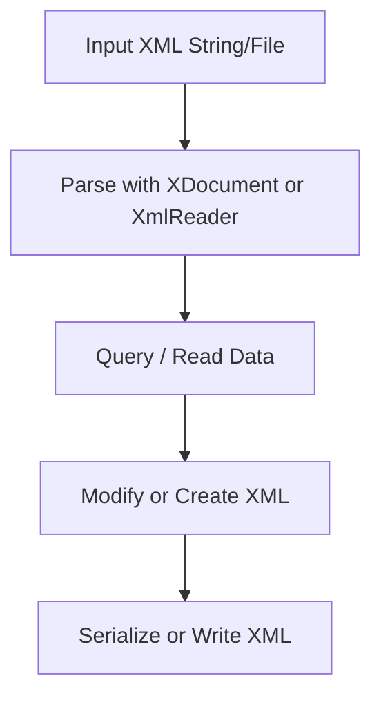

# 📗 XML Operations in C#

---

## 📌 What is XML?

**XML** (eXtensible Markup Language) is a markup language for storing and transporting data in a structured, hierarchical format.

C# provides several ways to work with XML:

- `System.Xml` namespace (low-level DOM, reader/writer)
- `System.Xml.Linq` namespace (LINQ to XML - modern and easier)
- Serialization / Deserialization with `XmlSerializer`

---

## 🔧 Common Libraries

```csharp
using System.Xml;
using System.Xml.Linq;
using System.Xml.Serialization;
```

---

## 1️⃣ Parsing XML with `XDocument` (LINQ to XML)

```csharp
string xml = @"
<bookstore>
  <book genre='Fantasy' ISBN='123456789'>
    <title>Harry Potter</title>
    <author>J.K. Rowling</author>
    <price>29.99</price>
  </book>
</bookstore>";

XDocument doc = XDocument.Parse(xml);

var books = doc.Descendants("book")
               .Select(b => new
               {
                   Genre = (string)b.Attribute("genre"),
                   ISBN = (string)b.Attribute("ISBN"),
                   Title = (string)b.Element("title"),
                   Author = (string)b.Element("author"),
                   Price = (decimal)b.Element("price")
               });

foreach (var book in books)
{
    Console.WriteLine($"{book.Title} by {book.Author} - {book.Price:C}");
}
```

---

## 2️⃣ Creating XML Document with `XDocument`

```csharp
XDocument doc = new XDocument(
    new XElement("library",
        new XElement("book",
            new XAttribute("genre", "Sci-Fi"),
            new XElement("title", "Dune"),
            new XElement("author", "Frank Herbert"),
            new XElement("price", 15.99)
        )
    )
);

string xmlString = doc.ToString();
Console.WriteLine(xmlString);
```

---

## 3️⃣ Reading XML with `XmlReader` (Forward-only, streaming)

```csharp
using (XmlReader reader = XmlReader.Create("books.xml"))
{
    while (reader.Read())
    {
        if (reader.IsStartElement() && reader.Name == "book")
        {
            string genre = reader["genre"];
            Console.WriteLine($"Book genre: {genre}");
        }
    }
}
```

---

## 4️⃣ Writing XML with `XmlWriter`

```csharp
using (XmlWriter writer = XmlWriter.Create("books_out.xml"))
{
    writer.WriteStartDocument();
    writer.WriteStartElement("books");

    writer.WriteStartElement("book");
    writer.WriteAttributeString("genre", "Thriller");
    writer.WriteElementString("title", "The Da Vinci Code");
    writer.WriteElementString("author", "Dan Brown");
    writer.WriteElementString("price", "12.50");
    writer.WriteEndElement();

    writer.WriteEndElement();
    writer.WriteEndDocument();
}
```

---

## 5️⃣ XML Serialization / Deserialization with `XmlSerializer`

```csharp
public class Book
{
    [XmlAttribute]
    public string Genre { get; set; }

    public string Title { get; set; }
    public string Author { get; set; }
    public decimal Price { get; set; }
}

// Serialize
var book = new Book { Genre = "Fantasy", Title = "Harry Potter", Author = "J.K. Rowling", Price = 29.99m };
var serializer = new XmlSerializer(typeof(Book));
using (var writer = new StreamWriter("book.xml"))
{
    serializer.Serialize(writer, book);
}

// Deserialize
using (var reader = new StreamReader("book.xml"))
{
    var deserializedBook = (Book)serializer.Deserialize(reader);
    Console.WriteLine(deserializedBook.Title);
}
```

---

## 6️⃣ XPath Queries with `XPathSelectElements` (LINQ to XML)

```csharp
using System.Xml.XPath;

var titles = doc.XPathSelectElements("//book/title");

foreach (var title in titles)
{
    Console.WriteLine(title.Value);
}
```

---

## 📊 Summary Table

| Task                      | API/Method                       | Notes                         |
|---------------------------|---------------------------------|-------------------------------|
| Parse XML                 | `XDocument.Parse`                | Easy LINQ querying             |
| Create XML                | `XDocument` + `XElement`         | Fluent creation                |
| Stream Read              | `XmlReader`                      | Efficient for large files      |
| Stream Write             | `XmlWriter`                      | Efficient writing              |
| Serialize Object to XML  | `XmlSerializer.Serialize`        | For POCO objects              |
| Deserialize XML to Object | `XmlSerializer.Deserialize`      |                              |
| XPath Queries             | `XPathSelectElements`             | Powerful querying              |

---

## 🧭 Diagram — XML Workflow



---

## ✅ Best Practices

- Use **LINQ to XML** (`XDocument`) for ease and readability.
- Use **XmlReader/XmlWriter** for large XML or streaming scenarios.
- Use **XmlSerializer** to map XML to C# classes for strongly-typed access.
- Always handle exceptions like `XmlException`.

---

## 📚 References

- [Microsoft Docs - LINQ to XML](https://learn.microsoft.com/en-us/dotnet/standard/linq/linq-to-xml-overview)
- [Microsoft Docs - XmlSerializer](https://learn.microsoft.com/en-us/dotnet/api/system.xml.serialization.xmlserializer)
- [Microsoft Docs - XmlReader](https://learn.microsoft.com/en-us/dotnet/api/system.xml.xmlreader)
- [Microsoft Docs - XmlWriter](https://learn.microsoft.com/en-us/dotnet/api/system.xml.xmlwriter)
