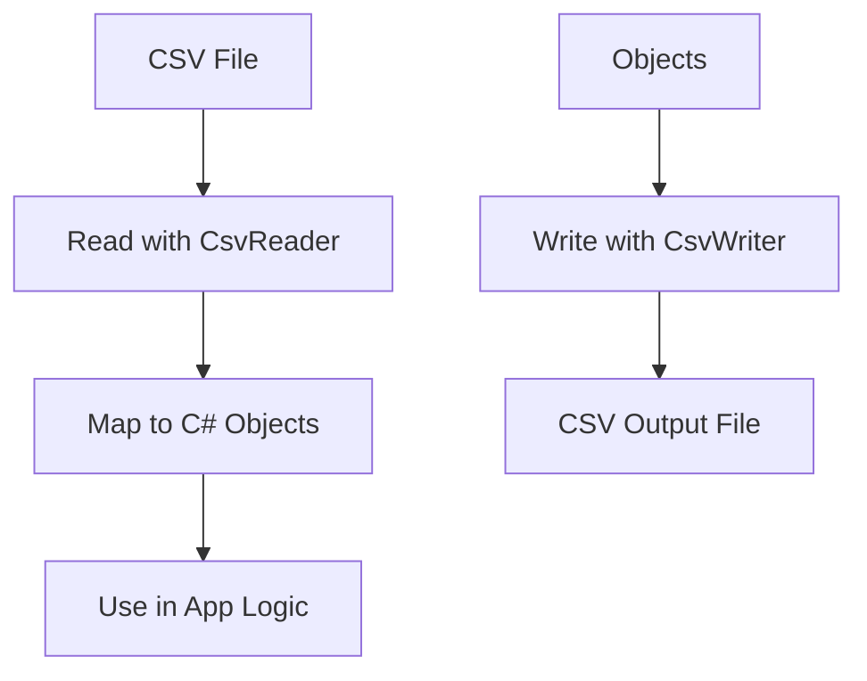

# 📄 CSV Operations in C#

---

## 📌 Overview

CSV (Comma-Separated Values) is a simple file format used to store tabular data (numbers and text) in plain text.

In C#, common ways to work with CSV files include:

- Manual parsing (using `string.Split`)
- Using libraries like **CsvHelper** (recommended for robust CSV handling)

---

## 🔧 Popular CSV Library: CsvHelper

- NuGet Package: `CsvHelper`
- Handles reading/writing, custom mappings, headers, quoting, culture formats, and more.

---

## 1️⃣ Installing CsvHelper

```bash
dotnet add package CsvHelper
```

---

## 2️⃣ Reading CSV File

```csharp
using System.Globalization;
using CsvHelper;
using CsvHelper.Configuration;
using System.IO;

public class Person
{
    public string Name { get; set; }
    public int Age { get; set; }
}

using var reader = new StreamReader("people.csv");
using var csv = new CsvReader(reader, CultureInfo.InvariantCulture);

var records = csv.GetRecords<Person>().ToList();

foreach (var person in records)
{
    Console.WriteLine($"{person.Name} - {person.Age}");
}
```

*Example CSV file (`people.csv`):*

```csv
Name,Age
Alice,30
Bob,25
Charlie,35
```

---

## 3️⃣ Writing CSV File

```csharp
using var writer = new StreamWriter("output.csv");
using var csv = new CsvWriter(writer, CultureInfo.InvariantCulture);

var records = new List<Person>
{
    new Person { Name = "Dave", Age = 40 },
    new Person { Name = "Eva", Age = 28 }
};

csv.WriteRecords(records);
```

---

## 4️⃣ Manual CSV Parsing (Simple)

```csharp
string[] lines = File.ReadAllLines("people.csv");
foreach (string line in lines.Skip(1)) // skip header
{
    var columns = line.Split(',');
    string name = columns[0];
    int age = int.Parse(columns[1]);
    Console.WriteLine($"{name} is {age} years old.");
}
```

*Note:* Manual parsing is prone to errors with commas inside quotes, multiline fields, etc.

---

## 5️⃣ Configuring CsvHelper (Custom Delimiters, Headers)

```csharp
var config = new CsvConfiguration(CultureInfo.InvariantCulture)
{
    Delimiter = ";",
    HasHeaderRecord = true,
};

using var reader = new StreamReader("data.csv");
using var csv = new CsvReader(reader, config);

var records = csv.GetRecords<Person>().ToList();
```

---

## 📊 Summary Table

| Task                  | Method / Class               | Notes                       |
|-----------------------|-----------------------------|-----------------------------|
| Read CSV              | `CsvReader.GetRecords<T>()` | Maps CSV rows to C# classes |
| Write CSV             | `CsvWriter.WriteRecords()`   | Writes list of objects       |
| Manual Parsing        | `string.Split(',')`          | Simple, error-prone          |
| Custom Configurations | `CsvConfiguration`           | Delimiters, culture, headers|

---

## 🧭 Diagram — CSV Read/Write Flow



---

## ✅ Best Practices

- Use **CsvHelper** for production code to handle CSV edge cases.
- Always specify culture info to avoid formatting issues.
- Validate CSV files before processing.
- Use classes to map CSV data clearly.

---

## 📚 References

- [CsvHelper GitHub](https://github.com/JoshClose/CsvHelper)
- [CsvHelper Documentation](https://joshclose.github.io/CsvHelper/)
