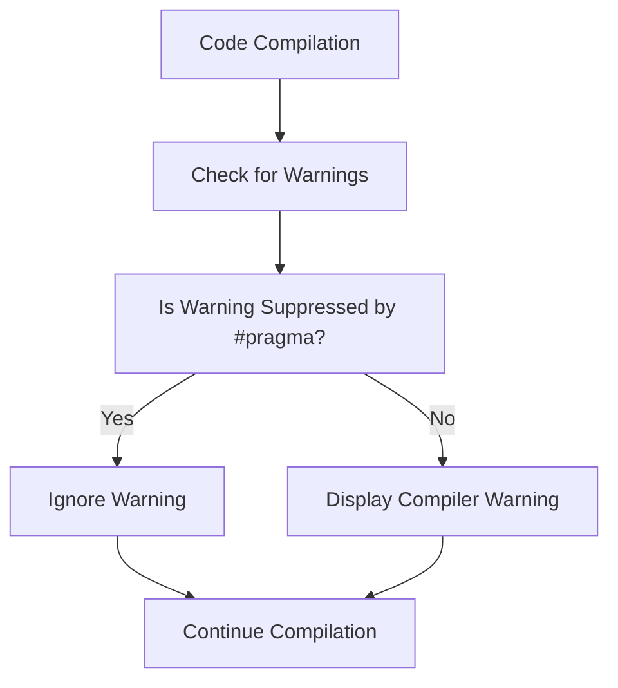

# C# `#pragma` Directive Explained

The `#pragma` directive in C# gives the compiler special instructions for compiling the code. It is mostly used to **suppress warnings**, enable specific behaviors, or control code analysis tools.

---

## 🔧 Common Usage

### 1. Suppressing a specific compiler warning
```csharp
#pragma warning disable CS0168  // Disable "variable declared but never used"
int unusedVariable;
#pragma warning restore CS0168  // Re-enable the warning
```

### 2. Ignoring multiple warnings
```csharp
#pragma warning disable CS0168, CS0219
```

### 3. Region control for analyzers
```csharp
#pragma warning disable
// All warnings suppressed
#pragma warning restore
```

---

## ⚠️ Why Use `#pragma`?

- To silence harmless warnings temporarily
- To isolate legacy code that triggers many warnings
- To focus on more important issues during development
- To manage code analysis behavior across CI pipelines

---

## 🔍 Example: Without and With `#pragma`

### ❌ Without `#pragma` (Causes warning)
```csharp
int unusedVar; // Warning: CS0168
```

### ✅ With `#pragma` (Suppresses warning)
```csharp
#pragma warning disable CS0168
int unusedVar;
#pragma warning restore CS0168
```

---

## 🧠 Best Practices

- Only suppress warnings you understand
- Always restore warnings after the relevant code block
- Document why a warning is being suppressed

---

## 📊 Mermaid Diagram: How `#pragma warning` works



---

## ✅ Summary

| Feature                  | Description                                     |
|--------------------------|-------------------------------------------------|
| `#pragma warning disable`| Disables specified warning codes                |
| `#pragma warning restore`| Re-enables previously disabled warning codes    |
| Use case                 | Suppress known or harmless warnings             |

---

## 📚 Related

- [`#if`, `#else`, `#endif`] — for conditional compilation
- [Microsoft Docs on `#pragma`](https://learn.microsoft.com/en-us/dotnet/csharp/language-reference/preprocessor-directives/preprocessor-pragma-warning)
